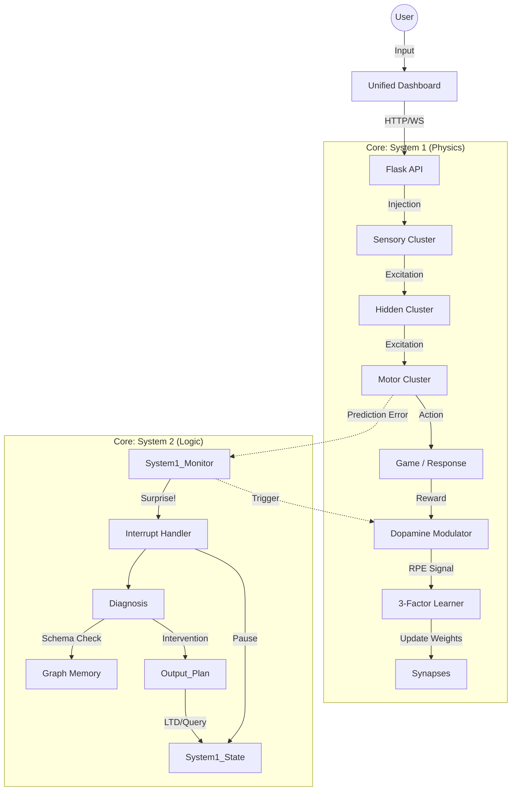

# NCGN v6 Unified Architecture

## 1. High-Level Data Flow

The flow of information through the unified system, from Sensory Input to Motor Output (System 1) and Logic Oversight (System 2).

---

## 2. Core Modules

### `core/memory.py` (The State)
*   **GraphMemory**: $O(1)$ dictionary-based graph.
    *   `nodes`: Stores energy, threshold, cluster.
    *   `active_nodes`: Set of currently firing nodes.
    *   `traced_synapses`: List of synapses eligible for learning.
*   **Classes**:
    *   `ConceptNode`: The neuron.
    *   `Synapse`: The connection (Weight + Trace + Stability).
    *   `ClusterType`: ENUM (Motor, Sensory, Hidden).

### `core/system1.py` (The Engine)
*   **Thermodynamics**:
    *   Manages Global Energy (Entropy Control).
    *   Dynamic Temperature (Exploration/Exploitation).
*   **Pipeline**:
    1.  **Transduction**: Buffer $\to$ Sensory Nodes.
    2.  **Decay**: Passive energy loss.
    3.  **Softmax**: Cluster-based competition.
    4.  **Firing**: $E > Threshold$.
    5.  **Propagation**: Spreading energy via Synapses.
    6.  **Learning**: Apply weight updates (if RPE exists).

### `core/system2.py` (The Supervisor)
*   **Trigger**: High Surprise (Prediction Failure).
*   **Diagnosis**:
    *   Validates "Subject-Verb-Object" triples.
    *   Checks against `EventSchema` constraints.
*   **Intervention**:
    *   **LTD**: Weaken bad connections.
    *   **LTP**: Strengthen good connections.
    *   **Query**: Ask user for help.

---

## 3. Learning Dynamics

The v6 system uses **3-Factor Hebbian Learning** to solve the credit assignment problem.

### The Equation
$$ \Delta W_{ij} = \eta \cdot (1 - S_{ij}) \cdot \delta \cdot e_{ij} $$

*   $\eta$: Learning Rate.
*   $S_{ij}$: **Stability** (0=Plastic, 1=Rigid).
*   $\delta$: **Dopamine RPE** (Actual - Expected).
*   $e_{ij}$: **Eligibility Trace** (Pre $\times$ Post activity).

### Stability Mechanism
To prevent **Catastrophic Forgetting**:
1.  Synapses start with Stability $S=0$.
2.  Successful use (Positive RPE) increases $S$.
3.  As $S \to 1$, the effective learning rate $\to 0$.
4.  Result: Old, useful memories become "crystalized" and are hard to overwrite.

---

## 4. Interaction Model

### The "Dog Eat Metal" Use Case
Demonstrates the handover between System 1 and System 2.

1.  **Input**: "Dog eat metal" (Sensory Cluster).
2.  **System 1**:
    *   Propagates energy: Dog $\to$ Meat (Prediction).
    *   Input conflicts: Dog $\to$ Metal (Observation).
    *   **Surprise**: High RMS error.
3.  **Interrupt**: Engine Pauses.
4.  **System 2**:
    *   Loads `eat` schema.
    *   Constraint: `target` must be `is_edible`.
    *   Fact Check: `Metal.is_edible == False`.
    *   **Diagnosis**: Constraint Violation.
5.  **Response**:
    *   System 2 generates query: "Metal is not edible?"
    *   User confirms.
    *   System 2 applies **LTD** to `Dog->Metal`.
