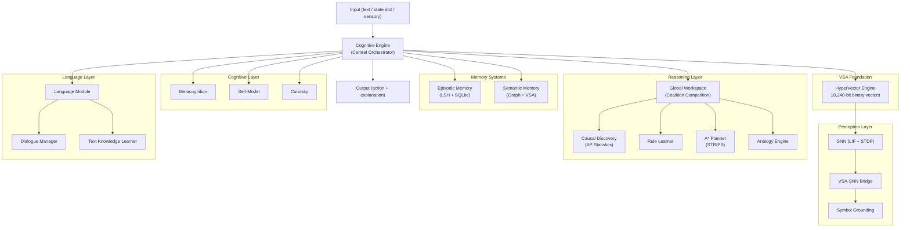

# NSCK — Neural-Symbolic Cognitive Kernel

A transparent, glass-box cognitive architecture that combines **Vector Symbolic Architecture (VSA)** with **symbolic reasoning**, **spiking neural networks**, and **Global Workspace Theory** into a unified decision-making system.

> **No black boxes.** Every decision is traceable, every weight is inspectable, every reasoning step is explainable in natural language.

---

## What Is NSCK?

NSCK is a cognitive architecture — not a chatbot, not a neural network fine-tune. It is a **reasoning engine** that:

- Represents all knowledge as 10,240-bit binary hypervectors (VSA)
- Learns causal models from observation (ΔP statistical discovery)
- Plans with A* search over STRIPS operators
- Competes proposals through Global Workspace Theory (attention)
- Grounds symbols in sensory data via Spiking Neural Networks
- Learns autonomously through curiosity-driven exploration
- Explains every decision in natural language

## Quick Start

```bash
# Clone and enter
git clone https://github.com/shiva2321/Node_network.git
cd Node_network/nsck

# Install dependencies
pip install -r ../requirements.txt

# Build the Rust VSA accelerator (optional, ~10x faster)
cd rust_vsa && pip install -e . && cd ..

# Run the test suite
pytest tests/ python/core/tests/ -q

# Run the real-world evaluation
python real_world_eval.py
```

## Project Structure

```
Node_network/
├── README.md                    ← You are here
├── requirements.txt             ← Python dependencies
├── pytest.ini                   ← Test configuration
│
├── nsck/                        ← Main NSCK package
│   ├── python/core/             ← Core cognitive modules (41 files, ~17,300 LOC)
│   │   ├── vsa/                 ← HyperVector engine (Python + Rust shim)
│   │   ├── reasoning/           ← Cognitive Engine, GWT, Planner, Causal, Rules, Analogy
│   │   ├── learning/            ← Hebbian learning, Curiosity module
│   │   ├── cognitive/           ← Metacognition, Self-Model, Theory of Mind, Emotions
│   │   ├── perception/          ← SNN (LIF + STDP), VSA-SNN Bridge, Grounding
│   │   ├── memory/              ← Episodic Memory (LSH), Semantic Memory (Graph+VSA)
│   │   ├── language/            ← NLU, Dialogue, Text Knowledge Learner
│   │   ├── integration/         ← Config, Persistence (SQLite), Brain Fusion
│   │   └── training/            ← SNN training pipelines
│   │
│   ├── rust_vsa/                ← Rust accelerator (7 files, ~2,665 LOC)
│   │   └── src/                 ← HyperVector, SemanticMemory, EpisodicMemory, WorkerPool
│   │
│   ├── tests/                   ← Test suite (39 files, ~7,400 LOC)
│   │   ├── unit/                ← Module-level unit tests
│   │   ├── integration/         ← Cross-module integration tests
│   │   ├── core_architecture/   ← Architecture verification tests
│   │   ├── experiments/         ← Experimental validation
│   │   └── regression/          ← Regression tests
│   │
│   ├── docs/                    ← Documentation
│   │   ├── ARCHITECTURE.md      ← System architecture with Mermaid diagrams
│   │   ├── FORMULAS.md          ← Mathematical foundations (all equations)
│   │   ├── WORKFLOWS.md         ← Decision loop & data flow explanations
│   │   ├── MODULE_REFERENCE.md  ← Per-module API reference
│   │   ├── REPOMAP.md           ← Full codebase map (Mermaid)
│   │   └── ...
│   │
│   ├── data/                    ← Test corpora (belief revision, causal chains)
│   ├── examples/                ← Usage examples
│   └── archive/                 ← Historical experiments & benchmarks
│
└── nsck_ai_model/               ← Standalone AI model training (separate system)
```

## Architecture at a Glance



## Key Numbers

| Metric | Value |
|--------|-------|
| Core Python files | 41 |
| Core Python LOC | ~17,300 |
| Rust source files | 7 |
| Rust LOC | ~2,665 |
| Test files | 39 |
| Test LOC | ~7,400 |
| HyperVector dimension | 10,240 bits |
| Test pass rate | 279/284 (98.2%) |
| Real-world eval | 80% (Grade A) |

## Documentation

| Document | Description |
|----------|-------------|
| [ARCHITECTURE.md](nsck/docs/ARCHITECTURE.md) | Full system architecture with Mermaid diagrams |
| [FORMULAS.md](nsck/docs/FORMULAS.md) | Every mathematical formula used, with source references |
| [WORKFLOWS.md](nsck/docs/WORKFLOWS.md) | Decision loop, learning cycle, and data flow explanations |
| [MODULE_REFERENCE.md](nsck/docs/MODULE_REFERENCE.md) | Per-module API reference with classes and methods |
| [REPOMAP.md](nsck/docs/REPOMAP.md) | Complete codebase map showing every file and connection |
| [TRANSPARENCY_GUARANTEE.md](nsck/docs/TRANSPARENCY_GUARANTEE.md) | Glass-box transparency properties and verification |

## Design Principles

1. **Transparency** — Every decision produces a traceable explanation. Q-values, coalition scores, rule activations, and confidence levels are all inspectable at runtime.

2. **Neuro-Symbolic Integration** — VSA provides a common mathematical language where neural (SNN/Hebbian) and symbolic (rules/planning) systems operate on the same representations.

3. **Biological Plausibility** — Global Workspace Theory for attention, Hebbian learning for association, spiking neurons for perception, curiosity-driven exploration for learning.

4. **Domain Agnosticism** — The engine is task-agnostic. Register predicates, actions, and causal models for any domain. The same architecture handles mazes, text understanding, physics, and more.

5. **No External AI Dependencies** — All reasoning is self-contained. No LLM API calls required. Optional LLM integration available for enhanced NLU but the system works fully without it.

## License

See [LICENSE](LICENSE) for details.
