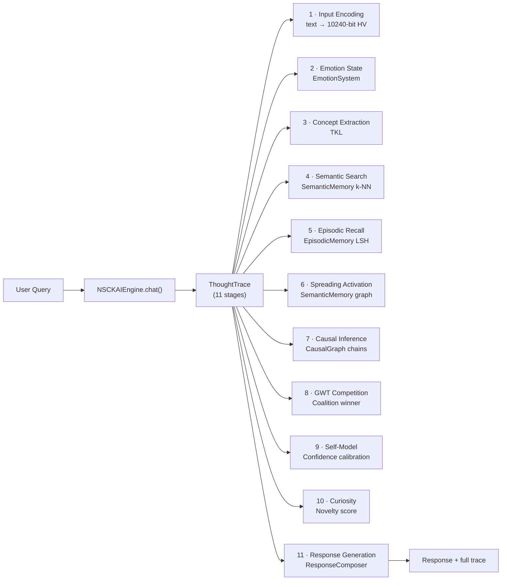

# Node\_network — NSCK + AI Model

> **No black boxes. Every decision is traceable, every reasoning step is explainable.**

This repository contains two tightly related projects built on the same cognitive foundation:

| Sub-project | What it is |
|---|---|
| **[`nsck/`](nsck/)** | Neural-Symbolic Cognitive Kernel — a general-purpose cognitive architecture |
| **[`nsck_ai_model/`](nsck_ai_model/)** | Conversational AI layer that wires NSCK modules into a glass-box chat engine |

---

## What Is NSCK?

NSCK (Neural-Symbolic Cognitive Kernel) is a **reasoning engine**, not a chatbot or neural-network fine-tune. It represents all knowledge as 10,240-bit binary hypervectors (Vector Symbolic Architecture), reasons symbolically, and explains every decision in natural language.

**Core capabilities:**

- **Representation** — Every concept, relation, and context is a 10,240-bit binary hypervector. XOR binds roles to fillers; majority-vote bundling creates superpositions; circular shift encodes word order.
- **Memory** — Two-tier episodic memory (in-memory hot tier + SQLite warm tier with LSH indexing) and a directed-graph semantic memory with spreading activation.
- **Reasoning** — Global Workspace Theory competition, Δ*P* causal discovery, STRIPS A\* planning, rule induction, analogical transfer, cross-domain knowledge transfer, and math/numeric reasoning.
- **Perception** — Leaky Integrate-and-Fire spiking neurons with STDP learning, connected to VSA via a Rate/Temporal coder bridge.
- **Learning** — Curiosity-driven exploration (VSA novelty), Hebbian association, continual learning (EWC), meta-learning (MAML-style), and cross-domain rule lifting.
- **Language** — Text → HV encoding via semantic folding; Semantic Role Labeling (SRL) extracts thematic roles (AGENT/PATIENT/LOCATION/…); TextKnowledgeLearner extracts triples; NLG with discourse planning and anaphora assembles multi-sentence responses.
- **Transparency** — Every action is accompanied by a human-readable explanation tracing the winning coalition, rule activations, causal chain, and confidence score.

## What Is the AI Model?

`nsck_ai_model/` is a conversational wrapper around the NSCK modules. It adds:

- **11-stage ThoughtTrace** — records every processing stage from input encoding to final response.
- **CounterfactualReasoner** — detects "what if" queries and simulates hypothetical states.
- **ContextRetentionModule** — maintains a 20-turn conversation history with entity resolution.
- **MathHandler** — symbolic arithmetic, algebra, and unit conversion (no neural nets).
- **Flask dashboard** — live chat, training, telemetry, and knowledge browser on port 5090.

---

## Repository Layout

```
Node_network/
├── README.md                       ← You are here
├── requirements.txt                ← Python dependencies
├── pytest.ini                      ← Test configuration
│
├── nsck/                           ← NSCK cognitive architecture
│   ├── python/
│   │   └── core/                   ← ~47 Python source files, ~23,800 LOC
│   │       ├── vsa/                ← HyperVector engine + Rust shim
│   │       ├── reasoning/          ← CognitiveEngine, GWT, Planner, Causal, Rules, Analogy, MathReasoner
│   │       ├── memory/             ← EpisodicMemory (LSH+SQLite), SemanticMemory (Graph+VSA)
│   │       ├── cognitive/          ← Emotions, Metacognition, Self-Model, Theory of Mind
│   │       ├── perception/         ← SNN (LIF+STDP), VSA-SNN Bridge, Symbol Grounding
│   │       ├── learning/           ← Hebbian learning, Curiosity module, CrossDomainTransfer
│   │       ├── language/           ← NLU, SRL, Discourse NLG, Dialogue, Text Knowledge Learner, Universal Input
│   │       ├── integration/        ← Config, BrainStore (SQLite), BrainFusion, Explanation
│   │       ├── multimodal/         ← Image processor, Image generator
│   │       └── training/           ← SNN training pipelines
│   │
│   ├── rust_vsa/                   ← Rust VSA accelerator (PyO3, 7 source files)
│   │   └── src/                    ← HyperVector, SemanticMemory, EpisodicMemory,
│   │                               ←   WorkerPool, AsyncRuntime, Persistence
│   ├── rust_snn/                   ← Rust SNN accelerator (PyO3)
│   │   └── src/                    ← LIFLayer, SnnCore, StdpEngine, HebbianMatrix
│   │
│   ├── tests/                      ← Test suite (~39 files, ~7,400 LOC)
│   │   ├── unit/                   ← Module-level tests
│   │   ├── integration/            ← Cross-module tests
│   │   ├── core_architecture/      ← Architecture verification
│   │   ├── experiments/            ← Experimental validation
│   │   └── regression/             ← Regression tests
│   │
│   ├── docs/                       ← Documentation
│   │   ├── ARCHITECTURE.md         ← System architecture with Mermaid diagrams
│   │   ├── FORMULAS.md             ← Theory, formulas, proofs, and design goals
│   │   ├── MODULE_REFERENCE.md     ← Every file, class, and method
│   │   ├── TESTING.md              ← All tests: what they test, how, and why
│   │   ├── WORKFLOWS.md            ← Decision loop and data-flow walkthroughs
│   │   └── NSCK_ROADMAP_AND_PLAN.md ← Implementation roadmap: gaps, phases, research
│   │
│   ├── examples/                   ← Runnable usage examples
│   ├── data/                       ← Test corpora (belief revision, causal chains)
│   └── archive/                    ← Historical experiments and benchmarks
│
├── nsck_ai_model/                  ← Conversational AI layer on top of NSCK
│   ├── ai_engine.py                ← NSCKAIEngine: train + chat + ThoughtTrace
│   ├── dashboard.py                ← Flask dashboard (15 API endpoints)
│   ├── context_retention.py        ← 20-turn conversation context + entity resolution
│   ├── counterfactual_reasoner.py  ← Hypothetical state simulation
│   ├── math_handler.py             ← Symbolic math (arithmetic, algebra, units)
│   ├── response_composer.py        ← VSA-based response assembly
│   ├── data_pipeline.py            ← HuggingFace streaming data loader
│   ├── data_fetcher.py             ← Multi-modal sample fetcher
│   ├── evaluator.py                ← Benchmark evaluation (F1, accuracy, timing)
│   ├── autonomous_trainer.py       ← Multi-phase autonomous training orchestrator
│   ├── telemetry_monitor.py        ← Live performance telemetry
│   ├── train.py                    ← Quick training entry point
│   ├── train_autonomous.py         ← Autonomous training entry point
│   └── tests/                      ← 123 tests (77 unit + 46 production)
│
└── research/                       ← Research notes (VSA/SNN literature)
```

---

## Architecture Overview

```mermaid
graph TB
    subgraph Input["Input Layer"]
        TXT["Text"]
        STATE["State dict"]
        IMG["Image (H×W array)"]
    end

    subgraph VSA["VSA Foundation — hypervec_py.py + rust_vsa/"]
        HV["HyperVector<br/>10,240-bit binary<br/>XOR · Bundle · Permute"]
        CM["CleanupMemory<br/>LRU denoising store"]
    end

    subgraph Perception["Perception — perception/"]
        SNN["LIF Spiking Neurons<br/>+ STDP learning"]
        Bridge["VSA-SNN Bridge<br/>Rate / Temporal coding"]
        Ground["Symbol Grounding<br/>predicate ↔ HV binding"]
        MM["MultimodalProcessor<br/>HOG · color · LBP · edges"]
    end

    subgraph Memory["Memory — memory/"]
        Epi["EpisodicMemory<br/>Hot tier (deque) + Warm tier (SQLite)<br/>LSH k-NN retrieval"]
        Sem["SemanticMemory<br/>NetworkX DiGraph + HV index<br/>Spreading activation"]
    end

    subgraph Reasoning["Reasoning — reasoning/"]
        GWT["GlobalWorkspace<br/>Coalition competition (LIDA-Lite)<br/>Mental rehearsal veto"]
        Causal["CausalDiscovery + CausalGraph<br/>ΔP statistics · forward/backward chain"]
        RL["RuleLearner<br/>Frequency-based ILP<br/>tenure stability"]
        Plan["STRIPSPlanner<br/>A* search over operators"]
        Ana["AnalogyEngine<br/>Cross-domain structural alignment"]
    end

    subgraph Cognitive["Cognitive — cognitive/"]
        Emo["EmotionSystem<br/>Plutchik 8 emotions<br/>Circumplex (valence/arousal)"]
        Meta["SafetyGate + MetacognitiveEngine<br/>Veto + introspection"]
        Self["SelfModel<br/>Calibrated confidence per task"]
        ToM["TheoryOfMind<br/>Belief modelling of other agents"]
    end

    subgraph Language["Language — language/"]
        TKL["TextKnowledgeLearner<br/>SVO triple extraction → SemanticMemory"]
        LM["LanguageModule + LinguaCortex<br/>Text → HV encoding"]
        DM["DialogueManager<br/>Discourse state machine"]
        UI["UniversalInput<br/>Text / dict / image unification"]
    end

    subgraph Integration["Integration — integration/"]
        BS["BrainStore (SQLite)<br/>Concepts · Episodes · Rules · Q-values"]
        BF["BrainFusion<br/>Multi-task knowledge sharing"]
        EG["ExplanationGenerator<br/>Natural-language action traces"]
    end

    CE["CognitiveEngine<br/>Central Orchestrator<br/>cognitive_engine.py"]

    TXT & STATE & IMG --> CE
    CE --> HV & CM
    CE --> SNN --> Bridge --> Ground
    CE --> MM
    CE --> Epi & Sem
    CE --> GWT --> RL & Causal & Plan & Ana
    CE --> Emo & Meta & Self & ToM
    CE --> TKL & LM & DM & UI
    CE --> BS & BF & EG
```



### nsck\_ai\_model Layer



---

## Quick Start

### NSCK Cognitive Engine

```bash
git clone https://github.com/shiva2321/Node_network.git
cd Node_network

# Install dependencies
pip install -r requirements.txt

# (Optional) Build Rust accelerator — ~10x speedup for HV operations
cd nsck/rust_vsa && pip install -e . && cd ../..

# Run the test suite
cd nsck
pytest tests/ python/core/tests/ -q
```

```python
import sys
sys.path.insert(0, 'nsck')

from python.core.reasoning.cognitive_engine import CognitiveEngine

engine = CognitiveEngine()
engine.register_task(
    task_tag="demo",
    predicates={"obstacle": lambda s: s.get("obstacle", False)},
    actions=["move", "wait"],
)

state = engine.decide({"obstacle": True}, ["move", "wait"], "demo")
print(state.chosen_action)   # e.g. "wait"
print(state.explanation)     # human-readable reasoning trace
```

### NSCK AI Model (Chat)

```bash
# Train on seed data and start the dashboard
python -m nsck_ai_model.dashboard --train seed --port 5090

# Then open http://localhost:5090
```

```python
from nsck_ai_model.ai_engine import NSCKAIEngine

engine = NSCKAIEngine()
engine.train_on_text("Paris is the capital of France.")
engine.train_on_text("France is a country in Europe.")

response = engine.chat("What is the capital of France?")
print(response['response'])   # "Paris"
print(response['trace'])      # full 11-stage ThoughtTrace
```

---

## Key Metrics

| Metric | Value |
|---|---|
| Python source files (nsck core) | ~45 |
| Python LOC (nsck core) | ~23,000 |
| Rust source files (rust_vsa + rust_snn) | 9 |
| Test files | ~39 (nsck) + 3 (ai model) |
| HyperVector dimension | 10,240 bits |
| Rust speedup over Python VSA | 21–206× (21× for element-wise ops; up to 206× for parallel search over 1,000 vectors — see [ARCHITECTURE.md](nsck/docs/ARCHITECTURE.md#12-rust-concurrent-layer)) |
| AI model test suite | 123 tests (77 unit + 46 production) |

---

## Documentation

| Document | Contents |
|---|---|
| [nsck/README.md](nsck/README.md) | NSCK package overview, quick start, module list |
| [nsck_ai_model/README.md](nsck_ai_model/README.md) | AI model overview, API reference, dashboard |
| [nsck/docs/ARCHITECTURE.md](nsck/docs/ARCHITECTURE.md) | Full architecture with Mermaid diagrams per subsystem |
| [nsck/docs/MODULE_REFERENCE.md](nsck/docs/MODULE_REFERENCE.md) | Every file, class, method, and parameter |
| [nsck/docs/FORMULAS.md](nsck/docs/FORMULAS.md) | Theory, math foundations, proofs, and design goals |
| [nsck/docs/TESTING.md](nsck/docs/TESTING.md) | All test files: what they test, how, and why |

---

## Design Principles

1. **Glass-box transparency** — Every decision produces a traceable explanation. Q-values, coalition scores, rule activations, and confidence levels are all available at runtime. Nothing is hidden inside gradient tensors.

2. **Neuro-symbolic unity** — VSA provides a shared mathematical language for both neural (SNN/Hebbian) and symbolic (rules/planning) processing. The same 10,240-bit representation is used everywhere.

3. **Biological plausibility** — Global Workspace Theory for attention, Hebbian learning for association, spiking neurons with STDP for perception, curiosity-driven exploration for self-directed learning.

4. **Domain agnosticism** — The engine is task-agnostic. Register predicates, actions, and causal graphs for any domain. The same architecture handles mazes, text, physics, and conversation.

5. **No external AI dependencies** — All reasoning is self-contained. No LLM API calls, no transformer inference, no embedding services. The Rust accelerator is the only optional component.

---

## License

See [LICENSE](LICENSE) for details.
