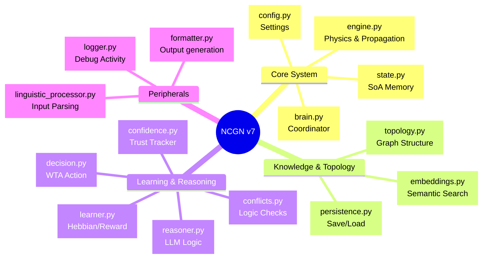

# NCGN v7 Codebase Analysis

## Architecture Mindmap

## Module Functional Analysis

This section details the responsibility, key functions, and dependencies of each module.

### Core System

#### `ncgn/brain.py` (Coordinator)
**Role:** The central executive that orchestrates the cognitive cycle. It integrates all other subsystems (System 1, System 2, Learning, I/O).
**Key Components:**
- `Brain` class: Initializes components (`engine`, `state`, `learner`, etc.).
- `active_tick()`: The main loop. Runs propagation, checks for learning, and eventually triggers System 2.
- Integration points: Holds references to all sub-modules.

#### `ncgn/engine.py` (Physics)
**Role:** Implements the "fast" System 1 dynamics. It treats concepts as physical nodes with energy that spreads, decays, and triggers activation.
**Key Features:**
- **Vectorized Operations:** Uses sparse matrix memory (via `state.py`) for high performance.
- **Phases:** Decay -> Propagation -> Normalization -> Activation -> Refractory Period.
- **Seizure Damping:** Global stability mechanism to prevent runaway excitation.

#### `ncgn/state.py` (Memory)
**Role:** Manages the low-level cognitive data using a Structure-of-Arrays (SoA) approach for cache efficiency.
**Key Data:**
- `activations`: `np.array` of current energy levels.
- `thresholds`: Dynamic firing thresholds per node.
- `adjacency`: Compressed Sparse Row (CSR) matrix for connection weights.
- `refractory_counters`: Tracks recovery time for neurons.

#### `ncgn/config.py` (Configuration)
**Role:** Centralized configuration dataclass.
**Key Settings:**
- Physics: `decay_delta`, `flow_alpha`.
- Capacity: `initial_capacity`, `expansion_factor`.
- Paths: `llm_model_path`, `database_path`.

### Knowledge & Topology

#### `ncgn/topology.py` (Graph Structure)
**Role:** Manages the graph topology (nodes and edges) using `rustworkx`.
**Key Components:**
- `GraphTopology` class: Main wrapper.
- `IndexRegistry`: Thread-safe mapping between string labels and integer indices.
- **Optimization:** Uses a `_dirty` flag to minimize expensive adjacency matrix synchronizations.

#### `ncgn/persistence.py` (Save/Load)
**Role:** Handles serialization and deserialization of the brain's state.
**Key Methods:**
- `save()`: Writes config (JSON), topology (JSON), state arrays (NPZ), and embeddings (NPY/NPZ).
- `load()`: Reconstructs the full brain object from disk.

#### `ncgn/embeddings.py` (Semantic Search)
**Role:** Provides semantic grounding using SentenceTransformers.
**Key Features:**
- **Lazy Loading:** Model loads only on first use.
- **Semantic Search:** Finds nearest neighbors for graph entry points.
- **Similarity:** Computes cosine similarity for edge weight initialization.

### Learning & Reasoning

#### `ncgn/learner.py` (Hebbian/Reward)
**Role:** Implements 3-Factor Hebbian Learning (Pre-synaptic * Post-synaptic * Reward).
**Key Components:**
- `HebbianLearner`: Updates weights of *existing* active synapses.
- `auto_learn()`: Creates new edges based on co-occurrence counts.
- `RewardModulator`: Calculates RPE (Reward Prediction Error).

#### `ncgn/reasoner.py` (LLM Logic)
**Role:** System 2 interface. Uses a local LLM (via `llama-cpp-python` + `instructor`) for structured reasoning.
**Capabilities:**
- `extract_knowledge()`: Text -> Triplets.
- `answer_query()`: Context -> Answer.
- `diagnose_anomaly()`: Agent-Action-Object analysis.
- **Safety:** Mock reasoner available for testing without LLM.

#### `ncgn/decision.py` (Action Selection)
**Role:** Deterministic decision making engine.
**Key Functions:**
- `select_action()`: Winner-Take-All selection of the most active concept.
- `decide_acceptance()`: Logic to accept/reject new knowledge based on conflict reports.

#### `ncgn/conflicts.py` (Logic Checks)
**Role:** Logical conflict detection.
**Types:**
- `HARD_REJECT`: Contradicts high-confidence fact.
- `CURIOSITY`: Contradicts medium-confidence fact.
- `ACCEPT`: No conflict or overrides low-confidence.

#### `ncgn/confidence.py` (Trust Tracker)
**Role:** Tracks the reliability of edges and nodes.
**Mechanism:** Confidence increases with repetition and decreases with decay (forgetting curve). Distinguishes between "training" data (robust) and "user" data (plastic).

### Peripherals

#### `ncgn/linguistic_processor.py` (Input Parsing)
**Role:** Dedicated module for translating raw text into structured graph updates.
**Method:** Uses LLM with a strict JSON system prompt. Includes "robustness patching" to fix common JSON errors from smaller models like TinyLlama.

#### `ncgn/formatter.py` (Output Generation)
**Role:** Translates the brain's mathematical state into natural language.
**Constraint:** Pure formatting; does not perform reasoning. Uses active concepts and decision state to generate a single-sentence response.

#### `ncgn/logger.py` (Debug Activity)
**Role:** Comprehensive event logging for debugging and visualization.
**Logs:** Ticks, Learning events (LTP/LTD), Input injections, and Game rewards.
