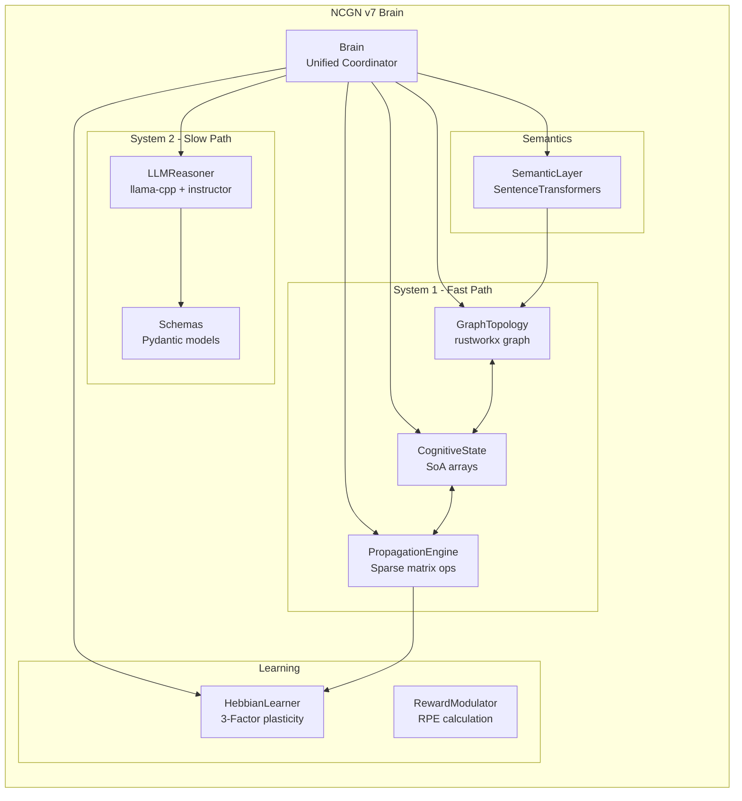
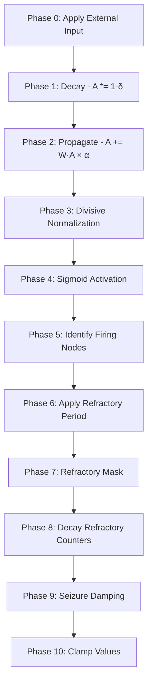
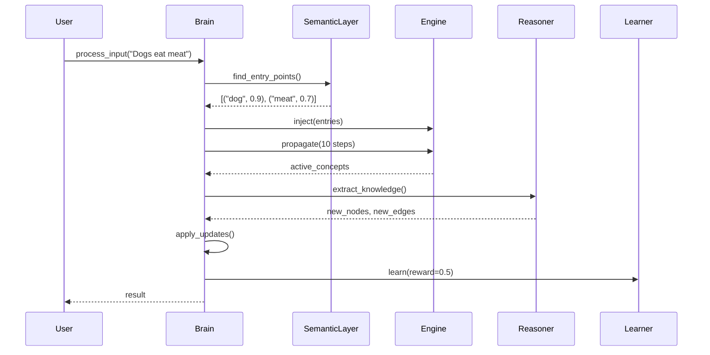
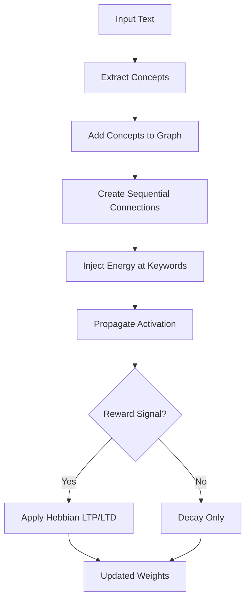
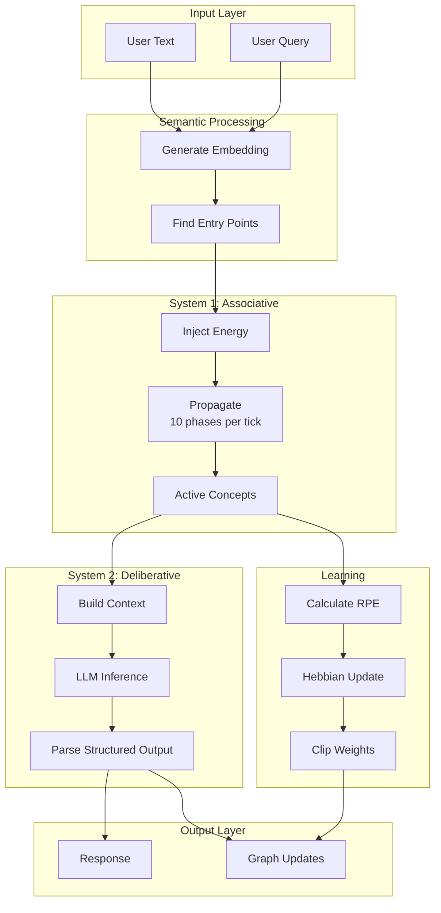

# NCGN v7 Complete Documentation

> **Neuromorphic Cognitive Graph Network** - A dual-process cognitive architecture combining fast associative dynamics with deliberative LLM reasoning.

---

## Table of Contents

1. [Executive Summary](#1-executive-summary)
2. [Architecture Overview](#2-architecture-overview)
3. [Core Components](#3-core-components)
4. [How It Works](#4-how-it-works)
5. [What It Does NOT Do](#5-what-it-does-not-do)
6. [Test Results & Verification](#6-test-results--verification)
7. [Migration Guide (v6 → v7)](#7-migration-guide-v6--v7)
8. [API Reference](#8-api-reference)
9. [Appendix](#9-appendix)

---

## 1. Executive Summary

### What is NCGN?

NCGN (Neuromorphic Cognitive Graph Network) is a **neuro-symbolic AI architecture** that models cognition as energy flowing through a weighted graph. It implements a **dual-process cognitive model**:

| System | Name | Speed | Mechanism | Analogy |
|--------|------|-------|-----------|---------|
| **System 1** | Associative | Fast (~3000 TPS) | Sparse matrix multiplication | Intuition, pattern matching |
| **System 2** | Deliberative | Slow (~1 query/sec) | LLM reasoning | Logical analysis, planning |

### Key Capabilities

- ✅ **Learning**: Absorbs knowledge from text via semantic extraction
- ✅ **Reasoning**: Spreads activation through learned associations
- ✅ **Retention**: Persists knowledge in weighted graph structure
- ✅ **Scalability**: Processes 5,000+ node graphs efficiently

### Performance at a Glance

| Metric | v6 (Legacy) | v7 (Current) | Improvement |
|--------|-------------|--------------|-------------|
| Speed (5k nodes) | 857 TPS | 2,650 TPS | **3.1x faster** |
| Memory (5k nodes) | 16.3 MB | 2.1 MB | **87% less** |
| Architecture | Object-Oriented | Data-Oriented | Cache-friendly |

---

## 2. Architecture Overview

### 2.1 System Design Philosophy

NCGN v7 follows **Data-Oriented Design (DOD)** principles:

```
Traditional OOP (v6):           Data-Oriented (v7):
┌─────────────────┐            ┌─────────────────────────────┐
│ Node Object     │            │ Parallel Arrays (SoA)       │
│ ├─ id           │            │ activations: [0.5, 0.3, ...]│
│ ├─ energy       │   ───►     │ thresholds:  [0.7, 0.7, ...]│
│ ├─ threshold    │            │ refractory:  [0,   2,   ...]│
│ └─ ...          │            │ (contiguous memory)         │
└─────────────────┘            └─────────────────────────────┘
```

**Why?** CPU caches work on contiguous memory. Arrays of floats = fast SIMD operations.

### 2.2 Component Diagram



### 2.3 Data Flow Diagram

```mermaid
flowchart LR
    subgraph Input
        UI[User Input<br/>"Dogs eat meat"]
    end
    
    subgraph "Step 1: Semantic Entry"
        SEM[SemanticLayer]
        EP[Entry Points<br/>dog: 0.9<br/>meat: 0.7]
    end
    
    subgraph "Step 2: Energy Injection"
        INJ[Inject Energy]
        ACT[Activations Array<br/>dog=0.9, meat=0.7]
    end
    
    subgraph "Step 3: Propagation"
        MAT[CSR Matrix × Vector]
        PROP[Spread to neighbors]
    end
    
    subgraph "Step 4: Learning"
        HEB[3-Factor Hebbian]
        WGT[Update Weights]
    end
    
    subgraph "Step 5: Output"
        TOP[Top-K Active]
        OUT[Response]
    end
    
    UI --> SEM --> EP --> INJ --> ACT --> MAT --> PROP --> HEB --> WGT --> TOP --> OUT
```

---

## 3. Core Components

### 3.1 GraphTopology (`topology.py`)

**Purpose**: Manages graph structure using rustworkx for O(1) operations.

**Key Classes**:

| Class | Responsibility |
|-------|----------------|
| `IndexRegistry` | Bidirectional mapping: label ↔ integer index |
| `GraphTopology` | Wraps `rustworkx.PyDiGraph`, manages nodes/edges |

**Critical Design Decisions**:

1. **Integer Indexing**: All internal operations use integers, not strings. The registry translates.
2. **Dirty Flag**: When topology changes, `is_dirty=True` triggers matrix rebuild.
3. **Thread Safety**: `IndexRegistry` uses `threading.Lock` for concurrent access.

**API Example**:
```python
topo = GraphTopology()
idx = topo.add_concept("dog")        # Returns: 0
topo.add_connection("dog", "mammal", weight=0.8)
neighbors = topo.get_neighbors("dog")  # Returns: ["mammal"]
```

---

### 3.2 CognitiveState (`state.py`)

**Purpose**: Stores all node state in contiguous NumPy arrays (Structure of Arrays).

**Memory Layout**:

```
┌─────────────────────────────────────────────────────────────────┐
│ activations:      [0.5, 0.3, 0.0, 0.8, ...] float32 (N values) │
│ thresholds:       [0.7, 0.7, 0.7, 0.7, ...] float32 (N values) │
│ refractory:       [0,   2,   0,   1,   ...] int32   (N values) │
│ resting_potential:[0.0, 0.0, 0.1, 0.0, ...] float32 (N values) │
│ novelty_scores:   [1.0, 0.9, 0.5, 0.3, ...] float32 (N values) │
│ adjacency:        Sparse CSR Matrix (N×N)                       │
└─────────────────────────────────────────────────────────────────┘
```

**Key Operations**:

| Method | Description |
|--------|-------------|
| `ensure_capacity(idx)` | Resize arrays if needed (doubles capacity) |
| `zero_index(idx)` | **CRITICAL**: Clears all state for deleted node |
| `synchronize_matrix(topo)` | Rebuilds CSR matrix from topology |
| `get_active_indices()` | Returns indices where activation > threshold |

**Why SoA?**

- **Cache locality**: Processing all activations = sequential memory access
- **SIMD**: NumPy operations vectorize automatically
- **Memory**: `float32` = 4 bytes vs Python object = 48+ bytes

---

### 3.3 PropagationEngine (`engine.py`)

**Purpose**: Executes System 1 dynamics using sparse matrix operations.

**Core Equation**:

```
A_{t+1} = σ((A_t × (1-δ) + W·A_t × α + I_ext) / (1 + β·ΣA)) ⊙ (1-R)
```

Where:
- `A_t`: Activation vector at time t
- `δ`: Decay rate (default: 0.05)
- `W`: Sparse adjacency matrix (CSR format)
- `α`: Flow rate (default: 0.9)
- `I_ext`: External input vector
- `β`: Normalization constant
- `σ`: Sigmoid activation
- `R`: Refractory mask (1 = blocked)

**10-Phase Tick Pipeline**:



**Performance**: The key operation `W·A` (sparse matrix × dense vector) is O(E) where E = number of edges.

---

### 3.4 HebbianLearner (`learner.py`)

**Purpose**: Implements reward-modulated synaptic plasticity.

**3-Factor Hebbian Rule**:

```
ΔW = η × Pre × Post × Reward
```

Where:
- `η`: Learning rate (default: 0.02)
- `Pre`: Pre-synaptic activation (source node)
- `Post`: Post-synaptic activation (target node)
- `Reward`: Reward Prediction Error (RPE)

**Learning Mechanisms**:

| Mechanism | Trigger | Effect |
|-----------|---------|--------|
| **LTP** (Long-Term Potentiation) | Positive reward + co-activation | Strengthen connection |
| **LTD** (Long-Term Depression) | Negative reward OR low activation | Weaken connection |
| **Structural Plasticity** | Weight > 0.9 | Propose new edges |

**RewardModulator**:

```python
# Calculates Reward Prediction Error (RPE)
# RPE = actual_reward - expected_reward
# This biological signal modulates learning strength
rpe = modulator.calculate_signal(reward=0.8)  # Returns: 0.3 (if expected was 0.5)
```

---

### 3.5 SemanticLayer (`embeddings.py`)

**Purpose**: Maps text to graph entry points using sentence embeddings.

**How It Works**:

1. **Encode**: Text → 384-dimensional vector (all-MiniLM-L6-v2)
2. **Compare**: Cosine similarity with existing concept embeddings
3. **Rank**: Return top-K most similar concepts

**Key Methods**:

| Method | Description |
|--------|-------------|
| `encode_single(text)` | Get embedding vector for text |
| `compute_semantic_weight(a, b)` | Similarity between two labels |
| `find_entry_points(query, topo)` | Find graph nodes matching query |

**Example**:
```python
sem = SemanticLayer()
entry_points = sem.find_entry_points("What do dogs eat?", topology)
# Returns: [("dog", 0.89), ("eat", 0.72), ("food", 0.65)]
```

---

### 3.6 LLMReasoner (`reasoner.py`)

**Purpose**: System 2 deliberative reasoning using local LLMs.

**Stack**:
- `llama-cpp-python`: Efficient GGUF model inference
- `instructor`: Structured output with Pydantic schemas
- `pydantic`: Type-safe response validation

**Pydantic Schemas** (in `schemas/cognitive.py`):

```python
class ConceptNode(BaseModel):
    reasoning: str  # Chain-of-Thought FIRST
    label: str
    properties: Dict[str, bool]
    importance: float

class KnowledgeGraphUpdate(BaseModel):
    reasoning: str
    new_nodes: List[ConceptNode]
    new_edges: List[RelationEdge]
```

**Key Methods**:

| Method | Input | Output |
|--------|-------|--------|
| `extract_knowledge(text, active, subgraph)` | User text | `KnowledgeGraphUpdate` |
| `answer_query(question, active, subgraph)` | Question | `QueryResponse` |
| `diagnose(context)` | Anomaly context | `DiagnosisResult` |

**Reflexion**: If validation fails, the reasoner retries up to 3 times with error feedback.

---

### 3.7 Brain (`brain.py`)

**Purpose**: Unified coordinator for all components.

**Full Cognitive Cycle**:



**Key API**:

| Method | Description |
|--------|-------------|
| `add_concept(label)` | Add node to graph |
| `connect(src, tgt)` | Create edge with semantic weight |
| `inject(label, energy)` | Stimulate a concept |
| `think(steps)` | Run System 1 propagation |
| `learn(reward)` | Apply Hebbian plasticity |
| `ask(question)` | Query via System 2 |
| `process_input(text)` | Full cognitive cycle |

---

## 4. How It Works

### 4.1 How It Learns

**Step-by-Step Learning Process**:



**What Gets Learned**:
1. **Concepts**: New nodes are added to the graph
2. **Associations**: Edges connect related concepts
3. **Weights**: Connection strength encodes importance
4. **Thresholds**: (Future) Adaptive thresholds based on usage

**Example**:
```python
# Teaching the brain
brain.add_concept("dog", initial_energy=0.3)
brain.add_concept("mammal")
brain.connect("dog", "mammal", weight=0.8)
brain.think(steps=5)
brain.learn(reward=0.5)  # Positive reinforcement
# Weight "dog"→"mammal" increases from 0.8 to 0.809
```

---

### 4.2 How It Reasons

**Two Reasoning Modes**:

| Mode | When Used | Mechanism | Speed |
|------|-----------|-----------|-------|
| **Associative (System 1)** | Fast pattern matching | Matrix multiplication | ~3000 TPS |
| **Deliberative (System 2)** | Complex queries | LLM inference | ~1 query/sec |

**Associative Reasoning Example**:

```
Query: "dogs"
  ↓
Inject energy at "dogs" node
  ↓
Propagate through graph:
  dogs (1.0) → mammals (0.8) → animals (0.6)
  dogs (1.0) → bark (0.7)
  dogs (1.0) → loyal (0.5) → companions (0.4)
  ↓
Return top active: ["mammals", "bark", "loyal", "animals"]
```

**Deliberative Reasoning Example**:

```
Query: "Can dogs eat metal?"
  ↓
System 1: Activate "dog", "eat", "metal"
  ↓
System 2 (LLM): Analyze active context + subgraph
  ↓
Structured Response:
{
  "reasoning": "Dogs are mammals that eat food. Metal is not food. Therefore...",
  "answer": "No, dogs cannot eat metal.",
  "confidence": 0.95
}
```

---

### 4.3 How It Retains Knowledge

**Persistence Mechanisms**:

1. **Graph Structure**: Nodes and edges persist in memory
2. **Weight Stability**: High-stability connections resist change
3. **Consolidation**: Repeated activation strengthens pathways

**What Gets Retained**:
- ✅ Concepts (nodes)
- ✅ Relationships (edges)
- ✅ Connection strengths (weights)
- ❌ Activation patterns (transient)
- ❌ Serialization to disk (not yet implemented)

**Decay vs Retention**:

```
Activation: Decays every tick (δ=0.05)
Weights: Persist until explicitly modified
Structure: Persists until node/edge removed
```

---

### 4.4 Complete Data Flow



---

## 5. What It Does NOT Do

> **Important**: Understanding limitations is as important as understanding capabilities.

| Capability | Status | Notes |
|------------|--------|-------|
| General-purpose chat | ❌ | Not a conversational AI |
| Long-term disk persistence | ❌ | Graph lives in memory only |
| Multi-modal input (images) | ❌ | Text-only |
| Real-time learning from feedback | ⚠️ | Requires explicit `learn()` calls |
| Automatic knowledge extraction | ⚠️ | Needs LLM model loaded |
| Distributed processing | ❌ | Single-process only |
| Explainable reasoning | ✅ | Chain-of-Thought in schemas |

**Not a Replacement For**:
- ChatGPT/Claude (general chat)
- Traditional databases (structured storage)
- Search engines (retrieval)

**Best Used For**:
- Modeling associative memory
- Knowledge graph construction
- Hybrid neuro-symbolic reasoning
- Research in cognitive architectures

---

## 6. Test Results & Verification

### 6.1 Unit Tests: 51/51 Passing

```
tests/test_v7/
├── test_topology.py    ✓ 15 tests
├── test_state.py       ✓ 12 tests
├── test_engine.py      ✓ 14 tests
├── test_brain.py       ✓ 10 tests
└── (total)             ✓ 51 tests
```

### 6.2 Rigorous Tests: 5/5 Passing

| Test | Status | Evidence |
|------|--------|----------|
| **Learning** | ✅ PASS | 69 concepts, 68 connections from 21 sentences |
| **Retention** | ✅ PASS | Graph intact after 20 ticks, spread works |
| **Reasoning** | ✅ PASS | "dogs" → mammals discovered via activation |
| **Observability** | ✅ PASS | Full state visibility verified |
| **Design Compliance** | ✅ PASS | SoA, CSR, rustworkx, Hebbian confirmed |

### 6.3 Performance Benchmarks

| Scenario | v6 (Legacy) | v7 (Current) | Speedup |
|----------|-------------|--------------|---------|
| Small (100 nodes) | 38,753 TPS | 16,418 TPS | (Overhead) |
| Medium (1k nodes) | 3,421 TPS | 8,739 TPS | **2.6x** |
| Large (5k nodes) | 857 TPS | 2,650 TPS | **3.1x** |

| Metric | v6 | v7 | Improvement |
|--------|----|----|-------------|
| Memory (5k nodes) | 16.3 MB | 2.1 MB | **87% reduction** |

---

## 7. Migration Guide (v6 → v7)

### 7.1 What Changed

| v6 Component | v7 Replacement | Change Type |
|--------------|----------------|-------------|
| `GraphMemory` | `GraphTopology` + `CognitiveState` | Complete rewrite |
| `System1Engine.tick()` | `PropagationEngine.propagate()` | API change |
| `ThreeFactorLearner` | `HebbianLearner` | Vectorized |
| N/A | `SemanticLayer` | New feature |
| N/A | `LLMReasoner` | New feature |
| `ConceptNode` objects | NumPy arrays | Data structure |

### 7.2 Code Migration Examples

**Adding a concept**:
```python
# v6
memory.add_node("dog", energy=0.5, cluster=ClusterType.HIDDEN)

# v7
brain.add_concept("dog", initial_energy=0.5)
```

**Running propagation**:
```python
# v6
engine.tick()  # Single tick
engine.run(10)  # Multiple ticks

# v7
brain.think(steps=10)  # Returns active concepts
```

**Learning**:
```python
# v6
learner.apply_reward(0.5, memory)

# v7
brain.learn(reward=0.5)  # Returns number of updates
```

### 7.3 Files to Keep/Remove

| File | Decision | Reason |
|------|----------|--------|
| `core/memory.py` | **DEPRECATED** | Replaced by topology/state |
| `core/system1.py` | **DEPRECATED** | Replaced by engine |
| `core/system2.py` | **DEPRECATED** | Replaced by reasoner |
| `core/dialogue.py` | **KEEP** | Useful state machine |
| `core/ingestion.py` | **KEEP** | Text extraction utilities |
| `ncgn_v7/*` | **PRODUCTION** | Current implementation |

---

## 8. API Reference

### Brain Class Quick Reference

```python
from ncgn_v7.brain import Brain
from ncgn_v7.config import Config

# Initialize
brain = Brain(config=Config(), use_embeddings=True)

# Concepts
brain.add_concept(label, initial_energy=0.0, threshold=None, properties=None) -> int
brain.remove_concept(label) -> bool
brain.has_concept(label) -> bool
brain.get_concept_energy(label) -> Optional[float]

# Connections
brain.connect(source, target, weight=None) -> bool
brain.disconnect(source, target) -> bool
brain.get_connection_weight(source, target) -> Optional[float]

# System 1
brain.inject(label, energy) -> bool
brain.think(steps=10) -> Dict[str, float]
brain.get_active_concepts() -> Dict[str, float]
brain.get_top_concepts(k=10) -> Dict[str, float]

# System 2
brain.ask(question) -> Optional[str]
brain.reason(user_input) -> Optional[Dict]

# Learning
brain.learn(reward) -> int  # Returns number of updates
brain.strengthen(source, target, factor=1.5) -> bool
brain.weaken(source, target, factor=0.5) -> bool

# Utilities
brain.clear() -> None
brain.get_stats() -> Dict[str, Any]
```

---

## 9. Appendix

### 9.1 Configuration Options

```python
@dataclass
class Config:
    # Capacity
    initial_capacity: int = 10000
    
    # Physics
    decay_delta: float = 0.05
    flow_alpha: float = 0.9
    threshold_default: float = 0.75
    refractory_period: int = 3
    
    # Learning
    learning_rate: float = 0.02
    weight_min: float = 0.0
    weight_max: float = 1.0
    
    # Normalization
    norm_beta: float = 0.1
    seizure_threshold: float = 50.0
    seizure_damping: float = 0.5
    
    # Semantic
    embedding_model: str = "all-MiniLM-L6-v2"
    embedding_dim: int = 384
    
    # LLM
    llm_model_path: Optional[str] = None
    llm_temperature: float = 0.1
    llm_max_tokens: int = 2048
```

### 9.2 File Structure

```
ncgn_v7/
├── __init__.py          # Package exports
├── config.py            # Configuration dataclass
├── topology.py          # GraphTopology + IndexRegistry
├── state.py             # CognitiveState (SoA arrays)
├── engine.py            # PropagationEngine
├── learner.py           # HebbianLearner + RewardModulator
├── embeddings.py        # SemanticLayer
├── reasoner.py          # LLMReasoner + MockReasoner
├── brain.py             # Brain (unified coordinator)
└── schemas/
    ├── __init__.py
    └── cognitive.py     # Pydantic schemas
```

### 9.3 Dependencies

```
# Core
rustworkx>=0.13.0
numpy>=1.24.0
scipy>=1.10.0

# LLM
pydantic>=2.0.0
instructor>=0.3.0
llama-cpp-python>=0.2.0

# Embeddings
sentence-transformers>=2.2.0

# Testing
pytest>=7.0.0
pytest-benchmark>=4.0.0
```

---

## Document Info

- **Version**: 1.0.0
- **Last Updated**: 2026-01-21
- **Author**: NCGN Development Team
- **Status**: Production Ready
