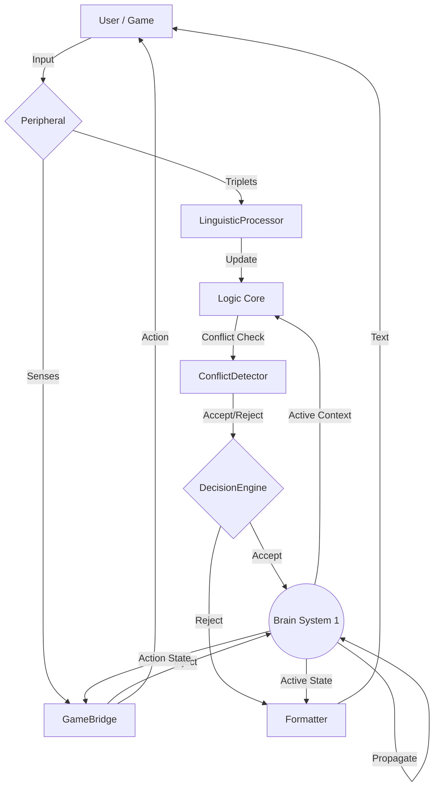

# NCGN v2.0 Architecture

**"Brain-First" Cognitive Graph Network**

NCGN v2.0 shifts from an LLM-centric design to a **Brain-Centric** design. The core logic is handled by graph dynamics (associative memory, spreading activation) and explicit logic modules, while the LLM is relegated to a peripheral role for linguistic translation.

## Core Components

### 1. Brain (`ncgn.brain.Brain`)
The central coordinator.
- **System 1 (Fast)**: `PropagationEngine` handles spreading activation.
- **System 2 (Logic)**: `ConflictDetector`, `DecisionEngine` handle rules and acceptance.
- **Learning**: `HebbianLearner` (3-Factor) handles plasticity.

### 2. Logic Core (New in v2.0)
Replaces the "LLM Reasoner" as the decision maker.
- **`DecisionEngine` (`ncgn.decision.py`)**: Uses Winner-Take-All and conflict heuristics to decide actions.
- **`ConflictDetector` (`ncgn.conflicts.py`)**: Checks if new information contradicts existing graph structure (e.g. "A is B" vs "A is NOT B").
- **`ConfidenceTracker` (`ncgn.confidence.py`)**: Assigns confidence scores to edges based on reinforcement history.

### 3. Peripherals (LLM)
The LLM is treated as a sensory organ for language.
- **`LinguisticProcessor`**: Parses raw text into Graph Triplets (Nodes/Edges) WITHOUT reasoning.
- **`NaturalLanguageFormatter`**: Translates internal Brain State (active concepts, integrity flags) into human-readable text.

### 4. Game Integration
- **`GameBrainBridge`**: Connects the Brain to external environments (Snake, Corridor).
- Relies on **Concept Injection** (Simulating senses by activating nodes) and **Action Readout** (Reading highest active action node).

## Data Flow (Cognitive Cycle)

1. **Input**: User text or Game observation.
2. **Translation**: `LinguisticProcessor` extracts triplets / `Bridge` injects sensory concepts.
3. **Association (System 1)**: `PropagationEngine` spreads energy to retrieve context.
4. **Logic (System 2)**: 
   - `ConflictDetector` verifies new triplets against context.
   - `DecisionEngine` accepts or rejects changes.
5. **Learning**: `HebbianLearner` updates weights based on reward/activity (Auto-Hebbian).
6. **Output**: `NaturalLanguageFormatter` generates text / `Bridge` executes game action.

## Cognitive Cycle Diagram

## Dashboard v2

- **Cytoscape.js**: Real-time graph visualization.
- **Live State**: WebSocket stream of activation levels.
- **Game Panel**: Integrated view of Game rendering + Brain activity.
