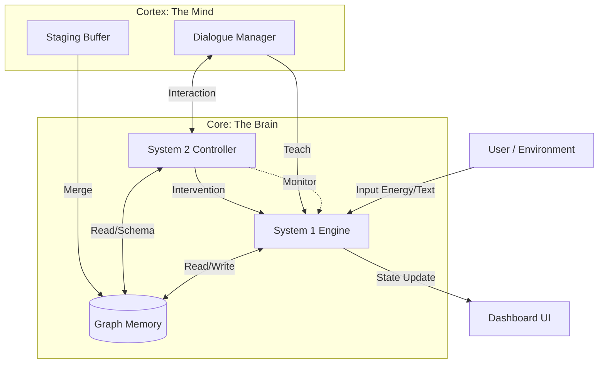

# NCGN Architecture Overview

**Neuromorphic Cognitive Graph Network (NCGN)** represents a hybrid cognitive architecture combining fast, reactive "System 1" processing (activation spreading) with slow, deliberative "System 2" reasoning (symbolic logic).

## Core Philosophy

The system mimics the dual-process theory of human cognition:
1.  **System 1 (Fast)**: An intuitive physics engine where "thoughts" are energy flowing through a graph. It is fast, parallel, and handles pattern matching and prediction.
2.  **System 2 (Slow)**: A logical controller that monitors System 1. It only wakes up when System 1 is "surprised" (prediction failure) to perform diagnosis and intervention.

## System Architecture

## Component Breakdown

### 1. Core (The "Hardware")
*Located in `core/`*

*   **GraphMemory (`memory.py`)**: The storage substrate. optimized for O(1) access.
    *   **ConceptNode**: Atomic unit of state. Has `energy` (membrane potential) and `threshold`.
    *   **Synapse**: Connector. Has `weight` (association strength) and `confidence` (truth value).
    *   **EventSchema**: Logic templates defining valid actions (e.g., "Eating requires edible targets").

*   **System 1 Engine (`system1.py`)**: The physics engine.
    *   Runs in discrete **ticks**.
    *   Executes an **8-Phase Pipeline** (Decay -> Fire -> Propagate -> Inhibit -> etc.).
    *   Calculates **Surprise** when observations contradict predictions.

*   **System 2 Controller (`system2.py`)**: The supervisor.
    *   Triggered when `Surprise > Threshold`.
    *   **Diagnoses** the cause (Constraint Violation, Missing Knowledge).
    *   **Plans Interventions** (Query user, weaken synapse, inject goal).

### 2. Cortex (The "Software/Mind")
*Located in `cortex/`*

*   **Dialogue Manager (`dialogue.py`)**: Manages conversation state.
    *   Handles the **Contradiction Loop**: Argumentation with the user to resolve conflicts.
    *   Tracks states: `IDLE` -> `PROCESSING` -> `CLARIFICATION_PENDING`.
    *   Learns from user proposals (Exceptions, New Subclasses).

*   **Staging Buffer (`staging.py`)**: The "Hippocampus".
    *   Intermediate buffer for file ingestion.
    *   Prevents knowledge pollution by verifying triples against System 2 schemas *before* committing to main memory.

### 3. UI (The Interface)
*Located in `ui/`*

*   **Brain Dashboard (`brain_dashboard.py`)**:
    *   Real-time visualization of the neural graph.
    *   Shows active nodes, energy levels, and surprise meter.
    *   Provides manual controls (Inject Energy, Step, Pause).

## The "Dog Eat Metal" Scenario

The canonical test case illustrating the architecture:

1.  **Prediction**: User activates "Dog". System 1 propagates energy: Dog -> Eats -> Meat. "Meat" is expected.
2.  **Surprise**: User introduces "Metal" instead. System 1 calculates high Surprise (Expected Meat, saw Metal).
3.  **Interrupt**: System 1 pauses. System 2 wakes up.
4.  **Diagnosis**: System 2 checks `schema_eat`. Metal is NOT audible. Violation detected.
5.  **Intervention**: System 2 generates a query: *"My physics say metal isn't edible."*
6.  **Resolution**: User explains *"It's a robot dog"*. Dialogue Manager learns `Robot Dog IS_A Dog` and creates an exception allowing Robot Dogs to eat Metal.
