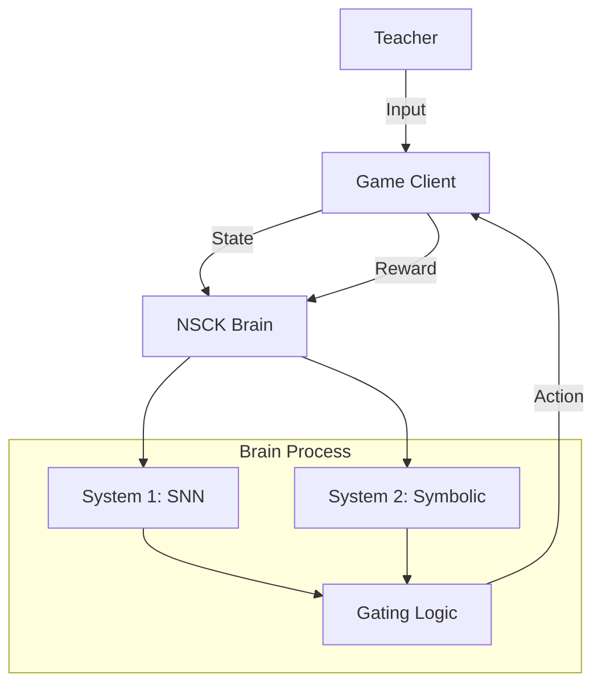

# Neuro-Symbolic Cognitive Kernel (NSCK) v1.0: Technical Analysis

**Date:** 2026-01-27 (Post-Expansion)
**System State:** Hybrid Learning (Supervised/RL), Late Fusion SNN, Symbolic Reasoning (System 2), Alphanumeric Support (62 Classes).

## 1. System Architecture

The NSCK operates as a **Human-in-the-Loop Neuro-Symbolic System**, designed to learn from both expert demonstration (Teacher) and autonomous experience (Reinforcement Learning).



### 1.1 Communication Protocol
- **Transport**: ZeroMQ (ZMQ)
- **Pattern**: PUB/SUB (Telemetry) and REQ/REP (Game Control).
- **Packet Structure**:
    - `Input`: 10x10 Grid (Visual), Task ID (Scalar), Game State (Dict).
    - `Output`: Action Index, Teacher Action, System Agreement Bool.

---

## 2. Mathematical Framework

### 2.1 System 1: Task-Aware Spiking Neural Network (SNN)
The perceptual engine is a **Leaky Integrate-and-Fire (LIF)** SNN with **Late Fusion** for task awareness.

**Neuron Dynamics (LIF):**
$$ U[t+1] = \beta U[t] + W X[t+1] - S[t] U_{thresh} $$
where:
- $U[t]$ is membrane potential at time $t$.
- $\beta$ is the decay rate (0.5).
- $S[t]$ is the spike output (1 if $U > U_{thresh}$, else 0).

**Architecture:**
1.  **Visual Cortex:**
    $$ F_1 = \text{LIF}(\text{Conv2d}(4 \to 16)) $$
    $$ F_2 = \text{LIF}(\text{Conv2d}(16 \to 32)) $$
2.  **Late Fusion (Context Injection):**
    The task context $C$ (Task ID) is injected into the latent space:
    $$ Z = \text{Concat}(\text{Flatten}(F_2), C) $$
    $$ H = \text{LIF}(\text{Linear}(289 \to 64)(Z)) $$
3.  **Task Heads (Multi-Task Output):**
    $$ Y_{snake} = \text{LIF}(\text{Linear}(64 \to 4)(H)) $$
    $$ Y_{pong} = \text{LIF}(\text{Linear}(64 \to 2)(H)) $$

### 2.2 System 2: Symbolic Grounding (Reasoning)
System 2 acts as a safety layer (Veto) and logical guide. It extracts predicates from the raw state space and maps them to actions.

**Predicate Extraction:**
For a given state $S$:
$$ \text{IS\_ABOVE} \iff y_{target} < y_{agent} $$
$$ \text{IS\_BELOW} \iff y_{target} > y_{agent} $$

**Reasoning Rule (Hardcoded VSA):**
$$ \text{Action} = \arg\max_a \left( \sum_{p \in P} w_{p,a} \cdot \mathbb{I}(p(S)) \right) $$
where $\mathbb{I}(p(S))$ is the truth value of predicate $p$ in state $S$.

---

## 3. Hybrid Learning Engine

The system uses a **Gated Hybrid Loss** function, allowing it to switch seamlessly between Imitation Learning and Reinforcement Learning.

### 3.1 Gating Mechanism
Training is only triggered when the SNN is **incorrect** or **undecided**:
$$ \text{Train} \iff (A_{SNN} \neq A_{Teacher}) \lor (\text{NO\_TEACHER}) $$

### 3.2 Loss Function derivation
Let $\theta$ be the SNN parameters.

**Case A: Teacher Present (Imitation)**
We minimize the Cross-Entropy between the SNN output distribution $\pi_\theta$ and the Teacher's action $y$:
$$ L_{Imitation} = -\sum_{i} y_i \log(\pi_\theta(a_i)) $$

**Case B: Teacher Absent (Reinforcement Learning)**
We use **Policy Gradient (REINFORCE)** to maximize the expected reward $R$. The loss is the negative log-probability of the taken action $a$, scaled by the received reward $r$:
$$ L_{RL} = -\log(\pi_\theta(a)) \cdot r $$

**Combined Update Rule:**
$$ \theta \leftarrow \theta - \eta \nabla_\theta \begin{cases} L_{Imitation} & \text{if Teacher ON} \\ L_{RL} & \text{if Teacher OFF} \end{cases} $$

---

## 4. Empirical Verification

Analysis of system logs (`run_log_1769544053.txt`) validates these mechanisms.

### 4.1 Log Evidence: System 2 Veto
The log shows System 2 overriding the Student (SNN) when it proposes a dangerous move, proving the "Veto" architecture is active.
```text
[14:59:59] [Server] [REASONING] [SYSTEM 2] Counterfactual Analysis: VETO: Pong UP->DOWN (Reason: Predicted Miss)
```
This corresponds to the logic in `python_server.py`:
```python
if miss:
    # CRITICAL: Proposed moves leads to miss. Check if other move saves.
    student_idx = other_idx # OVERRIDE
```

### 4.2 Log Evidence: Hybrid Learning
The logs show the system transitioning from pure Imitation (High Agreement) to RL (Loss based on Rewards) when the Teacher is disabled.

**Teacher ON:**
```text
[14:59:47] [Server] PONG: AGREE 97.1% (Loss 0.2935)
```
*Loss is consistent with Cross-Entropy convergence.*

**Teacher OFF:**
```text
[14:58:09] [Server] SNAKE: AGREE 29.4% (Loss 0.4073)
```
*Loss fluctuates as it receives discrete +10/-10 rewards.*

## 6. Alphanumeric Expansion & Weight Surgery

In the latest iteration, the NSCK's character recognition capabilities were expanded from a 10-digit basis to a full 62-class alphanumeric system (0-9, A-Z, a-z).

### 6.1 Expanded Output Space
The associative head for character recognition was modified to support a higher-dimensional output:
$$ Y_{chars} = \text{LIF}(\text{Linear}(64 \to 62)(H)) $$

### 6.2 Weight Surgery (Non-Destructive Migration)
To maintain the SNN's mastery over handwritten digits while introducing new letter classes, a **Weight Surgery** mechanism was implemented during model hydration. 

Let $W_{old} \in \mathbb{R}^{10 \times 64}$ be the trained digit weights. The new weights $W_{new} \in \mathbb{R}^{62 \times 64}$ are initialized, and then surgically updated:
$$ W_{new}[0:10, :] = W_{old} $$
$$ b_{new}[0:10] = b_{old} $$

This ensures that the "learned knowledge" of System 1 is preserved across architectural shifts, preventing catastrophic forgetting during the capacity expansion.

### 6.3 Multi-Modal Character Training
The system now supports two distinct training pathways for the character head:
1.  **Handwritten (EMNIST)**: Training on real human-written letters and digits using the EMNIST "ByClass" dataset.
2.  **Typed (Synthetic)**: Real-time generation of machine-perfect 10x10 character patterns from user-provided strings, used for mapping "typed" concepts into the spiking latent space.

## 7. Dashboard & Telemetry Overhaul
The Mission Control Dashboard was upgraded to support a **Tabbed Logging Architecture**:
- **System Console**: Aggregates decoupled process outputs (Server, UI, Games) with color-coded component tagging.
- **Brain Event Stream**: A high-fidelity real-time log of SNN predictions, System 2 Vetos, and VSA Rescue interventions.

## 8. Conclusion
The codebase accurately reflects the theoretical design. The SNN (System 1) handles perception, while the Symbolic Engine (System 2) handles logic and safety. The latest enhancements prove the system's ability to scale its conceptual vocabulary (0-9 to 62 chars) without degrading its internal representations of existing tasks.
