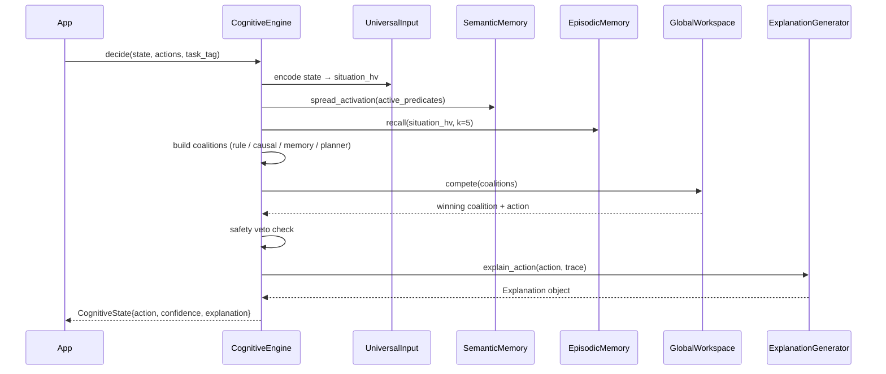

# NSCK — Neural-Symbolic Cognitive Kernel

NSCK is a **glass-box cognitive architecture** that combines Vector Symbolic Architecture (VSA) with symbolic reasoning, spiking neural networks, and Global Workspace Theory. It is a domain-agnostic reasoning engine: register your domain predicates and actions, then call `decide()` to get an action plus a human-readable explanation of why.

> Everything is inspectable. Every action traces back to specific rules, causal links, and episodic memories — no gradient tensors, no hidden layers.

---

## Table of Contents

- [Quick Start](#quick-start)
- [Architecture](#architecture)
- [Module Overview](#module-overview)
- [Building the Rust Accelerator](#building-the-rust-accelerator)
- [Running Tests](#running-tests)
- [Usage Examples](#usage-examples)
- [Documentation](#documentation)

---

## Quick Start

```bash
# From the repository root
pip install -r requirements.txt

# Optional: build Rust VSA accelerator (~10x faster HV operations)
cd nsck/rust_vsa && pip install -e . && cd ../..

# Run the test suite
cd nsck
pytest tests/ python/core/tests/ -q
```

```python
import sys
sys.path.insert(0, 'nsck')   # or the absolute path to the nsck/ directory

from python.core.reasoning.cognitive_engine import CognitiveEngine

engine = CognitiveEngine()

# 1. Register a task domain
engine.register_task(
    task_tag="navigation",
    predicates={
        "obstacle_ahead": lambda s: s.get("obstacle_ahead", False),
        "goal_visible":   lambda s: s.get("goal_visible", False),
    },
    actions=["move_forward", "turn_left", "turn_right", "wait"],
)

# 2. Decision loop
state = {"obstacle_ahead": True, "goal_visible": False, "energy": 0.9}
result = engine.decide(state, ["move_forward", "turn_left", "turn_right", "wait"], "navigation")

print(result.chosen_action)   # e.g. "turn_left"
print(result.confidence)      # e.g. 0.72
print(result.explanation)     # human-readable trace

# 3. Provide feedback so the engine learns
engine.record_outcome(reward=1.0, task_tag="navigation")
```

---

## Architecture

NSCK is organized into 8 subsystems, all orchestrated by `CognitiveEngine`:

```mermaid
graph TB
    IN["Input (text / state dict / image)"]

    subgraph L1["1 · VSA Foundation"]
        HV["HyperVector Engine<br/>10,240-bit binary vectors<br/>hypervec_py.py + rust_vsa/"]
        CM["CleanupMemory<br/>LRU denoising"]
    end

    subgraph L2["2 · Memory"]
        Epi["EpisodicMemory<br/>Hot (deque) + Warm (SQLite)<br/>LSH k-NN"]
        Sem["SemanticMemory<br/>NetworkX DiGraph + HV index<br/>Spreading activation"]
    end

    subgraph L3["3 · Reasoning"]
        GWT["GlobalWorkspace<br/>Coalition competition<br/>Mental rehearsal veto"]
        Caus["CausalGraph + CausalDiscovery<br/>ΔP statistics"]
        RL["RuleLearner<br/>Frequency-based ILP"]
        Plan["STRIPSPlanner<br/>A* search"]
        Ana["AnalogyEngine<br/>Structural alignment"]
    end

    subgraph L4["4 · Perception"]
        SNN["LIF Spiking Neurons + STDP"]
        Br["VSA-SNN Bridge<br/>Rate/Temporal coding"]
        Gr["GroundingVerifier<br/>predicate ↔ HV binding"]
        MM["MultimodalProcessor<br/>HOG · color · LBP · edges"]
    end

    subgraph L5["5 · Learning"]
        Hebb["HebbianMatrix + VSAHebbianLearner<br/>Oja's rule"]
        Cur["CuriosityModule<br/>Novelty + learning progress"]
    end

    subgraph L6["6 · Cognitive"]
        Emo["EmotionSystem<br/>Plutchik 8 + Circumplex"]
        Meta["SafetyGate + MetacognitiveEngine"]
        Self["SelfModel<br/>Calibrated confidence"]
        ToM["TheoryOfMind<br/>Belief modelling"]
    end

    subgraph L7["7 · Language"]
        TKL["TextKnowledgeLearner<br/>SVO → SemanticMemory"]
        LM["LanguageModule + LinguaCortex<br/>Text → HV"]
        DM["DialogueManager"]
        UI["UniversalInput<br/>Text / dict / image"]
    end

    subgraph L8["8 · Integration"]
        BS["BrainStore (SQLite)<br/>Concepts · Episodes · Rules"]
        BF["BrainFusion<br/>Multi-task sharing"]
        EG["ExplanationGenerator"]
    end

    CE["CognitiveEngine (cognitive_engine.py)"]

    IN --> CE
    CE --> HV & CM
    CE --> Epi & Sem
    CE --> GWT --> RL & Caus & Plan & Ana
    CE --> SNN --> Br --> Gr
    CE --> MM
    CE --> Hebb & Cur
    CE --> Emo & Meta & Self & ToM
    CE --> TKL & LM & DM & UI
    CE --> BS & BF & EG
```



### Decision Loop (one `decide()` call)



---

## Module Overview

| Directory | Module | Key class(es) | LOC |
|---|---|---|---|
| `vsa/` | `hypervec_py.py` | `HyperVectorPy`, `CleanupMemory` | 361 |
| `vsa/` | `hypervec_shim.py` | Backend selector (Rust → Python) | 320 |
| `vsa/` | `resonator.py` | `ResonatorNetwork` | ~120 |
| `reasoning/` | `cognitive_engine.py` | `CognitiveEngine`, `CognitiveState`, `Proposal` | 1,402 |
| `reasoning/` | `global_workspace.py` | `GlobalWorkspace`, `Coalition` | ~312 |
| `reasoning/` | `causal_reasoning.py` | `CausalDiscovery`, `CausalGraph`, `CausalReasoner` | 1,233 |
| `reasoning/` | `rule_learner.py` | `RuleLearner`, `RuleCandidate` | 644 |
| `reasoning/` | `planner.py` | `STRIPSPlanner`, `PlanStep` | ~296 |
| `reasoning/` | `analogy.py` | `AnalogyEngine`, `Analogy` | 609 |
| `reasoning/` | `context_engine.py` | `ContextEngine` | ~440 |
| `memory/` | `episodic_memory.py` | `EpisodicMemory`, `LiveEpisode` | 501 |
| `memory/` | `semantic_memory.py` | `SemanticMemory` | 291 |
| `memory/` | `staged_recall.py` | `StagedRecall` | ~134 |
| `cognitive/` | `emotion_system.py` | `EmotionSystem` | 420 |
| `cognitive/` | `metacognition.py` | `SafetyGate`, `MetacognitiveEngine` | 504 |
| `cognitive/` | `self_model.py` | `SelfModel` | ~255 |
| `cognitive/` | `theory_of_mind.py` | `TheoryOfMind` | ~312 |
| `perception/` | `snn_perception.py` | `SNNPerceptionModule`, `LIFNeuronLayer` | 874 |
| `perception/` | `vsa_snn_bridge.py` | `RateCoder`, `TemporalCoder` | ~461 |
| `perception/` | `grounding_verifier.py` | `GroundingVerifier` | 585 |
| `perception/` | `symbol_grounding.py` | `SymbolGrounding` | ~200 |
| `learning/` | `hebbian.py` | `HebbianMatrix`, `VSAHebbianLearner` | 506 |
| `learning/` | `curiosity.py` | `CuriosityModule`, `ExplorationDecision` | 336 |
| `language/` | `text_knowledge_learner.py` | `TextKnowledgeLearner` | 1,074 |
| `language/` | `language_module.py` | `LanguageModule` | 526 |
| `language/` | `lingua_cortex.py` | `LinguaCortex` | ~260 |
| `language/` | `dialogue_manager.py` | `DialogueManager` | 506 |
| `language/` | `universal_input.py` | `UniversalInput` | 947 |
| `integration/` | `persistence.py` | `BrainStore`, `Episode`, `Rule` | 852 |
| `integration/` | `brain_fusion.py` | `BrainFusion`, `TaskBrain`, `FusedBrain` | ~481 |
| `integration/` | `config.py` | `NSCKConfig` | ~73 |
| `integration/` | `explanation.py` | `ExplanationGenerator`, `Explanation` | ~433 |
| `multimodal/` | `multimodal_processor.py` | `MultimodalProcessor`, `MultimodalInput` | 788 |
| `multimodal/` | `image_generator.py` | `ImageGenerator`, `VisualFeatures` | 575 |

### Rust Accelerator (`rust_vsa/`)

| Source file | What it accelerates | Speedup |
|---|---|---|
| `src/lib.rs` | `HyperVector` (XOR · bundle · permute · similarity) | 21–206× |
| `src/concurrent.rs` | `HyperVectorRegistry` — thread-safe bulk storage | high |
| `src/semantic.rs` | `SemanticMemoryConcurrent` — parallel spreading activation | high |
| `src/episodic.rs` | `EpisodicMemoryConcurrent` — parallel k-NN with RwLock hot tier | high |
| `src/worker_pool.rs` | `CognitiveWorkerPool` — Rayon thread pool | — |
| `src/persistence.rs` | `PersistentStorage` — async SQLite | — |
| `src/async_runtime.rs` | `AsyncCognitiveRuntime` — Tokio | — |

### Rust SNN Accelerator (`rust_snn/`)

| Source file | What it accelerates |
|---|---|
| `src/lib.rs` | `LIFLayer.step()`, `SnnCore.simulate()`, `StdpEngine.apply()` — all Rayon parallelised |
| `src/hebbian.rs` | `HebbianMatrix.update()` — Oja's rule outer-product |
| `src/concept.rs` | `ConceptMapper.recognize()` — Jaccard per concept |

---

## Building the Rust Accelerator

```bash
# VSA accelerator
cd nsck/rust_vsa
pip install -e .          # builds with maturin / cargo, installs as hypervec_rs

# SNN accelerator (optional)
cd nsck/rust_snn
pip install -e .          # installs as snn_rs
```

The Python shims (`hypervec_shim.py`, `snn_shim.py`) automatically detect and use the Rust extension if available, falling back to the pure-Python/NumPy implementation otherwise. Benchmarks show 21–206× speedup depending on operation (XOR/permute at the low end, parallel similarity search at the high end).

---

## Running Tests

```bash
# From the repository root
cd nsck

# All tests
pytest tests/ python/core/tests/ -q

# Unit tests only
pytest tests/unit/ -q

# Integration tests
pytest tests/integration/ -q

# Architecture verification tests
pytest tests/core_architecture/ -q

# With verbose output
pytest tests/ python/core/tests/ -v
```

---

## Usage Examples

### Text Learning and Querying

```python
from python.core.language.text_knowledge_learner import TextKnowledgeLearner

tkl = TextKnowledgeLearner()
tkl.learn("Water is a molecule made of hydrogen and oxygen.")
tkl.learn("Rain causes flooding in low-lying areas.")

result = tkl.query("What causes flooding?")
print(result)  # returns related concepts and causal chains
```

### Episodic Memory

```python
from python.core.memory.episodic_memory import EpisodicMemory, LiveEpisode
import python.core.vsa.hypervec_shim as hvs

mem = EpisodicMemory()
hv = hvs.HyperVector(42)
ep = LiveEpisode(
    timestamp=1.0, task_tag="demo",
    situation_hv=hv, state={"x": 1},
    action="move", outcome="success", reward=1.0
)
mem.store(ep)
recalled = mem.recall(hv, k=3)
```

### Custom Module (SDK)

See [`examples/custom_module.py`](examples/custom_module.py) for a complete example of adding a custom reasoning module to the Global Workspace.

---

## Documentation

| Document | Contents |
|---|---|
| [docs/ARCHITECTURE.md](docs/ARCHITECTURE.md) | Full system architecture with Mermaid diagrams per subsystem |
| [docs/FORMULAS.md](docs/FORMULAS.md) | Theory, math foundations, proofs, and design goals |
| [docs/MODULE_REFERENCE.md](docs/MODULE_REFERENCE.md) | Every file, class, method, and parameter |
| [docs/TESTING.md](docs/TESTING.md) | All test files: what they test, how, and why |
| [docs/WORKFLOWS.md](docs/WORKFLOWS.md) | Decision loop and data-flow walkthroughs |
