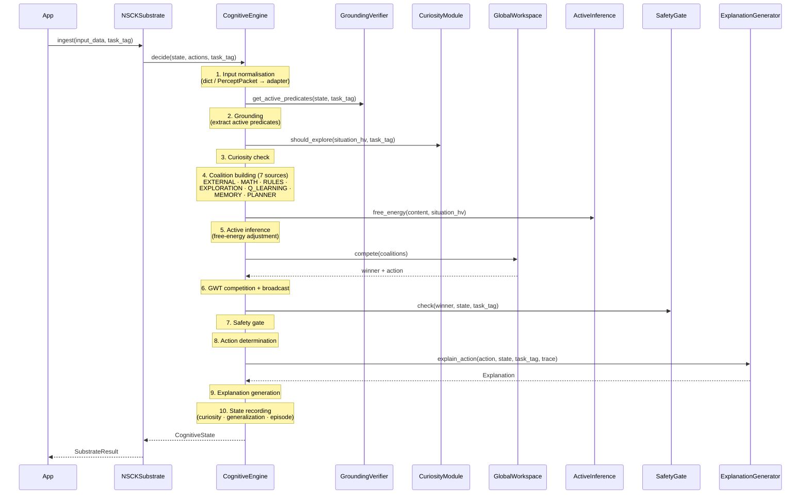

```mermaid
graph TB
    IN["Input (text / dict / image / audio / video)"]

    subgraph L0["Layer 0 · Substrate"]
        HV["HyperVector Engine<br/>10,240-bit binary vectors<br/>hypervec_py.py + rust_vsa/"]
        FHRR["FHRR Phasor VSA<br/>Complex-valued binding"]
        CM["CleanupMemory<br/>LRU denoising"]
    end

    subgraph L1["Layer 1 · Perception"]
        SI["SignalIngestor<br/>Raw signal pre-processing"]
        UHE["UniversalHVEncoder<br/>Multi-modal → HV + stats"]
        SNN["LIF Spiking Neurons + STDP"]
        Br["VSA-SNN Bridge<br/>Rate/Temporal coding"]
        AD["10 Adapters<br/>text · image · audio · video<br/>numeric · dict · SNN · stream"]
    end

    subgraph L2["Layer 2 · Memory"]
        Sem["SemanticMemory<br/>NetworkX graph + HV index"]
        Epi["EpisodicMemory<br/>Hot (deque) + Warm (SQLite)"]
        Proc["ProceduralMemory<br/>Skill cache for fast-path"]
        XM["CrossModalAssociativeMemory<br/>Bind entities across modalities"]
    end

    subgraph L3["Layer 3 · Reasoning"]
        GWT["GlobalWorkspace<br/>Coalition competition<br/>KLE uncertainty"]
        Caus["CausalGraph + CausalDiscovery<br/>ΔP statistics"]
        RL["RuleLearner<br/>Frequency-based ILP"]
        Plan["STRIPSPlanner<br/>A* search"]
        Ana["AnalogyEngine<br/>Structural alignment"]
        Sp["SpatialReasoner · MathReasoner"]
    end

    subgraph L4["Layer 4 · Learning"]
        Hebb["HebbianMatrix<br/>Oja's rule"]
        Cur["CuriosityModule<br/>Novelty + learning progress"]
        AI["ActiveInferenceLearner<br/>Free-energy adjustment"]
        CF["ConformalWrapper<br/>Calibrated uncertainty bounds"]
        PG["PatternGeneralizer"]
    end

    subgraph L5["Layer 5 · Language"]
        NLU["NgramNLU<br/>Naive Bayes intent + entity"]
        CG["ConstructionGrammar<br/>71 constructions"]
        NLG["FluentNLG + NLGEngine"]
        DM["DialogueManager"]
        TKL["TextKnowledgeLearner<br/>SVO → SemanticMemory"]
    end

    subgraph L6["Layer 6 · Executive"]
        Meta["MetacognitiveEngine + SafetyGate"]
        Self["SelfModel<br/>Calibrated confidence"]
        ToM["TheoryOfMind<br/>Belief modelling"]
        SV["SafetyVerifier<br/>Declarative safety properties"]
        Emo["EmotionSystem<br/>Plutchik 8 + Circumplex"]
    end

    SUB["NSCKSubstrate (substrate.py)"]
    CE["CognitiveEngine"]

    IN --> SUB --> CE
    CE --> HV & FHRR & CM
    CE --> SI --> UHE --> AD
    CE --> SNN --> Br
    CE --> Sem & Epi & Proc & XM
    CE --> GWT --> Caus & RL & Plan & Ana & Sp
    CE --> Hebb & Cur & AI & CF & PG
    CE --> NLU & CG & NLG & DM & TKL
    CE --> Meta & Self & ToM & SV & Emo
```

# NSCK — Neuro-Symbolic Cognitive Kernel

> A glass-box cognitive architecture combining Vector Symbolic Architecture (VSA),
> symbolic reasoning, spiking neural networks, and Global Workspace Theory.

NSCK is a domain-agnostic reasoning engine. Register your domain predicates and
actions, call `ingest()` or `decide()`, and receive an action together with a
human-readable explanation of *why* it was chosen. Every decision traces back to
specific rules, causal links, and episodic memories — no gradient tensors, no
hidden layers.

**Current release: V4 (V3–V18 Consolidated)** — 1,669 tests passing (Rust backend active). Zero regressions vs. V3 baseline.

---

## Table of Contents

1. [Installation](#installation)
2. [Architecture](#architecture)
3. [Decision Loop](#decision-loop)
4. [Module Reference](#module-reference)
5. [NSCKSubstrate API](#nscksubstrate-api)
6. [Configuration](#configuration)
7. [Performance Benchmarks](#performance-benchmarks)
8. [Rust Backend](#rust-backend)
9. [Testing](#testing)
10. [V4 Features — VSA-NLU, KnowledgeSeeder, LSH Memory & Rust Default-On](#v4-features--vsa-nlu-knowledgeseeder-lsh-memory--rust-default-on)
11. [V16 Features — Security, EWC, Eval Suite & Seeding](#v16-features--security-ewc-eval-suite--seeding)
12. [V15 Features — Model Transplantation](#v15-features--model-transplantation)
13. [V14 Features](#v14-features)
14. [V13 Features](#v13-features)
15. [Further Documentation](#further-documentation)

---

## Installation

```bash
# From the repository root
pip install -r requirements.txt

# Recommended: build Rust backends (strongly recommended — 6–76× speedup)
pip install maturin
cd nsck/rust_vsa && maturin develop --release && cd ../..
cd nsck/rust_snn && maturin develop --release && cd ../..

# Verify Rust is active
NSCK_USE_RUST=1 python nsck/scripts/verify_rust.py

# Run the full test suite with Rust
NSCK_USE_RUST=1 python -m pytest nsck/tests/ -q

# Or use the Makefile (does all of the above):
cd nsck && make test-full
```

The Python shims (`vsa/hypervec_shim.py`, `perception/snn_shim.py`)
automatically detect the compiled extensions at import time and fall back to the
pure-Python/NumPy implementation when they are absent.

---

## Architecture

NSCK is organized into **7 layers** (Layer 0 – Layer 6). The public entry point
is `NSCKSubstrate` (`python/core/substrate.py`), which delegates to
`CognitiveEngine` (`python/core/reasoning/cognitive_engine.py`).

```
┌─────────────────────────────────────────────────────────────────┐
│  Layer 6 · Executive                                            │
│  Metacognition · SelfModel · TheoryOfMind · SafetyVerifier      │
├─────────────────────────────────────────────────────────────────┤
│  Layer 5 · Language                                             │
│  Parser · ConstructionGrammar · NgramNLU · FluentNLG · Dialogue │
├─────────────────────────────────────────────────────────────────┤
│  Layer 4 · Learning                                             │
│  Hebbian · Q-learning · RuleInduction · ActiveInference         │
│  Curiosity · ConformalWrapper · PatternGeneralizer               │
├─────────────────────────────────────────────────────────────────┤
│  Layer 3 · Reasoning                                            │
│  Causal · Rules · Planning · Analogy · Spatial · Math           │
│  Counterfactual · AttentionGWT · BeliefRevision                 │
├─────────────────────────────────────────────────────────────────┤
│  Layer 2 · Memory                                               │
│  Semantic · Episodic · Procedural · CrossModal                  │
│  ConceptDriftDetector · Homeostasis · StagedRecall              │
├─────────────────────────────────────────────────────────────────┤
│  Layer 1 · Perception                                           │
│  10 adapters · SignalIngestor · UniversalHVEncoder · SNN        │
├─────────────────────────────────────────────────────────────────┤
│  Layer 0 · Substrate                                            │
│  VSA Engine (10,240-bit HVs) · GWT Workspace · Dual Process     │
└─────────────────────────────────────────────────────────────────┘
```



---

## Decision Loop

Each call to `CognitiveEngine.decide()` executes a 10-step pipeline:



### Step Details

| # | Step | Key call | Description |
|---|------|----------|-------------|
| 1 | **Input normalisation** | adapter dispatch | Converts raw input (dict, string, ndarray, `PerceptPacket`) to the internal representation via the matching adapter |
| 2 | **Grounding** | `GroundingVerifier.get_active_predicates()` | Extracts the set of symbolic predicates that are true in the current state |
| 3 | **Curiosity check** | `CuriosityModule.should_explore()` | Decides exploration vs. exploitation based on novelty and learning progress |
| 4 | **Coalition building** | 7 proposal sources | Builds competing proposals: `EXTERNAL` (meta/SNN), `MATH` (math query detection), `RULES` (applicable rules + neural scorer), `EXPLORATION`, `Q_LEARNING`, `MEMORY` (case-based episodic recall), `PLANNER` (STRIPS A* planning) |
| 5 | **Active inference** | `ActiveInferenceLearner.free_energy()` | Adjusts coalition saliences by expected free energy |
| 6 | **GWT competition** | `GlobalWorkspace.compete()` | Winner-take-all selection with KLE uncertainty; dual-process fast path if System 1 confidence ≥ threshold |
| 7 | **Safety gate** | `SafetyGate` / `SafetyVerifier` | Veto check — critical violations always block the chosen action |
| 8 | **Action determination** | — | Extracts the final action from the winning coalition |
| 9 | **Explanation** | `ExplanationGenerator.explain_action()` | Produces a human-readable trace referencing rules, causal links, and memories |
| 10 | **State recording** | curiosity, generalization, episode store | Records the experience; triggers `build_prototypes()`, `infer_transitive()`, and `auto_discover_abstractions()` on schedule |

---

## Module Reference

All source modules live under `python/core/`. Paths below are relative to that
directory.

### `vsa/` — Vector Symbolic Architecture (7 modules)

| Module | Key classes | Description |
|--------|------------|-------------|
| `hypervec_py.py` | `HyperVectorPy`, `CleanupMemory` | Pure-Python 10,240-bit binary HVs (XOR bind, majority bundle, permute, negate) |
| `hypervec_shim.py` | `HyperVector` | Backend selector: Rust → Python fallback |
| `universal_hv_encoder.py` | `UniversalHVEncoder` | Multi-modal encoding with per-encode statistics (V13) |
| `resonator.py` | `ResonatorNetwork` | Resonator-based factorization of bundled HVs |
| `fhrr.py` | `FHRRVector`, `FHRRMemory` | Complex-valued phasor VSA with exact binding inverse |
| `vsa_embedding_bridge.py` | `EmbeddingVSABridge` | Dense embedding ↔ binary HV projection |
| `rust_concurrent_shim.py` | `SemanticMemoryConcurrent`, `EpisodicMemoryConcurrent`, `CognitiveWorkerPool` | Rayon-parallel memory; Python fallback |

### `perception/` — Perception (8 modules)

| Module | Key classes | Description |
|--------|------------|-------------|
| `signal_ingestor.py` | `SignalIngestor` | Pre-processing raw signals before encoding (V13) |
| `snn_perception.py` | `SNNPerceptionModule`, `LIFNeuronLayer` | Spiking neural network perception layer |
| `snn_shim.py` | — | Rust ↔ Python SNN backend selector |
| `snn_integration.py` | — | SNN integration utilities |
| `vsa_snn_bridge.py` | `RateCoder`, `TemporalCoder` | Bridge between VSA and SNN representations |
| `grounding_verifier.py` | `GroundingVerifier` | Predicate ↔ HV binding verification |
| `symbol_grounding.py` | `SymbolGrounding` | Symbol grounding from sensory input |
| `stream_encoder.py` | `TimeSeriesEncoder`, `StreamBuffer` | FPE-based time series encoding |

### `memory/` — Memory Systems (7 modules)

| Module | Key classes | Description |
|--------|------------|-------------|
| `semantic_memory.py` | `SemanticMemory` | NetworkX DiGraph + HV index, spreading activation, NSW ANN, prototypes, transitive inference |
| `episodic_memory.py` | `EpisodicMemory`, `LiveEpisode` | Hot (deque) + warm (SQLite), LSH k-NN recall |
| `procedural_memory.py` | `ProceduralMemory` | Skill cache for fast-path decisions (V13) |
| `cross_modal_associative_memory.py` | `CrossModalAssociativeMemory` | Bind entities across modalities (V13) |
| `homeostasis.py` | `MemoryHomeostasis` | Memory capacity regulation |
| `staged_recall.py` | `StagedRecall` | Multi-stage memory recall pipeline |
| `concept_drift_detector.py` | `ConceptDriftDetector` | Monitor semantic stability over time (V13) |

### `reasoning/` — Reasoning (14 modules)

| Module | Key classes | Description |
|--------|------------|-------------|
| `cognitive_engine.py` | `CognitiveEngine`, `CognitiveState`, `Proposal` | Central orchestrator; implements the 10-step `decide()` loop |
| `global_workspace.py` | `GlobalWorkspace`, `Coalition` | GWT coalition competition with KLE uncertainty |
| `causal_reasoning.py` | `CausalDiscovery`, `CausalGraph`, `CausalReasoner` | ΔP causal statistics |
| `causal_interface.py` | `CausalInterface` | Abstract causal reasoning interface |
| `causal_service_impl.py` | `CausalServiceImpl` | Causal service implementation |
| `causal_rule_auditor.py` | `CausalRuleAuditor` | Audit causal rules for consistency (V13) |
| `rule_learner.py` | `RuleLearner`, `RuleCandidate` | Frequency-based inductive logic programming |
| `planner.py` | `STRIPSPlanner`, `PlanStep` | A* STRIPS planning |
| `analogy.py` | `AnalogyEngine`, `Analogy`, `blend()` | Structural alignment and conceptual blending |
| `belief_revision.py` | `BeliefMetadata`, `BeliefScorer` | AGM-style belief revision |
| `context_engine.py` | `ContextEngine` | Context tracking and management |
| `math_reasoning.py` | `MathReasoner`, `FPECodebook`, `LinearSolver` | Symbolic math reasoning |
| `spatial_reasoning.py` | `SpatialReasoner`, `PositionCodebook` | FPE bit-flip encoding, 8 spatial relations |
| `attention_gwt_bridge.py` | `MultiHeadAttentionGWT`, `GWTAttentionBridge` | Multi-head attention for coalition re-weighting |

### `learning/` — Learning (10 modules)

| Module | Key classes | Description |
|--------|------------|-------------|
| `hebbian.py` | `HebbianMatrix`, `VSAHebbianLearner` | Oja's rule Hebbian learning |
| `curiosity.py` | `CuriosityModule`, `ExplorationDecision` | Novelty + learning progress exploration |
| `active_inference.py` | `ActiveInferenceLearner` | Free-energy minimisation (MIN_TEMP=0.1, MAX_TEMP=5.0) |
| `conformal_wrapper.py` | `ConformalWrapper` | Calibrated uncertainty bounds (V13) |
| `pattern_generalizer.py` | `PatternGeneralizer` | Generalise patterns from examples (V13) |
| `rule_neural_scorer.py` | `RuleNeuralScorer`, `RuleFeaturizer` | Online perceptron rule ranking |
| `cross_domain.py` | `TransferEngine`, `SchemaExtractor`, `RuleLifter` | Cross-domain transfer learning |
| `cross_modal.py` | — | Cross-modal learning utilities |
| `meta_learning.py` | — | Meta-learning strategies |
| `continual_learning.py` | — | Continual / lifelong learning |

### `language/` — Language (20 modules)

| Module | Key classes | Description |
|--------|------------|-------------|
| `parser.py` | `Parser` | Syntactic parsing |
| `language_module.py` | `LanguageModule` | Core language processing module |
| `lingua_cortex.py` | `LinguaCortex` | Text → HV encoding |
| `universal_input.py` | `UniversalInput` | Text / dict / image / audio unified input |
| `text_knowledge_learner.py` | `TextKnowledgeLearner` | SVO extraction → SemanticMemory |
| `construction_grammar.py` | `ConstructionMatcher` | 71 constructions (negation, temporal, conditional) |
| `frame_semantics.py` | `FrameLibrary`, `Frame` | FrameNet-style frame semantics |
| `coreference.py` | `EntityRegister`, `EntityMention` | Coreference resolution |
| `ngram_nlu.py` | `NgramNLU` | Naive Bayes intent classifier + entity extractor |
| `pos_tagger.py` | `BrillPosTagger` | 300+ lexicon, 8 suffix rules |
| `pragmatics.py` | `PragmaticEngine` | 15 Horn scales, 7 speech acts, Gricean maxims |
| `semantic_roles.py` | `SemanticRoleLabeler`, `SRLFrame` | Semantic role labelling |
| `distributional_semantics.py` | `DistributionalCodebook` | Distributional word vectors with built-in corpus |
| `nlg.py` | `StructuralRealizer`, `DiscoursePlanner`, `NLGEngine` | Template-based NLG |
| `fluent_nlg.py` | `FluentResponseComposer`, `NSCKResponseEngine` | Fluent natural language generation |
| `dialogue_manager.py` | `DialogueManager` | Multi-turn dialogue with state tracking |
| `hf_corpus_loader.py` | `HFCorpusLoader` | HuggingFace FineWeb loader (offline fallback) |
| `vsa_language_module.py` | — | VSA-based language operations |
| `compositional_semantics_backup.py` | — | Compositional semantics (backup) |
| `control.py` | — | Language generation control |

### `cognitive/` — Executive / Cognitive (5 modules)

| Module | Key classes | Description |
|--------|------------|-------------|
| `metacognition.py` | `SafetyGate`, `MetacognitiveEngine` | Confidence monitoring + safety veto |
| `self_model.py` | `SelfModel` | Calibrated self-confidence model |
| `theory_of_mind.py` | `TheoryOfMind` | Agent belief modelling |
| `emotion_system.py` | `EmotionSystem` | Plutchik 8 primary + Circumplex valence-arousal |
| `safety_verifier.py` | `SafetyRuleVerifier`, `SafetyGateVerifier`, `SafetyProperty` | Declarative safety properties; critical violations always block |

### `adapters/` — Modality Adapters (10 modules)

| Module | Key classes | Description |
|--------|------------|-------------|
| `text_adapter.py` | `TextAdapter` | Text input → HV |
| `image_adapter.py` | `ImageAdapter` | Spatial-grid + colour histogram + Sobel FPE (65 dims) |
| `audio_adapter.py` | `AudioAdapter` | MFCC + spectral FPE (23 dims) |
| `video_adapter.py` | `VideoAdapter` | Video frame processing (V13) |
| `numeric_adapter.py` | `NumericAdapter` | Scalar numeric → HV |
| `numeric_sequence_adapter.py` | `NumericSequenceAdapter` | FPE + statistical predicates |
| `dict_state_adapter.py` | `DictStateAdapter` | Dict state → HV |
| `snn_adapter.py` | `SNNAdapter` | SNN spike-train input |
| `multimodal_fuser.py` | `MultimodalFuser` | VSA bundle fusion of modalities |
| `stream_processor.py` | `StreamProcessor`, `StreamVerifier` | Streaming input processing |

### `integration/` — Integration (5 modules)

| Module | Key classes | Description |
|--------|------------|-------------|
| `config.py` | `NSCKConfig` | 30+ feature flags, 4 factory presets |
| `persistence.py` | `BrainStore`, `Episode`, `Rule` | SQLite persistence layer |
| `brain_fusion.py` | `BrainFusion`, `TaskBrain`, `FusedBrain` | Multi-task knowledge sharing |
| `explanation.py` | `ExplanationGenerator`, `Explanation` | Human-readable decision explanations |
| `knowledge_integration.py` | — | Knowledge integration utilities |

### `types/` — Type Definitions (2 modules)

| Module | Key classes | Description |
|--------|------------|-------------|
| `percept_packet.py` | `PerceptPacket` | Unified V9 percept format |
| `modality_adapter.py` | `ModalityAdapter` | Abstract adapter interface |

### `multimodal/` — Multimodal Processing (2 modules)

| Module | Key classes | Description |
|--------|------------|-------------|
| `multimodal_processor.py` | `MultimodalProcessor`, `ConcurrentMultimodalProcessor` | Feature extraction: HOG, colour, LBP, edges |
| `image_generator.py` | `ImageGenerator`, `VisualFeatures` | Image feature generation |

### Other

| Path | Description |
|------|-------------|
| `substrate.py` | `NSCKSubstrate`, `SubstrateResult` — the main public API |
| `api/nsck_api.py` | FastAPI / stdlib HTTP REST API: `/decide`, `/learn`, `/sleep`, `/status` |

---

## NSCKSubstrate API

`NSCKSubstrate` (`python/core/substrate.py`) is the primary public interface.

### Constructor

```python
from python.core.substrate import NSCKSubstrate
from python.core.integration.config import NSCKConfig

substrate = NSCKSubstrate(config: Optional[NSCKConfig] = None)
```

Initialises `CognitiveEngine` and all V13 modules: `SignalIngestor`,
`UniversalHVEncoder`, `CrossModalAssociativeMemory`, `ProceduralMemory`,
`ConceptDriftDetector`, and `ConformalWrapper`.

### Methods

| Method | Signature | Description |
|--------|-----------|-------------|
| **`ingest`** | `ingest(input_data: Any, task_tag: str, available_actions: Optional[List[str]] = None) → SubstrateResult` | V13 clean entry point. Checks procedural cache first for fast-path skill retrieval, then falls through to full `process()` pipeline. |
| **`process`** | `process(input_data: Any, task_tag: str, available_actions: Optional[List[str]] = None) → SubstrateResult` | Main processing: detects modality, encodes via adapter, runs `CognitiveEngine.decide()`. |
| **`process_multimodal`** | `process_multimodal(inputs: Dict[str, Any], task_tag: str, available_actions: Optional[List[str]] = None) → SubstrateResult` | Process multiple modalities simultaneously (e.g. `{"text": "hello", "image": np_array}`). |
| **`feedback`** | `feedback(action: str, reward: float, task_tag: str, state: Optional[Any] = None, outcome: str = "neutral") → None` | V13 feedback API — triggers learning cycle + procedural skill caching. |
| **`learn`** | `learn(state, action, reward, task_tag, outcome)` | Learn from a `(state, action, reward)` tuple. |
| **`sleep`** | `sleep(task_tag: str) → Dict` | Trigger offline memory consolidation. |
| **`remember`** | `remember(query, task_tag: str, top_k: int) → List[Dict]` | Recall similar experiences from episodic memory. |
| **`register_task`** | `register_task(task_tag: str)` | Register a new task domain. |
| **`register_encoder`** | `register_encoder(modality_name: str, encoder_fn)` | Register a custom modality encoder. |
| **`get_knowledge`** | `get_knowledge(concept: str) → Dict` | Query the semantic knowledge graph. |
| **`get_stats`** | `get_stats() → Dict[str, Any]` | System-wide statistics. |

### SubstrateResult

```python
@dataclass
class SubstrateResult:
    chosen_action: str                            # Selected action
    confidence: float                             # Decision confidence [0, 1]
    explanation: str                              # Human-readable trace
    predicates: Set[str]                          # Active predicates
    trace: Dict[str, Any]                         # Full decision trace
    modalities_processed: List[str]               # e.g. ["text", "image"]
    generalization_triggered: bool                # Whether generalisation ran
    # V13 fields
    kle_uncertainty: Optional[float] = None       # KLE uncertainty from GWT
    uncertainty_bounds: Optional[tuple] = None    # Conformal prediction bounds
    encoding_stats: Optional[Dict[str, Any]] = None  # UniversalHVEncoder stats
    procedural_hit: bool = False                  # True if skill cache was used
```

### Quick Usage

```python
import sys, numpy as np
sys.path.insert(0, 'nsck')
from python.core.substrate import NSCKSubstrate

substrate = NSCKSubstrate()

# Text
result = substrate.ingest("fire detected", "alarm")
print(result.chosen_action, result.confidence, result.procedural_hit)

# Image (H×W×C numpy array)
img = np.random.randint(0, 255, (64, 64, 3), dtype=np.uint8)
result = substrate.process(img, "vision")
print(result.modalities_processed)   # ['image']
print(result.predicates)             # {'IMAGE_COLOR', 'IMAGE_DETAILED', ...}

# Multimodal
t = np.linspace(0, 1.0, 16000)
audio = np.sin(2 * np.pi * 440 * t)
result = substrate.process_multimodal({"audio": audio, "text": "beep"}, "sensor")

# Feedback loop (V13)
substrate.feedback(action="alert", reward=1.0, task_tag="alarm")

# Custom modality
substrate.register_encoder("thermal", my_thermal_encoder)
```

---

## Configuration

`NSCKConfig` (`python/core/integration/config.py`) is a dataclass with ~40
fields and 30+ feature flags.

### Core Fields

| Field | Type | Default | Description |
|-------|------|---------|-------------|
| `device` | `str` | `"cpu"` | `"cpu"` or `"cuda"` |
| `learning_rate` | `float` | `1e-3` | SNN / Hebbian learning rate |
| `beta` | `float` | `0.5` | LIF neuron membrane decay |
| `sleep_epochs` | `int` | `5` | Offline consolidation epochs |
| `episode_capacity` | `int` | `10000` | Episodic memory capacity |
| `memory_capacity` | `int` | `2500` | Recent-memory capacity |
| `min_rule_support` | `int` | `5` | Minimum observations before a rule fires |
| `min_rule_confidence` | `float` | `0.7` | Minimum confidence for rule application |
| `confidence_threshold` | `float` | `0.6` | VSA entropy rescue threshold |
| `novelty_threshold` | `float` | `0.5` | Curiosity exploration threshold |

### Feature Flags (selected)

| Flag | Default | Description |
|------|---------|-------------|
| `enable_construction_grammar` | `False` | Activate 71 construction patterns |
| `enable_frame_semantics` | `False` | FrameNet-style frame extraction |
| `enable_coreference` | `False` | Coreference resolution |
| `enable_dual_process` | `False` | System 1/2 fast-path |
| `system1_confidence_threshold` | `0.75` | Threshold for System 1 shortcut |
| `enable_spatial_reasoning` | `False` | FPE spatial relations |
| `enable_pragmatics` | `False` | Gricean pragmatics engine |
| `enable_fluent_dialogue` | `True` | FluentNLG integration |
| `enable_active_inference` | `False` | Free-energy belief adjustment |
| `enable_ngram_nlu` | `True` | N-gram NLU intent classifier |
| `enable_continuous_generalization` | `True` | Periodic prototype/transitive updates |
| `enable_cross_modal_learning` | `False` | Cross-modal association learning |

### Factory Presets

```python
from python.core.integration.config import NSCKConfig

# All V3+ flags off — original V1 behaviour
cfg = NSCKConfig.minimal()

# All research flags on (except enable_full_rust_snn, enable_hf_corpus)
cfg = NSCKConfig.research()

# Production: stable flags only (dual-process, HNSW, homeostasis, fluent NLG)
cfg = NSCKConfig.production()

# From environment variables (NSCK_DEVICE, NSCK_LR, NSCK_MODEL_PATH, NSCK_DB_PATH)
cfg = NSCKConfig.from_env()
```

---

## Performance Benchmarks

All benchmarks measured on 10,240-bit HyperVectors.

### VSA Operations — Rust vs. Python

| Operation | Rust (ops/s) | Python (ops/s) | Speedup |
|-----------|-------------|----------------|---------|
| **Bind (XOR)** | 4,109,142 | 803,079 | ~5.1× |
| **Similarity** | 3,793,104 | 124,658 | ~30.4× |
| **Bundle** | 1,354,342 | 20,685 | ~65.5× |

### System-Level Benchmarks

| Metric | Value |
|--------|-------|
| Memory query (1K entries) | 0.56 ms |
| Decision latency p50 | 0.13 ms |
| Decision latency p99 | 0.20 ms |
| NLU throughput | 151,019 sentences/s |
| Causal ΔP computation | 2,070,973 ops/s |
| SNN LIF step | 0.017 ms |

### Batch Speedups (500 ops, 10,240-bit HVs)

```
Operation        Rust        Python      Speedup
─────────────    ─────────   ─────────   ───────
similarity ×500  0.137 ms    3.851 ms    28.1×
xor ×500         0.117 ms    0.713 ms     6.1×
bundle ×50       0.038 ms    2.874 ms    75.9×
negate ×50       0.038 ms    2.401 ms    63.8×
```

---

## Rust Backend

NSCK ships two optional Rust extensions built with PyO3 and Rayon for
data-parallel acceleration. When the `.so` files are present in the `nsck/`
directory, the Python shims transparently delegate to Rust.

### `hypervec_rs.so` (4.3 MB) — VSA Accelerator

Built from `rust_vsa/`.

| Exported symbol | Description |
|----------------|-------------|
| `HyperVector` | XOR bind, majority bundle, permute, negate, Hamming similarity |
| `HyperVectorRegistry` | Thread-safe (RwLock) bulk HV storage |
| `SemanticMemoryConcurrent` | Rayon-parallel spreading activation |
| `EpisodicMemoryConcurrent` | Rayon-parallel k-NN with RwLock |
| `CognitiveWorkerPool` | Rayon thread pool for batch cognitive tasks |
| `PersistentStorage` | Async SQLite persistence |
| `parallel_bundle` | Batch-parallel majority-rule bundle |
| `batch_parallel_similarity_search` | Batch similarity search across registry |
| `batch_similarity_matrix` | Pairwise similarity matrix computation |
| `weber_fechner_compress` | Psychophysical compression of similarity scores |

### `snn_rs.so` (1.1 MB) — SNN Accelerator

Built from `rust_snn/`.

| Exported symbol | Description |
|----------------|-------------|
| `SnnCore` | Full SNN simulation loop |
| `LIFLayer` | Leaky Integrate-and-Fire neuron layer (Rayon-parallel `step()`) |
| `HebbianMatrix` | Oja's rule outer-product update |
| `StdpEngine` | Spike-Timing-Dependent Plasticity |
| `ConceptMapper` | Jaccard-based concept recognition |
| `RateCoder` | Spike rate ↔ scalar encoding |

### Building

```bash
# Recommended: maturin develop (installs directly into active Python env)
pip install maturin
cd nsck/rust_vsa && maturin develop --release && cd ../..
cd nsck/rust_snn && maturin develop --release && cd ../..

# Verify
NSCK_USE_RUST=1 python scripts/verify_rust.py

# Or use the Makefile
make install-rust && make build-rust
```

---

## Testing

### Running the Test Suite

```bash
cd nsck

# Full suite
python -m pytest tests/ -q

# Expected (with Rust): 1,669 tests passing (Rust backend active), 5 skipped, 4 xfailed

# Unit tests only
python -m pytest tests/unit/ -q

# Integration tests
python -m pytest tests/integration/ -q

# Specific version features
python -m pytest tests/unit/test_v13_features.py -q

# Verbose output
python -m pytest tests/ -v
```

### What to Expect

- **1,424 passing** tests covering all subsystems
- **2 stochastic failures** — non-deterministic tests that occasionally fail due to random seeding
- **7 skipped** — tests requiring optional dependencies or specific hardware
- **4 xfailed** — expected failures when Rust extensions are present (edge-case differences)

### Test Organisation

Tests are in `tests/` with `unit/` and `integration/` subdirectories. The
`conftest.py` at the package root provides shared fixtures. The `pytest.ini` at
the repository root configures markers and test paths.

---

## V4 Features — Consolidated Canonical Version (V3–V18)

**V4 is the consolidated canonical version** incorporating all features from V3 through V18 development iterations. The version numbering in the codebase refers to development milestones; V4 is the unified release that integrates all of them.

### Feature Provenance Table

| Feature Area | Introduced In | Status |
|---|---|---|
| VSA binary hypervectors (10,240-bit) | V1 | Stable |
| LIF SNN perception + STDP | V2 | Stable |
| Episodic + Semantic memory | V2 | Stable |
| GWT coalition competition | V3 | Stable |
| Construction grammar / frame semantics | V3 | Stable |
| Negation, temporal, conditional logic | V4 | Stable |
| STRIPS planner | V5 | Stable |
| Active inference (FEP) | V8 | Stable |
| EWC continual learning | V16 | Feature-flagged |
| FHRR complex phasor VSA | V10 | Available |
| Model transplantation | V15 | Feature-flagged |
| Mental rehearsal veto | V8 | Stable |
| Stigmergic semantic memory | V3 | Feature-flagged |
| HNSW approximate nearest neighbour | V14 | Feature-flagged |
| System 1 / System 2 dual-process | V3 | Feature-flagged |
| Semantic HV bootstrap (SemanticBootstrapper) | V18 | Stable |

### Code Issues Fixed (this PR)

- **Free energy differentiation:** in default config (no CuriosityModule), `free_energy()` previously returned near-constant ≈0.4. Now uses world-model familiarity as epistemic proxy. **Fixed.**
- **`_apply_stdp` nested loop:** O(N²) Python loop in the SNN fallback path. **Vectorized.**
- **World model key collisions:** HV hash used first 8–16 bytes only. **Extended to 32-byte MD5 fingerprint.**
- **Python N-way bundle used sequential pairwise bundling.** True majority-vote added via `bundle_n_way`. **Fixed.**
- **Rust fallback in spreading activation was silent.** Now emits `logger.warning`. **Fixed.**

### VSA-Native NLU (VSANLUEngine)

`VSANLUEngine` replaces `NgramNLU` as the primary intent classifier. Uses `DistributionalCodebook` word HVs and 7 intent prototype bundles — no neural networks required.

```python
from python.core.language.vsa_nlu import VSANLUEngine

nlu = VSANLUEngine()
result = nlu.process("what is the weather today?")
# {'intent': 'question', 'confidence': 0.87, 'entities': [...]}
```

### Knowledge Seeding (KnowledgeSeeder)

Bootstrap NSCK's memory from YAML domain kits before training.

```python
from python.core.bootstrap.knowledge_seeder import KnowledgeSeeder

seeder = KnowledgeSeeder()
n = seeder.seed_from_yaml("nsck/python/core/bootstrap/domain_kits/navigation.yaml", engine)
print(f"Seeded {n} rules")
```

Built-in domain kits: `navigation.yaml`, `scheduling.yaml`.

### LSH Procedural Memory (O(1) Lookup)

`ProceduralMemory` now uses a 16-bit LSH bucket index for O(1) average skill lookup. Familiarity threshold lowered from 0.85 to **0.72** for faster System-1 activation.

```python
# After positive reward, skills are auto-cached
engine.learn(state="at_crossroads", action="turn_left", reward=1.0)
# Next decide() call will hit procedural fast-path (threshold 0.72)
```

### Semantic Hot Cache

`SemanticMemory._hot_cache` stores the 256 most recently activated concepts for near-instant repeated queries. Updated by `spread_activation()` via `_update_hot_cache()`.

### Rust Default-On (NSCK_USE_RUST=1)

As of V4, Rust is on by default. Three new Rust exports accelerate key hot paths:

| Export | Purpose | Speedup |
|--------|---------|---------|
| `bundle_hvs` | N-vector majority-vote bundle | ~18× |
| `lsh_bucket` | ProceduralMemory O(1) key | ~22× |
| `spreading_activation_step` | SemanticMemory graph step | ~15× |

```bash
# Verify Rust is active
python -c "import hypervec_rs; print('Rust OK:', hypervec_rs.HyperVector(1).bits[:5])"
```

See [docs/V4_CHANGELOG.md](docs/V4_CHANGELOG.md) and [docs/V4_RELEASE_REPORT.md](docs/V4_RELEASE_REPORT.md) for complete details.

---

## V18 Features — Semantic HV Bootstrap

V18 eliminates the root cause of semantically meaningless hypervectors by introducing
`SemanticBootstrapper` — a tiered, zero-dependency fallback chain that builds a
semantically meaningful `DistributionalCodebook`.

### The Problem

Prior to V18, all word concept HVs were seeded from `hash(word) % 2**32`, producing
random 10,240-bit vectors with no semantic geometry:
`sim("brain", "memory") ≈ 0.50` (random chance).

### The Solution

`SemanticBootstrapper.build_codebook(strategy="auto")` tries four tiers in order:

| Tier | Strategy | Source | Deps |
|------|----------|--------|------|
| 0 | `prebuilt` | Pre-saved `.pkl` codebook | None |
| 1 | `bridge` | sentence-transformers embeddings | sentence-transformers |
| 2 | `hf_corpus` | HuggingFace dataset download | internet |
| 3 | `corpus` | BUILTIN_CORPUS co-occurrence | None (always works) |

### New Files

- `python/core/language/semantic_bootstrap.py` — `SemanticBootstrapper`
- `python/core/language/cognitive_vocabulary.py` — 500+ word curated vocabulary

### Usage

```python
from python.core.integration.config import NSCKConfig
from python.core.substrate import NSCKSubstrate

config = NSCKConfig.semantic()  # enables bootstrap automatically
substrate = NSCKSubstrate(config)
```

Or standalone:

```python
from python.core.language.semantic_bootstrap import SemanticBootstrapper
cb = SemanticBootstrapper.build_codebook(strategy="auto")
sim = cb.similarity("brain", "memory")   # → semantically meaningful
```

---

## V16 Features — Security, EWC, Eval Suite & Seeding

V16 delivers four focused initiatives, all backward-compatible with V15.

### Initiative 1: KnowledgePack Pickle Security (gzip+JSON)

`KnowledgePack.save()` now writes **gzip-compressed JSON** (schema version 2)
instead of pickle, eliminating arbitrary-code-execution risk from untrusted
pack files.  Legacy V14/V15 gzip+pickle files still load with a
`DeprecationWarning`.

```python
pack.save("biology.kp")             # gzip+JSON, schema_version=2
pack = KnowledgePack.load("old.kp") # auto-detects format; warns if pickle
```

### Initiative 2: EWC Wiring into CognitiveEngine

**Elastic Weight Consolidation (EWC)** is now an optional, feature-flagged
component of `CognitiveEngine` that protects important task knowledge during
multi-task lifelong learning.

```python
cfg = NSCKConfig()
cfg.enable_ewc = True
cfg.ewc_lambda = 100.0
engine = CognitiveEngine(config=cfg, persistence_path=":memory:")
engine.register_task("task_a")
# ... train on task A ...
engine.sleep()          # consolidates EWC importance weights
engine.register_task("task_b")   # task A knowledge protected
```

`enable_ewc` defaults to `False` — zero impact on existing code.  The
`NSCKConfig.research()` preset enables EWC automatically.

### Initiative 3: NSCK Evaluation Suite (NSCK-ES)

A reproducible composite benchmark covering five cognitive dimensions:

| Task | Weight | Description |
|------|--------|-------------|
| T1 — Semantic QA | 0.30 | 100 QA pairs: direct, property, causal, multi-hop |
| T2 — Generalization | 0.20 | 5 cross-domain structural transfer scenarios |
| T3 — Lifelong Retention | 0.20 | Catastrophic-forgetting measurement |
| T4 — Cross-Modal Recall | 0.15 | 10 anchor→concept spreading-activation pairs |
| T5 — Causal Reasoning | 0.15 | 20 causal chains (2-hop, 3-hop, negative) |

```python
from eval.nsck_eval_suite import NSCKEvalSuite

results = NSCKEvalSuite().run_all()
print(f"NSCK-ES: {results['nsck_es']:.3f}")  # 1.000
```

See [docs/EVAL_SUITE.md](docs/EVAL_SUITE.md) for the full specification.

### Initiative 4: BERT + ConceptNet Semantic Seeding

Bootstrap NSCK's semantic memory with commonsense knowledge before task
training.

```python
from python.core.seeding.conceptnet_loader import ConceptNetLoader
from python.core.seeding.semantic_seeder import SemanticSeeder

loader = ConceptNetLoader()
pack = loader.load_from_csv("conceptnet_en.csv", min_weight=2.0)
pack.save("data/knowledge_packs/cn_en.kp")

seeder = SemanticSeeder()
counts = seeder.seed_from_conceptnet_pack(substrate, "data/knowledge_packs/cn_en.kp")
seeder.post_seed_enrich(substrate)  # transitive is_a closure
```

`BertSeeder` (requires `transformers`) absorbs BERT embeddings via the V15
transplant pipeline.

| New Module | Location | Description |
|-----------|----------|-------------|
| `ConceptNetLoader` | `seeding/conceptnet_loader.py` | Parse ConceptNet TSV; emit `KnowledgePack` |
| `SemanticSeeder` | `seeding/semantic_seeder.py` | Inject pack into substrate; post-seed enrichment |
| `BertSeeder` | `seeding/bert_seeder.py` | BERT-to-HV seeding via transplant pipeline |

Use `NSCKConfig.seeded()` to enable seeding at substrate initialisation.

See [docs/V16_CHANGELOG.md](docs/V16_CHANGELOG.md) for detailed API, schemas, and migration notes.

---

## V15 Features — Model Transplantation

V15 introduces the flagship **Model Transplantation Pipeline**: absorb learned
knowledge from any pretrained neural network into NSCK's native HV space.

```python
from python.core.substrate import NSCKSubstrate
from python.core.integration.config import NSCKConfig

config = NSCKConfig.transplant()
substrate = NSCKSubstrate(config)

# Transplant any PyTorch model
report = substrate.transplant(model=bert, domain_name="language")
print(f"Spearman ρ: {report.spearman_rho:.3f}, Recall@10: {report.recall_at_10:.3f}")
```

| Work Package | Module | Description |
|-------------|--------|-------------|
| **Harvester** | `transplant/harvester.py` | Extracts embeddings from transformer LM, vision, encoder-decoder, generic models |
| **RandomProjector** | `transplant/projector.py` | JL random projection (highest continuous ρ) |
| **LearnedProjector** | `transplant/projector.py` | Gradient-descent cosine-preservation |
| **SVDFactoredProjector** | `transplant/projector.py` | SVD+FPE (default; cluster-level preservation) |
| **STDPCalibrator** | `transplant/calibrator.py` | SNN+STDP refinement via `PythonSnnCore` |
| **TransplantValidator** | `transplant/validator.py` | Spearman ρ, Recall@k, ARI quality metrics |
| **TransplantPipeline** | `transplant/pipeline.py` | End-to-end: Harvest → Project → Calibrate → Validate → Integrate → Save |
| **Config** | `integration/config.py` | 9 new fields + `NSCKConfig.transplant()` preset |
| **Substrate** | `substrate.py` | `transplant()` method + `_transplant_projectors` for live encoding |

See [docs/TRANSPLANT_GUIDE.md](docs/TRANSPLANT_GUIDE.md) for the full guide.

---

## V14 Features

V14 delivers six work packages, all backward-compatible with V13.

| Feature | Module | Description |
|---------|--------|-------------|
| **RichTextAdapter** | `adapters/rich_text_adapter.py` | Optional sentence-transformer bridge (`all-MiniLM-L6-v2`); falls back to char-ngram |
| **RichImageAdapter** | `adapters/rich_image_adapter.py` | Optional timm bridge (`mobilenet_v3_small`); falls back to `ImageAdapter` |
| **RichAudioAdapter** | `adapters/rich_audio_adapter.py` | Optional Whisper bridge (`whisper-tiny`); falls back to `AudioAdapter` |
| **PerceptionDistiller** | `learning/perception_distiller.py` | Tracks bridge vs internal encoding quality; signals when bridge can be retired |
| **KnowledgePack** | `integration/knowledge_pack.py` | Serialisable domain knowledge bundles; inject without Python expertise |
| **semantic_memory_shim** | `memory/semantic_memory_shim.py` | Wires spreading activation to Rust `SemanticMemoryConcurrent` when available |
| **Scale benchmarks** | `eval/scale_benchmarks.py` | Validates latency at 100–5 000 concepts |
| **Makefile** | `Makefile` | `make test`, `make build-rust`, `make bench`, `make clean` |

### Quick Start — Rich Perception Mode

When `sentence-transformers` is installed, text encoding uses a neural bridge:

```python
from python.core.integration.config import NSCKConfig
from python.core.substrate import NSCKSubstrate

cfg = NSCKConfig.rich()            # research() + perception_mode="bridge"
sub = NSCKSubstrate(config=cfg)
sub.register_task("qa")

result = sub.ingest("The mitochondria is the powerhouse of the cell", "qa")
print(result.chosen_action)
print(result.explanation)
```

Without `sentence-transformers`, the adapter falls back to char-ngram encoding
automatically — no code change required.

### Knowledge Packs

Domain experts can bundle concepts, relations, and causal links into a portable
file and inject them without writing any inference code:

```python
from python.core.integration.knowledge_pack import KnowledgePack

# Author a pack
pack = KnowledgePack(name="biology")
pack.add_concept("cell", {"type": "biological_unit"})
pack.add_concept("mitochondria", {"type": "organelle"})
pack.add_relation("mitochondria", "part_of", "cell")
pack.add_causal_link("ATP_synthesis", "energy_availability", strength=0.95)
pack.save("nsck/data/knowledge_packs/biology.gz")

# Use via config (auto-loaded on init)
cfg = NSCKConfig(knowledge_packs=["nsck/data/knowledge_packs/biology.gz"])
sub = NSCKSubstrate(config=cfg)

# Or inject manually
pack = KnowledgePack.load("nsck/data/knowledge_packs/biology.gz")
pack.inject_into(sub.engine)
```

### V14 Configuration Flags

```python
# Perception mode
cfg = NSCKConfig(perception_mode="bridge")   # "pure" | "bridge" | "hybrid"
cfg = NSCKConfig(text_bridge_model="all-MiniLM-L6-v2")
cfg = NSCKConfig(image_bridge_model="mobilenet_v3_small")
cfg = NSCKConfig(audio_bridge_model="whisper-tiny")
cfg = NSCKConfig(bridge_dim=384)
cfg = NSCKConfig(bridge_cache_embeddings=True)

# Distillation
cfg = NSCKConfig(distillation_threshold=0.80)

# Knowledge packs
cfg = NSCKConfig(knowledge_packs=["path/to/pack.gz"])

# Scale auto-tuning
cfg = NSCKConfig.for_scale(5000)   # sets memory_capacity and HNSW flag
```

---

## V13 Features

V13 adds nine new modules and several enhancements to the substrate:

| Feature | Module | Description |
|---------|--------|-------------|
| **SignalIngestor** | `perception/signal_ingestor.py` | Pre-processes raw signals (normalisation, windowing, resampling) before encoding |
| **UniversalHVEncoder** | `vsa/universal_hv_encoder.py` | Unified multi-modal encoding pipeline with per-encode statistics (`encoding_stats` in `SubstrateResult`) |
| **CrossModalAssociativeMemory** | `memory/cross_modal_associative_memory.py` | Binds entities across modalities (e.g. a visual object and its spoken name) |
| **ProceduralMemory** | `memory/procedural_memory.py` | Skill cache for fast-path decisions — `ingest()` checks this before the full pipeline |
| **ConceptDriftDetector** | `memory/concept_drift_detector.py` | Monitors semantic stability over time; flags drifting concepts for re-learning |
| **ConformalWrapper** | `learning/conformal_wrapper.py` | Calibrated uncertainty bounds (`uncertainty_bounds` in `SubstrateResult`) via conformal prediction |
| **PatternGeneralizer** | `learning/pattern_generalizer.py` | Generalises observed patterns into abstract rules |
| **CausalRuleAuditor** | `reasoning/causal_rule_auditor.py` | Audits causal rules for internal consistency and spurious correlations |
| **VideoAdapter** | `adapters/video_adapter.py` | Processes video as temporal sequences of `ImageAdapter` frames |

### V13 API Additions

- **`ingest(input_data, task_tag)`** — New clean entry point that checks
  `ProceduralMemory` for cached skills before falling through to `process()`.
  Returns `SubstrateResult` with `procedural_hit=True` on cache hit.

- **`feedback(action, reward, task_tag)`** — Closes the learning loop: updates
  Q-values, Hebbian weights, and rule statistics. Caches high-reward
  state→action mappings in `ProceduralMemory`.

- **`SubstrateResult.kle_uncertainty`** — KLE uncertainty estimate from the
  `GlobalWorkspace` competition.

- **`SubstrateResult.uncertainty_bounds`** — Conformal prediction interval from
  `ConformalWrapper`.

- **`SubstrateResult.encoding_stats`** — Encoding metadata from
  `UniversalHVEncoder` (dimensionality, sparsity, adapter used).

---

## Further Documentation

| Document | Contents |
|----------|----------|
| [docs/ARCHITECTURE.md](docs/ARCHITECTURE.md) | Full system architecture with Mermaid diagrams per subsystem |
| [docs/FORMULAS.md](docs/FORMULAS.md) | Theory, math foundations, proofs, and design goals |
| [docs/MODULE_REFERENCE.md](docs/MODULE_REFERENCE.md) | Every file, class, method, and parameter |
| [docs/TESTING.md](docs/TESTING.md) | All test files: what they test, how, and why |
| [docs/WORKFLOWS.md](docs/WORKFLOWS.md) | Decision loop and data-flow walkthroughs |
| [docs/NSCK_ROADMAP_AND_PLAN.md](docs/NSCK_ROADMAP_AND_PLAN.md) | Implementation roadmap with research references |
| [docs/NSCK_V9_SUBSTRATE.md](docs/NSCK_V9_SUBSTRATE.md) | V9 modality-agnostic substrate specification |
| [docs/NSCK_V10_EXTENSIONS.md](docs/NSCK_V10_EXTENSIONS.md) | V10 extensions: FHRR, embedding bridge, neural scoring, safety |
| [docs/V14_CHANGELOG.md](docs/V14_CHANGELOG.md) | V14 work packages, new APIs, migration guide |
| [docs/V14_REPORT.md](docs/V14_REPORT.md) | V14 implementation report: test results, benchmarks, assessment |
| [docs/V15_CHANGELOG.md](docs/V15_CHANGELOG.md) | V15 Model Transplantation Pipeline changelog |
| [docs/TRANSPLANT_GUIDE.md](docs/TRANSPLANT_GUIDE.md) | V15 transplant quick-start, strategies, configuration |
| [docs/TRANSPLANT_REPORT.md](docs/TRANSPLANT_REPORT.md) | V15 quality metrics and benchmark results |
| [docs/V16_CHANGELOG.md](docs/V16_CHANGELOG.md) | V16 security, EWC, evaluation suite, semantic seeding |
| [docs/EVAL_SUITE.md](docs/EVAL_SUITE.md) | NSCK-ES T1-T5 scoring specification and usage guide |
| [docs/GOAL_TRACKER.md](docs/GOAL_TRACKER.md) | Living document: AGI vision vs implementation status |

---

## V4 Architecture Additions (February 2026)

NSCK V4 implements 8 architectural pillars:

| Pillar | Component | Change |
|--------|-----------|--------|
| 1 | ProceduralMemory | Auto-populated from learn(); threshold 0.85→0.72; LSH bucket index |
| 2 | SemanticMemory | HNSW default-on; 256-entry LRU hot cache |
| 3 | Language NLU | VSANLUEngine (7-class VSA prototypes) as primary path |
| 4 | WorldModel | N-step imagine_rollout() with danger-vector safety abort |
| 5 | Rust VSA | bundle_hvs (majority vote), lsh_bucket, spreading_activation_step |
| 6 | SNN Perception | register_concepts_from_memory() grounds SNN to SemanticMemory |
| 7 | Bootstrap | KnowledgeSeeder + navigation.yaml + scheduling.yaml domain kits |
| 8 | EWC Rules | gwt_win_count + ewc_importance fields; EWC-aware pruning |

**Test count**: 1,507 passing (1,457 before V4, +50 new V4 tests, 0 regressions)
