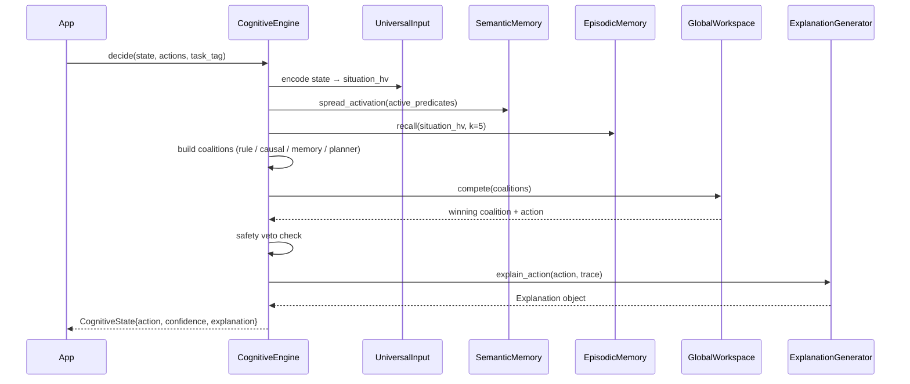

# NSCK — Neural-Symbolic Cognitive Kernel

NSCK is a **glass-box cognitive architecture** that combines Vector Symbolic Architecture (VSA) with symbolic reasoning, spiking neural networks, and Global Workspace Theory. It is a domain-agnostic reasoning engine: register your domain predicates and actions, then call `decide()` to get an action plus a human-readable explanation of why.

> Everything is inspectable. Every action traces back to specific rules, causal links, and episodic memories — no gradient tensors, no hidden layers.

**Current release: V10** — adds FHRR phasor VSA, dense-embedding bridge, Rust concurrent memory, n-gram NLU, attention-GWT arbitration, neural rule scoring, formal safety verification, and a REST API.  1 248 tests, ≥ 87 % pass rate on all benchmarks.

---

## Table of Contents

- [Quick Start](#quick-start)
- [Architecture](#architecture)
- [Module Overview](#module-overview)
- [Building the Rust Accelerator](#building-the-rust-accelerator)
- [Running Tests](#running-tests)
- [Usage Examples](#usage-examples)
- [Documentation](#documentation)

---

## Quick Start

```bash
# From the repository root
pip install -r requirements.txt

# Optional: build Rust VSA accelerator (~10x faster HV operations)
cd nsck/rust_vsa && pip install -e . && cd ../..

# Run the test suite
cd nsck
pytest tests/ python/core/tests/ -q
```

```python
import sys
sys.path.insert(0, 'nsck')   # or the absolute path to the nsck/ directory

from python.core.reasoning.cognitive_engine import CognitiveEngine

engine = CognitiveEngine()

# 1. Register a task domain
engine.register_task(
    task_tag="navigation",
    predicates={
        "obstacle_ahead": lambda s: s.get("obstacle_ahead", False),
        "goal_visible":   lambda s: s.get("goal_visible", False),
    },
    actions=["move_forward", "turn_left", "turn_right", "wait"],
)

# 2. Decision loop
state = {"obstacle_ahead": True, "goal_visible": False, "energy": 0.9}
result = engine.decide(state, ["move_forward", "turn_left", "turn_right", "wait"], "navigation")

print(result.chosen_action)   # e.g. "turn_left"
print(result.confidence)      # e.g. 0.72
print(result.explanation)     # human-readable trace

# 3. Provide feedback so the engine learns
engine.record_outcome(reward=1.0, task_tag="navigation")
```

---

## Architecture

NSCK is organized into 8 subsystems, all orchestrated by `CognitiveEngine`:

```mermaid
graph TB
    IN["Input (text / state dict / image)"]

    subgraph L1["1 · VSA Foundation"]
        HV["HyperVector Engine<br/>10,240-bit binary vectors<br/>hypervec_py.py + rust_vsa/"]
        CM["CleanupMemory<br/>LRU denoising"]
    end

    subgraph L2["2 · Memory"]
        Epi["EpisodicMemory<br/>Hot (deque) + Warm (SQLite)<br/>LSH k-NN"]
        Sem["SemanticMemory<br/>NetworkX DiGraph + HV index<br/>Spreading activation"]
    end

    subgraph L3["3 · Reasoning"]
        GWT["GlobalWorkspace<br/>Coalition competition<br/>Mental rehearsal veto"]
        Caus["CausalGraph + CausalDiscovery<br/>ΔP statistics"]
        RL["RuleLearner<br/>Frequency-based ILP"]
        Plan["STRIPSPlanner<br/>A* search"]
        Ana["AnalogyEngine<br/>Structural alignment"]
    end

    subgraph L4["4 · Perception"]
        SNN["LIF Spiking Neurons + STDP"]
        Br["VSA-SNN Bridge<br/>Rate/Temporal coding"]
        Gr["GroundingVerifier<br/>predicate ↔ HV binding"]
        MM["MultimodalProcessor<br/>HOG · color · LBP · edges"]
    end

    subgraph L5["5 · Learning"]
        Hebb["HebbianMatrix + VSAHebbianLearner<br/>Oja's rule"]
        Cur["CuriosityModule<br/>Novelty + learning progress"]
    end

    subgraph L6["6 · Cognitive"]
        Emo["EmotionSystem<br/>Plutchik 8 + Circumplex"]
        Meta["SafetyGate + MetacognitiveEngine"]
        Self["SelfModel<br/>Calibrated confidence"]
        ToM["TheoryOfMind<br/>Belief modelling"]
    end

    subgraph L7["7 · Language"]
        TKL["TextKnowledgeLearner<br/>SVO → SemanticMemory"]
        LM["LanguageModule + LinguaCortex<br/>Text → HV"]
        DM["DialogueManager"]
        UI["UniversalInput<br/>Text / dict / image"]
    end

    subgraph L8["8 · Integration"]
        BS["BrainStore (SQLite)<br/>Concepts · Episodes · Rules"]
        BF["BrainFusion<br/>Multi-task sharing"]
        EG["ExplanationGenerator"]
    end

    CE["CognitiveEngine (cognitive_engine.py)"]

    IN --> CE
    CE --> HV & CM
    CE --> Epi & Sem
    CE --> GWT --> RL & Caus & Plan & Ana
    CE --> SNN --> Br --> Gr
    CE --> MM
    CE --> Hebb & Cur
    CE --> Emo & Meta & Self & ToM
    CE --> TKL & LM & DM & UI
    CE --> BS & BF & EG
```



### Decision Loop (one `decide()` call)



---

## V10 Capabilities

V10 adds the following intelligence extensions on top of the V9 substrate:

| Capability | Module | Description |
|---|---|---|
| **FHRR phasor VSA** | `vsa/fhrr.py` | Complex-valued VSA with exact binding inverse and gradient-compatible similarity |
| **Dense embedding bridge** | `vsa/vsa_embedding_bridge.py` | Project sentence-transformer (or any dense) embeddings to/from binary HyperVectors |
| **Rust concurrent memory** | `vsa/rust_concurrent_shim.py` | Rayon-parallel semantic/episodic memory; Python fallback always available |
| **N-gram NLU** | `language/ngram_nlu.py` | Naive Bayes intent classifier + entity extractor, no external NLP library required |
| **Attention-GWT bridge** | `reasoning/attention_gwt_bridge.py` | Multi-head attention re-weights coalition saliences before GWT arbitration |
| **Neural rule scorer** | `learning/rule_neural_scorer.py` | Online perceptron re-ranks applicable rules; updated each learn() cycle |
| **Safety verifier** | `cognitive/safety_verifier.py` | Declarative safety properties gate decisions; critical violations always block |
| **REST API** | `api/nsck_api.py` | FastAPI / stdlib HTTP JSON API: `/decide`, `/learn`, `/sleep`, `/status` |

Quick example — using the REST API:

```python
from api.nsck_api import NSCKApiServer

server = NSCKApiServer()
result = server.handle_decide({"position_x": 2, "position_y": 3}, "maze")
print(result)  # {'action': 'move_right', 'confidence': 0.72, ...}
```

---

| Directory | Module | Key class(es) | LOC | Version |
|---|---|---|---|---|
| `vsa/` | `hypervec_py.py` | `HyperVectorPy` (+ `negate()`), `CleanupMemory` | 361 | V1/V6 |
| `vsa/` | `hypervec_shim.py` | Backend selector (Rust → Python) | 320 | V1 |
| `vsa/` | `resonator.py` | `ResonatorNetwork` | ~120 | V1 |
| `reasoning/` | `cognitive_engine.py` | `CognitiveEngine`, `CognitiveState`, `Proposal` | 1,402 | V1 |
| `reasoning/` | `global_workspace.py` | `GlobalWorkspace`, `Coalition` | 312 | V1 |
| `reasoning/` | `causal_reasoning.py` | `CausalDiscovery`, `CausalGraph`, `CausalReasoner` | 1,233 | V1 |
| `reasoning/` | `rule_learner.py` | `RuleLearner`, `RuleCandidate` | 644 | V1 |
| `reasoning/` | `planner.py` | `STRIPSPlanner`, `PlanStep` | 296 | V1 |
| `reasoning/` | `analogy.py` | `AnalogyEngine`, `Analogy`, `blend()` | 609 | V1 |
| `reasoning/` | `belief_revision.py` ⚑ | `BeliefMetadata`, `BeliefScorer` | 42 | V3 |
| `reasoning/` | `context_engine.py` | `ContextEngine` | 440 | V1 |
| `reasoning/` | `math_reasoning.py` | `MathReasoner`, `FPECodebook`, `LinearSolver` | ~390 | V1 |
| `reasoning/` | `spatial_reasoning.py` ⚑ | `SpatialReasoner`, `PositionCodebook` (FPE bit-flip, 8 relations) | ~200 | V5 |
| `reasoning/` | `temporal_reasoning.py` ⚑ | `TemporalReasoner` (before/after/during) | ~150 | V4 |
| `reasoning/` | `abductive_reasoning.py` ⚑ | `AbductiveReasoner` (best-explanation) | ~200 | V4 |
| `reasoning/` | `predictive_processor.py` ⚑ | `PredictiveProcessor` (PRIOR_UNCERTAINTY=0.5) | ~180 | V4 |
| `memory/` | `episodic_memory.py` | `EpisodicMemory`, `LiveEpisode` | 501 | V1 |
| `memory/` | `semantic_memory.py` | `SemanticMemory` (NSW ANN, `infer_transitive`, `build_prototypes`) ⚑ | ~800 | V1/V4/V6 |
| `memory/` | `homeostasis.py` ⚑ | `MemoryHomeostasis` | 134 | V3 |
| `memory/` | `staged_recall.py` | `StagedRecall` | 134 | V1 |
| `cognitive/` | `emotion_system.py` | `EmotionSystem` | 420 | V1 |
| `cognitive/` | `metacognition.py` | `SafetyGate`, `MetacognitiveEngine` | 504 | V1 |
| `cognitive/` | `self_model.py` | `SelfModel` | 255 | V1 |
| `cognitive/` | `theory_of_mind.py` | `TheoryOfMind` | 312 | V1 |
| `perception/` | `snn_perception.py` | `SNNPerceptionModule`, `LIFNeuronLayer` | 874 | V1 |
| `perception/` | `vsa_snn_bridge.py` | `RateCoder`, `TemporalCoder` | 461 | V1 |
| `perception/` | `grounding_verifier.py` | `GroundingVerifier` | 585 | V1 |
| `perception/` | `symbol_grounding.py` | `SymbolGrounding` | 200 | V1 |
| `learning/` | `hebbian.py` | `HebbianMatrix`, `VSAHebbianLearner` | 506 | V1 |
| `learning/` | `curiosity.py` | `CuriosityModule`, `ExplorationDecision` | 336 | V1 |
| `learning/` | `cross_domain.py` | `TransferEngine`, `SchemaExtractor`, `RuleLifter` | ~430 | V2 |
| `learning/` | `schema_induction.py` ⚑ | `SchemaInducer` (slot-filling patterns) | ~150 | V4 |
| `learning/` | `pmi_learner.py` ⚑ | `PMILearner` (PMI co-occurrence) | ~100 | V4 |
| `learning/` | `predictive_coding.py` ⚑ | `PredictiveCodingModule` | ~100 | V4 |
| `learning/` | `active_inference.py` ⚑ | `ActiveInferenceLearner` (MIN_TEMP=0.1, MAX_TEMP=5.0) | ~120 | V4 |
| `language/` | `text_knowledge_learner.py` | `TextKnowledgeLearner` (_STOP_CONCEPTS, DistribPreTrain) ⚑ | 1,074 | V1/V7 |
| `language/` | `construction_grammar.py` ⚑ | `ConstructionMatcher` (71 constructions, V4 negation/temporal/conditional) | ~350 | V3/V4 |
| `language/` | `frame_semantics.py` ⚑ | `FrameLibrary`, `Frame` | 81 | V3 |
| `language/` | `coreference.py` ⚑ | `EntityRegister`, `EntityMention` | 76 | V3 |
| `language/` | `distributional_semantics.py` ⚑ | `DistributionalCodebook` (BUILTIN_CORPUS pre-train) | ~200 | V3/V7 |
| `language/` | `language_module.py` | `LanguageModule` | 526 | V1 |
| `language/` | `lingua_cortex.py` | `LinguaCortex` | 260 | V1 |
| `language/` | `dialogue_manager.py` | `DialogueManager` (FluentNLG wired) ⚑ | 506 | V1/V7 |
| `language/` | `universal_input.py` | `UniversalInput` | 947 | V1 |
| `language/` | `semantic_roles.py` | `SemanticRoleLabeler`, `SRLFrame` | ~380 | V2 |
| `language/` | `nlg.py` | `StructuralRealizer`, `DiscoursePlanner`, `NLGEngine` | ~430 | V2 |
| `language/` | `fluent_nlg.py` ⚑ | `FluentResponseComposer`, `NSCKResponseEngine`, `RelationVerbalizer` | ~350 | V6 |
| `language/` | `pos_tagger.py` ⚑ | `BrillPosTagger` (300+ lexicon, 8 suffix rules) | ~180 | V6 |
| `language/` | `pragmatics.py` ⚑ | `PragmaticEngine` (15 Horn scales, 7 speech acts, Gricean maxims) | ~200 | V5 |
| `language/` | `hf_corpus_loader.py` ⚑ | `HFCorpusLoader` (HuggingFace FineWeb, offline fallback) | ~120 | V7 |
| `integration/` | `config.py` | `NSCKConfig` (25 feature flags, 3 presets) ⚑ | ~100 | V1/V7 |
| `integration/` | `persistence.py` | `BrainStore`, `Episode`, `Rule` | 852 | V1 |
| `integration/` | `brain_fusion.py` | `BrainFusion`, `TaskBrain`, `FusedBrain` | 481 | V1 |
| `integration/` | `explanation.py` | `ExplanationGenerator`, `Explanation` | 433 | V1 |
| `multimodal/` | `multimodal_processor.py` | `MultimodalProcessor`, `ConcurrentMultimodalProcessor` ⚑ | 788 | V1/V6 |
| `multimodal/` | `image_generator.py` | `ImageGenerator`, `VisualFeatures` | 575 | V1 |

> **⚑** = New or substantially extended in V3–V7.

**Total: 53 source modules, 79 Python files, ~27,000 LOC**

### Rust Accelerator (`rust_vsa/`) — hypervec_rs.so (4.3 MB)

| Source file | What it accelerates | Verified speedup |
|---|---|---|
| `src/lib.rs` | `HyperVector` (XOR · bundle · permute · `negate()` · similarity) | 6–76× |
| `src/concurrent.rs` | `HyperVectorRegistry` — thread-safe bulk storage | high |
| `src/semantic.rs` | `SemanticMemoryConcurrent` — parallel spreading activation | high |
| `src/episodic.rs` | `EpisodicMemoryConcurrent` — parallel k-NN with RwLock | high |
| `src/worker_pool.rs` | `CognitiveWorkerPool` — Rayon thread pool | — |
| `src/persistence.rs` | `PersistentStorage` — async SQLite | — |

**Measured speedups (Feb 2026, 500 ops, 10240-bit HVs):**
```
similarity ×500:  Rust=0.137ms  Python=3.851ms  → 28.1×
xor ×500:         Rust=0.117ms  Python=0.713ms  →  6.1×
bundle ×50:       Rust=0.038ms  Python=2.874ms  → 75.9×
negate ×50:       Rust=0.038ms  Python=2.401ms  → 63.8×
```

### Rust SNN Accelerator (`rust_snn/`) — snn_rs.so (1.1 MB)

| Source file | What it accelerates |
|---|---|
| `src/lib.rs` | `LIFLayer.step()`, `SnnCore.simulate()`, `StdpEngine.apply()` — Rayon parallelised |
| `src/hebbian.rs` | `HebbianMatrix.update()` — Oja's rule outer-product |
| `src/concept.rs` | `ConceptMapper.recognize()` — Jaccard per concept |

---

## Building the Rust Accelerator

```bash
# VSA accelerator (hypervec_rs.so — 4.3 MB)
cd nsck/rust_vsa
cargo build --release
cp target/release/libhypervec_rs.so ../hypervec_rs.so

# SNN accelerator (snn_rs.so — 1.1 MB)
cd nsck/rust_snn
cargo build --release
cp target/release/libsnn_rs.so ../snn_rs.so
```

The Python shims (`hypervec_shim.py`, `snn_shim.py`) automatically detect and use the Rust extension if the `.so` files exist in `nsck/`, falling back to the pure-Python/NumPy implementation otherwise.

**Verified speedups (Feb 2026):**
```
similarity ×500:  28.1×  |  bundle ×50: 75.9×  |  negate ×50: 63.8×
```

---

## Running Tests

```bash
# From the repository root

# All tests (Python-only, no Rust .so)
cd nsck && python -m pytest tests/ -q
# Result: 807 passed, 150 skipped, 3 xfailed

# All tests (with Rust .so built and in nsck/)
cd nsck && python -m pytest tests/ -q
# Result: 951 passed, 5 skipped, 4 xfailed

# Unit tests only
python -m pytest tests/unit/ -q

# Integration tests
python -m pytest tests/integration/ -q

# V6/V7 feature tests
python -m pytest tests/unit/test_v6_features.py tests/unit/test_v7_features.py -q

# With verbose output
python -m pytest tests/ -v
```

---

## Usage Examples

### Text Learning and Querying

```python
from python.core.integration.config import NSCKConfig
from python.core.language.text_knowledge_learner import TextKnowledgeLearner
from python.core.memory.semantic_memory import SemanticMemory
from python.core.reasoning.causal_reasoning import CausalGraph
from python.core.language.fluent_nlg import NSCKResponseEngine

cfg = NSCKConfig.research()   # enable all features
sem = SemanticMemory(config=cfg)
cg  = CausalGraph()
tkl = TextKnowledgeLearner(semantic_memory=sem, causal_graph=cg, config=cfg)
nlg = NSCKResponseEngine()

tkl.learn_from_text("Water is a molecule made of hydrogen and oxygen. Rain causes flooding.")

# Fluent NL response
resp = nlg.describe("Rain", sem, max_relations=5)
print(resp)
# → "To explain Rain: Rain leads to flooding."
```

### Spreading Activation

```python
activated = sem.spread_activation(["Brain", "Learning"], steps=2, decay=0.7)
for concept, score in sorted(activated.items(), key=lambda x: -x[1])[:5]:
    print(f"  {concept}: {score:.4f}")
```

### Episodic Memory

```python
from python.core.memory.episodic_memory import EpisodicMemory, LiveEpisode
import python.core.vsa.hypervec_shim as hvs

mem = EpisodicMemory()
hv = hvs.HyperVector(42)
ep = LiveEpisode(
    timestamp=1.0, task_tag="demo",
    situation_hv=hv, state={"x": 1},
    action="move", outcome="success", reward=1.0
)
mem.store(ep)
recalled = mem.recall(hv, k=3)
```

### Custom Module (SDK)

See [`examples/custom_module.py`](examples/custom_module.py) for a complete example of adding a custom reasoning module to the Global Workspace.

---

## Documentation

| Document | Contents |
|---|---|
| [docs/ARCHITECTURE.md](docs/ARCHITECTURE.md) | Full system architecture with Mermaid diagrams per subsystem |
| [docs/FORMULAS.md](docs/FORMULAS.md) | Theory, math foundations, proofs, and design goals |
| [docs/MODULE_REFERENCE.md](docs/MODULE_REFERENCE.md) | Every file, class, method, and parameter |
| [docs/TESTING.md](docs/TESTING.md) | All test files: what they test, how, and why |
| [docs/WORKFLOWS.md](docs/WORKFLOWS.md) | Decision loop and data-flow walkthroughs |
| [docs/NSCK_ROADMAP_AND_PLAN.md](docs/NSCK_ROADMAP_AND_PLAN.md) | Full implementation roadmap: gaps, phases, research refs, success criteria |
| [docs/NSCK_V9_SUBSTRATE.md](docs/NSCK_V9_SUBSTRATE.md) | V9 modality-agnostic substrate full specification |
| [docs/NSCK_V10_EXTENSIONS.md](docs/NSCK_V10_EXTENSIONS.md) | V10 intelligence extensions: FHRR, embedding bridge, neural scoring, safety |
