# NSCK Architecture

Complete system architecture of the Neural-Symbolic Cognitive Kernel. All diagrams reflect the actual codebase — every arrow is a verified import or method call.

---

## Table of Contents

- [High-Level Overview](#high-level-overview)
- [Subsystem Architecture](#subsystem-architecture)
  - [VSA Foundation](#1-vsa-foundation)
  - [Reasoning Layer](#2-reasoning-layer)
  - [Memory Systems](#3-memory-systems)
  - [Perception Layer](#4-perception-layer)
  - [Learning Subsystem](#5-learning-subsystem)
  - [Cognitive Layer](#6-cognitive-layer)
  - [Language Layer](#7-language-layer)
  - [Integration Layer](#8-integration-layer)
- [Central Orchestrator](#central-orchestrator)
- [GWT Broadcast Network](#gwt-broadcast-network)
- [Data Flow Summary](#data-flow-summary)
- [Directory Layout](#directory-layout)

---

## High-Level Overview

NSCK is organized into 8 subsystems, all orchestrated by the `CognitiveEngine`:

```mermaid
graph TB
    subgraph Foundation["1. VSA Foundation"]
        HV["HyperVector Engine<br/>hypervec_py.py (361 LOC)<br/>hypervec_shim.py (320 LOC)<br/>+ Rust accelerator (2,665 LOC)"]
    end

    subgraph Reasoning["2. Reasoning"]
        CE["CognitiveEngine<br/>cognitive_engine.py<br/>1,188 LOC"]
        GWT["GlobalWorkspace<br/>global_workspace.py<br/>312 LOC"]
        Plan["STRIPSPlanner<br/>planner.py<br/>296 LOC"]
        Causal["CausalDiscovery + CausalGraph<br/>causal_reasoning.py<br/>954 LOC"]
        RL["RuleLearner<br/>rule_learner.py<br/>624 LOC"]
        Ana["AnalogyEngine<br/>analogy.py<br/>528 LOC"]
        Ctx["ContextEngine<br/>context_engine.py<br/>440 LOC"]
    end

    subgraph Memory["3. Memory"]
        Epi["EpisodicMemory<br/>episodic_memory.py<br/>398 LOC"]
        Sem["SemanticMemory<br/>semantic_memory.py<br/>217 LOC"]
        Staged["StagedRecall<br/>staged_recall.py<br/>134 LOC"]
    end

    subgraph Perception["4. Perception"]
        SNN["SNNPerceptionModule<br/>snn_perception.py<br/>561 LOC"]
        Bridge["VSA-SNN Bridge<br/>vsa_snn_bridge.py<br/>461 LOC"]
        Ground["GroundingVerifier<br/>grounding_verifier.py<br/>585 LOC"]
        SNNInt["SNNWorkspaceAdapter<br/>snn_integration.py<br/>240 LOC"]
    end

    subgraph Learning["5. Learning"]
        Hebb["HebbianMatrix + VSAHebbianLearner<br/>hebbian.py<br/>506 LOC"]
        Cur["CuriosityModule<br/>curiosity.py<br/>336 LOC"]
    end

    subgraph Cognitive["6. Cognitive"]
        Meta["SafetyGate + MetacognitiveEngine<br/>metacognition.py<br/>504 LOC"]
        Self["SelfModel<br/>self_model.py<br/>255 LOC"]
        ToM["TheoryOfMind<br/>theory_of_mind.py<br/>312 LOC"]
        Emo["EmotionSystem<br/>emotion_system.py<br/>420 LOC"]
    end

    subgraph Lang["7. Language"]
        LM["LanguageModule<br/>language_module.py<br/>484 LOC"]
        DM["DialogueManager<br/>dialogue_manager.py<br/>145 LOC"]
        TKL["TextKnowledgeLearner<br/>text_knowledge_learner.py<br/>1,071 LOC"]
        UI["UniversalInput<br/>universal_input.py<br/>947 LOC"]
        LC["LinguaCortex<br/>lingua_cortex.py<br/>260 LOC"]
    end

    subgraph Integration["8. Integration"]
        Conf["NSCKConfig<br/>config.py<br/>73 LOC"]
        Persist["BrainStore<br/>persistence.py<br/>852 LOC"]
        Fusion["BrainFusion<br/>brain_fusion.py<br/>481 LOC"]
        Explain["ExplanationGenerator<br/>explanation.py<br/>433 LOC"]
    end

    HV --> CE
    CE --> GWT
    CE --> Plan
    CE --> Causal
    CE --> RL
    CE --> Ana
    CE --> Epi
    CE --> Sem
    CE --> Ground
    CE --> Cur
    CE --> Self
    CE --> Meta
    CE --> LM
    CE --> DM
    CE --> Explain
    CE --> Persist
```

---

## Subsystem Architecture

### 1. VSA Foundation

All modules encode knowledge as 10,240-bit binary hypervectors. The VSA layer provides three core operations:

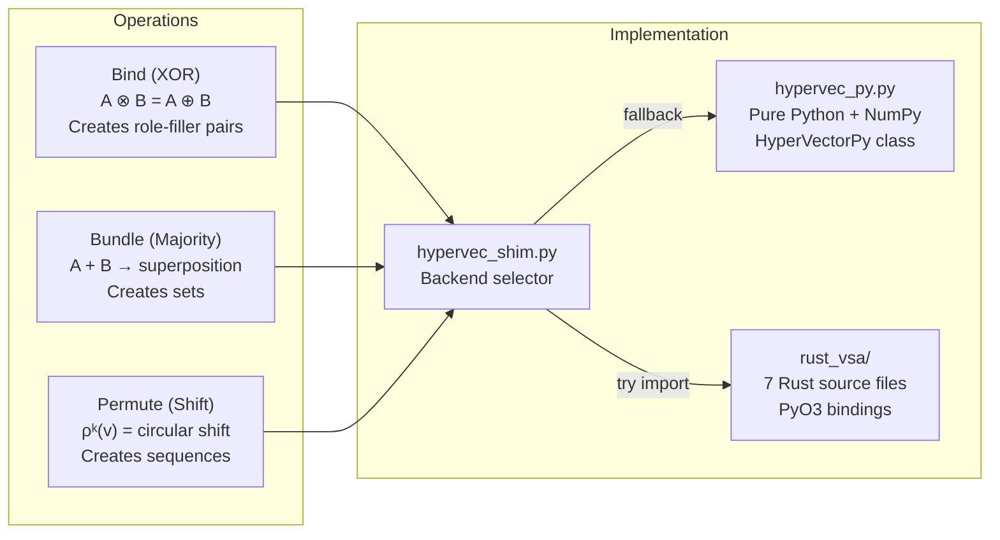

**Rust Accelerator** (`rust_vsa/src/`):

| File | Lines | What It Provides |
|------|-------|-----------------|
| `lib.rs` | 280 | HyperVector type + PyO3 bindings |
| `semantic.rs` | 444 | SemanticMemoryConcurrent (thread-safe) |
| `episodic.rs` | 427 | EpisodicMemoryConcurrent (thread-safe) |
| `worker_pool.rs` | 488 | CognitiveWorkerPool (parallel ops) |
| `concurrent.rs` | 319 | Lock-free concurrent data structures |
| `persistence.rs` | 416 | PersistentStorage (disk I/O) |
| `async_runtime.rs` | 291 | AsyncCognitiveRuntime (tokio) |

---

### 2. Reasoning Layer

The reasoning layer is where decisions happen. All proposals compete in the **Global Workspace**:

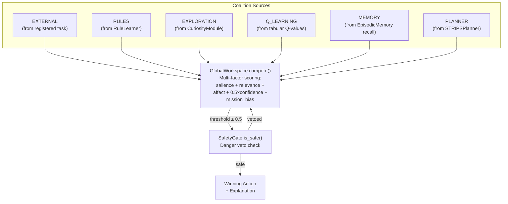

**Planner ↔ Causal Discovery Integration:**

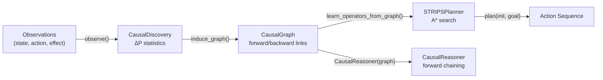

---

### 3. Memory Systems

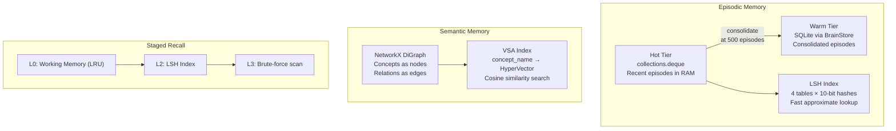

**Episodic Memory Flow:** New episodes enter the hot deque → indexed by LSH → when count exceeds 500, older half is consolidated to SQLite. Retrieval: query HV → LSH bucket match → 1-bit neighbor probing → exact similarity ranking → top-k results.

**Semantic Memory:** Dual representation — NetworkX graph for structural queries (inheritance, spreading activation) and VSA index for similarity-based retrieval. `spread_activation(concepts, steps, decay)` performs iterative activation through the graph.

---

### 4. Perception Layer

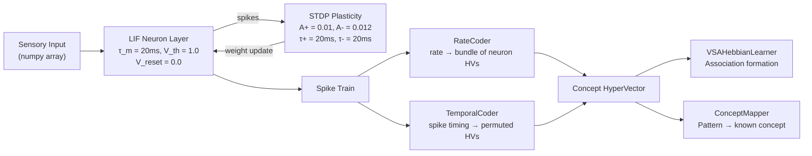

The SNN layer uses **Leaky Integrate-and-Fire** neurons with **STDP** (Spike-Timing-Dependent Plasticity). The `vsa_snn_bridge.py` module provides bidirectional conversion between spike trains and HyperVectors via rate coding or temporal coding.

---

### 5. Learning Subsystem

Two complementary learning systems:

| System | File | Mechanism | Purpose |
|--------|------|-----------|---------|
| **Hebbian** | `hebbian.py` | Oja's rule + reward modulation + eligibility traces | Association learning, weight adaptation |
| **Curiosity** | `curiosity.py` | VSA novelty detection + learning progress tracking | Exploration vs. exploitation balance |

**Hebbian Learning:** Three-factor rule: `ΔW = α × pre × post × (reward - baseline)`. Eligibility traces (`λ=0.9`) allow credit assignment across time delays.

**Curiosity Module:** Computes novelty as `1 - max_similarity(query, visited)`. When novelty exceeds threshold (0.5), triggers random exploration. Learning progress is tracked per-task to drive sustained curiosity in productive areas.

---

### 6. Cognitive Layer

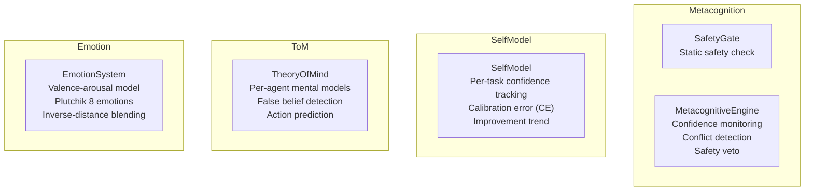

**Active in decide() loop:** SafetyGate (veto), SelfModel (confidence).  
**Instantiated but not currently wired into decide():** TheoryOfMind, EmotionSystem.

---

### 7. Language Layer

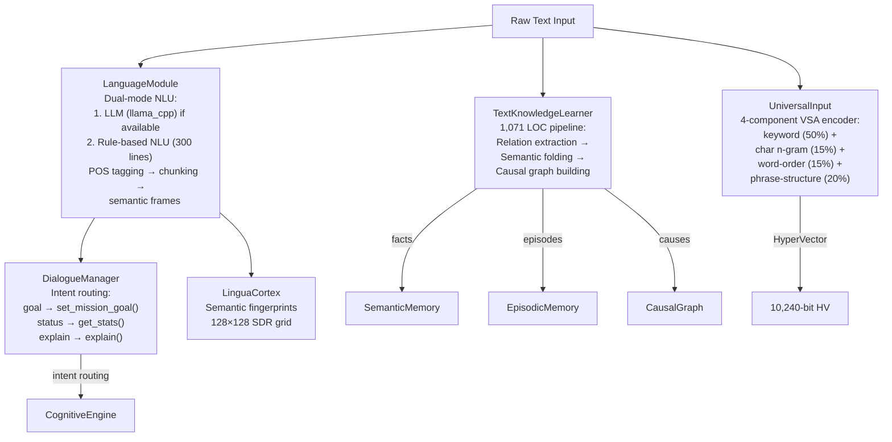

---

### 8. Integration Layer

| Module | File | LOC | Purpose |
|--------|------|-----|---------|
| **NSCKConfig** | `config.py` | 73 | Hyperparameter dataclass |
| **BrainStore** | `persistence.py` | 852 | SQLite persistence for rules, episodes, concepts |
| **BrainFusion** | `brain_fusion.py` | 481 | Multi-task brain management + rule resolution |
| **ExplanationGenerator** | `explanation.py` | 433 | Natural language explanation templates |
| **KnowledgeIntegration** | `knowledge_integration.py` | 530 | Alternative pipeline connecting perception → memory → reasoning |

---

## Central Orchestrator

`CognitiveEngine` is the hub that instantiates and connects all modules:

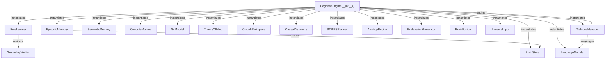

---

## GWT Broadcast Network

When the Global Workspace selects a winning coalition, it **broadcasts** to all registered `WorkspaceModule` subscribers:

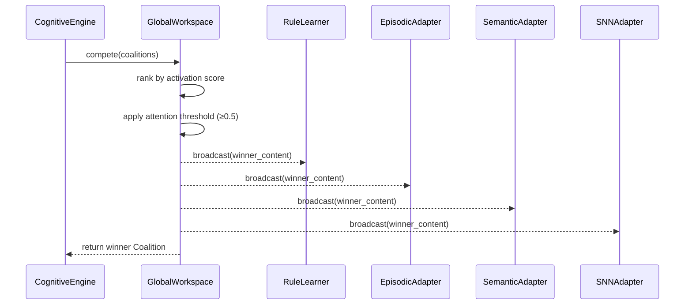

Registered subscribers:
- **RuleLearner** — observes broadcast for rule induction
- **EpisodicBroadcastAdapter** — updates episode statistics
- **SemanticBroadcastAdapter** — triggers spreading activation
- **SNNWorkspaceAdapter** — perceptual priming (when SNN is registered)

---

## Data Flow Summary

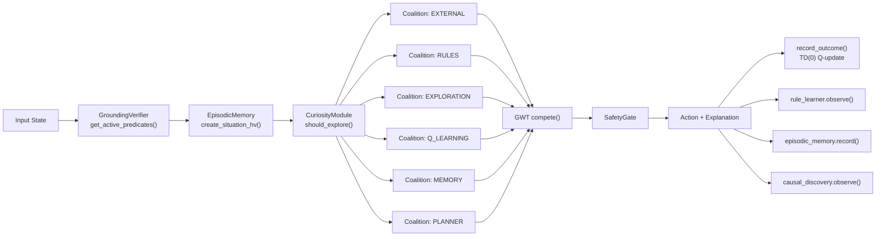

---

## Directory Layout

```
nsck/python/core/
├── vsa/                          # VSA Foundation
│   ├── hypervec_py.py            # Pure Python HyperVector (361 LOC)
│   └── hypervec_shim.py          # Rust/Python backend selector (320 LOC)
│
├── reasoning/                    # Reasoning Layer
│   ├── cognitive_engine.py       # Central orchestrator (1,188 LOC)
│   ├── global_workspace.py       # GWT coalition competition (312 LOC)
│   ├── planner.py                # A* STRIPS planner (296 LOC)
│   ├── causal_reasoning.py       # ΔP causal discovery + graph (954 LOC)
│   ├── rule_learner.py           # Rule induction from experience (624 LOC)
│   ├── analogy.py                # Analogical reasoning + transfer (528 LOC)
│   └── context_engine.py         # Polysemy disambiguation (440 LOC)
│
├── learning/                     # Learning Subsystem
│   ├── hebbian.py                # Oja's rule + reward modulation (506 LOC)
│   └── curiosity.py              # VSA novelty + exploration (336 LOC)
│
├── cognitive/                    # Cognitive Layer
│   ├── metacognition.py          # Safety gate + confidence (504 LOC)
│   ├── self_model.py             # Per-task calibration (255 LOC)
│   ├── theory_of_mind.py         # Agent mental models (312 LOC)
│   └── emotion_system.py         # Valence-arousal + Plutchik (420 LOC)
│
├── perception/                   # Perception Layer
│   ├── snn_perception.py         # LIF neurons + STDP (561 LOC)
│   ├── snn_integration.py        # GWT adapter for SNN (240 LOC)
│   ├── vsa_snn_bridge.py         # Spike ↔ HyperVector conversion (461 LOC)
│   ├── grounding_verifier.py     # Predicate grounding (585 LOC)
│   └── symbol_grounding.py       # Abstract symbol grounding (196 LOC)
│
├── memory/                       # Memory Systems
│   ├── episodic_memory.py        # Two-tier + LSH indexing (398 LOC)
│   ├── semantic_memory.py        # Graph + VSA dual repr (217 LOC)
│   └── staged_recall.py          # Multi-level retrieval (134 LOC)
│
├── language/                     # Language Layer
│   ├── language_module.py        # Dual-mode NLU/NLG (484 LOC)
│   ├── dialogue_manager.py       # Intent routing (145 LOC)
│   ├── text_knowledge_learner.py # Text → knowledge pipeline (1,071 LOC)
│   ├── universal_input.py        # 4-component VSA encoder (947 LOC)
│   └── lingua_cortex.py          # Semantic fingerprints (260 LOC)
│
├── integration/                  # Integration Layer
│   ├── config.py                 # Hyperparameters (73 LOC)
│   ├── persistence.py            # SQLite brain store (852 LOC)
│   ├── brain_fusion.py           # Multi-task management (481 LOC)
│   ├── explanation.py            # NL explanation templates (433 LOC)
│   └── knowledge_integration.py  # Alternative pipeline (530 LOC)
│
└── training/                     # Training
    ├── snn_training.py           # SNN training pipeline (589 LOC)
    └── snn_benchmarks.py         # SNN benchmark suite (483 LOC)
```
