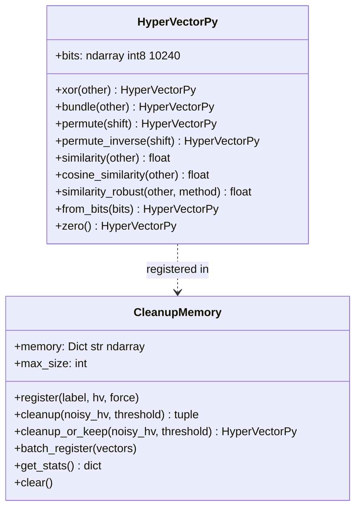
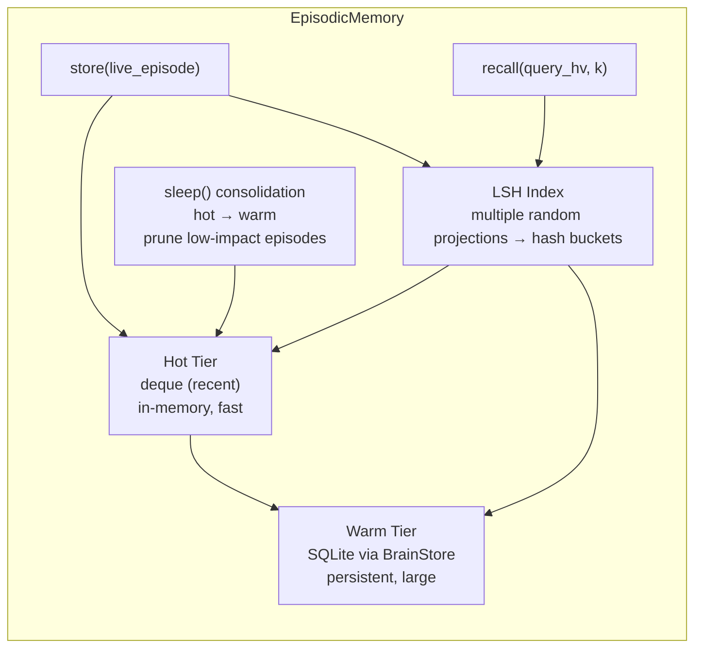
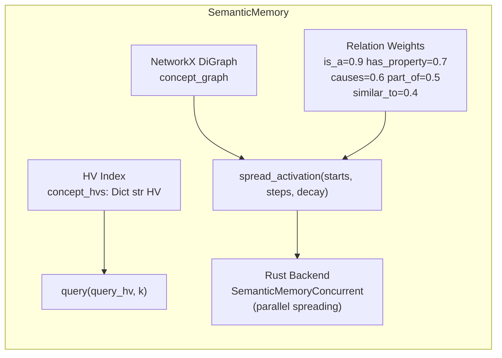
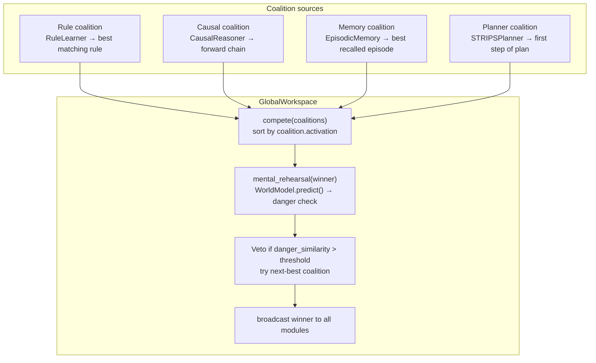
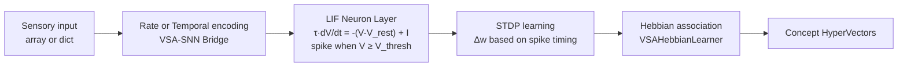
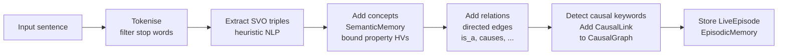
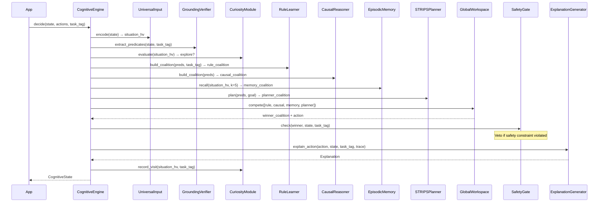
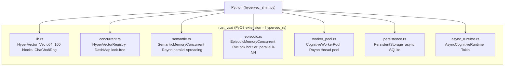
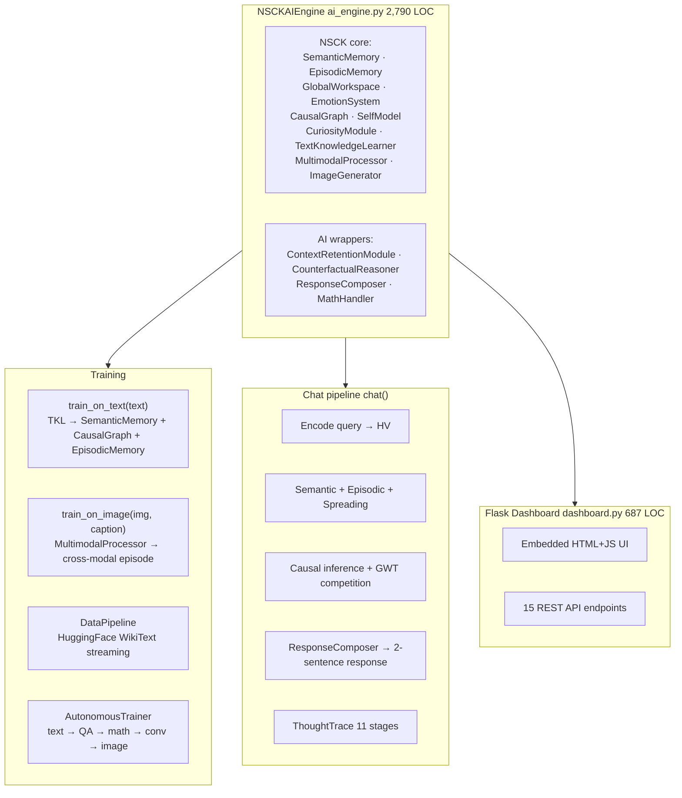

# NSCK Architecture

Complete system architecture of the Neural-Symbolic Cognitive Kernel. All diagrams, LOC counts, and arrows reflect the actual codebase — every link is a verified import or method call.

---

## Table of Contents

1. [System Overview](#1-system-overview)
2. [VSA Foundation](#2-vsa-foundation)
3. [Memory Systems](#3-memory-systems)
4. [Reasoning Layer](#4-reasoning-layer)
5. [Perception Layer](#5-perception-layer)
6. [Learning Subsystem](#6-learning-subsystem)
7. [Cognitive Layer](#7-cognitive-layer)
8. [Language Layer](#8-language-layer)
9. [Integration Layer](#9-integration-layer)
10. [Central Orchestrator — CognitiveEngine](#10-central-orchestrator--cognitiveengine)
11. [Decision Loop Data Flow](#11-decision-loop-data-flow)
12. [Rust Concurrent Layer](#12-rust-concurrent-layer)
13. [nsck_ai_model Architecture](#13-nsck_ai_model-architecture)

---

## 1. System Overview

NSCK is structured as 8 subsystems, all orchestrated by a single `CognitiveEngine`. The subsystems communicate through the `CognitiveEngine` and the `GlobalWorkspace` broadcast channel.

```mermaid
graph TB
    subgraph S1["1 · VSA Foundation"]
        HV["HyperVector Engine\nhypervec_py.py · 361 LOC\nhypervec_shim.py · 320 LOC\nrust_vsa/ · 7 files"]
    end

    subgraph S2["2 · Memory"]
        Epi["EpisodicMemory\nepisodic_memory.py · 501 LOC\nHot tier (deque) + Warm tier (SQLite)\nLSH k-NN retrieval"]
        Sem["SemanticMemory\nsemantic_memory.py · 291 LOC\nNetworkX DiGraph + HV index\nSpreading activation"]
        SR["StagedRecall\nstaged_recall.py · ~134 LOC"]
    end

    subgraph S3["3 · Reasoning"]
        CE["CognitiveEngine\ncognitive_engine.py · 1,402 LOC"]
        GWT["GlobalWorkspace\nglobal_workspace.py · 312 LOC"]
        Caus["CausalDiscovery + CausalGraph\ncausal_reasoning.py · 1,233 LOC"]
        RL["RuleLearner\nrule_learner.py · 644 LOC"]
        Plan["STRIPSPlanner\nplanner.py · 296 LOC"]
        Ana["AnalogyEngine\nanalogy.py · 609 LOC"]
        Ctx["ContextEngine\ncontext_engine.py · 440 LOC"]
        Math["MathReasoner\nmath_reasoning.py\nFPE + algebra + word problems"]
    end

    subgraph S4["4 · Perception"]
        SNN["SNNPerceptionModule\nsnn_perception.py · 874 LOC\nLIF neurons + STDP"]
        Br["VSA-SNN Bridge\nvsa_snn_bridge.py · ~461 LOC\nRate/Temporal coding"]
        Gr["GroundingVerifier\ngrounding_verifier.py · 585 LOC"]
        MM["MultimodalProcessor\nmultimodal_processor.py · 788 LOC\nHOG · color · LBP · edges"]
    end

    subgraph S5["5 · Learning"]
        Hebb["HebbianMatrix + VSAHebbianLearner\nhebbian.py · 506 LOC\nOja's rule"]
        Cur["CuriosityModule\ncuriosity.py · 336 LOC"]
        XD["TransferEngine\ncross_domain.py\nSchema + Structure + Rule lifting"]
    end

    subgraph S6["6 · Cognitive"]
        Emo["EmotionSystem\nemotion_system.py · 420 LOC\nPluchtik 8 + Circumplex"]
        Meta["SafetyGate + MetacognitiveEngine\nmetacognition.py · 504 LOC"]
        Self["SelfModel\nself_model.py · ~255 LOC"]
        ToM["TheoryOfMind\ntheory_of_mind.py · 312 LOC"]
    end

    subgraph S7["7 · Language"]
        TKL["TextKnowledgeLearner\ntext_knowledge_learner.py · 1,074 LOC"]
        LM["LanguageModule + LinguaCortex\nlanguage_module.py · 526 LOC\nlingua_cortex.py · ~260 LOC"]
        DM["DialogueManager\ndialogue_manager.py · 506 LOC"]
        UI["UniversalInput\nuniversal_input.py · 947 LOC"]
        SRL["SemanticRoleLabeler\nsemantic_roles.py\n12 thematic roles · resonator"]
        NLG["NLGEngine + DiscoursePlanner\nnlg.py\nconnectives · anaphora · steps"]
    end

    subgraph S8["8 · Integration"]
        BS["BrainStore (SQLite)\npersistence.py · 852 LOC"]
        BF["BrainFusion\nbrain_fusion.py · 481 LOC"]
        EG["ExplanationGenerator\nexplanation.py · 433 LOC"]
        Conf["NSCKConfig\nconfig.py · ~73 LOC"]
    end

    CE --> GWT --> RL & Caus & Plan & Ana
    CE --> Epi & Sem & SR
    CE --> HV
    CE --> SNN --> Br --> Gr
    CE --> MM
    CE --> Hebb & Cur
    CE --> Emo & Meta & Self & ToM
    CE --> TKL & LM & DM & UI
    CE --> BS & BF & EG & Conf
```



---

## 2. VSA Foundation

All knowledge in NSCK is represented as **10,240-bit binary hypervectors**. The VSA operations define an algebra over this space.

### Class diagram



**Key operations:**

| Operation | Code | Role |
|---|---|---|
| `xor(A, B)` | element-wise XOR | Binding — encodes role–filler pairs |
| `bundle(A, B)` | majority vote + random tie-break | Superposition — "both A and B" |
| `permute(k)` | `np.roll(bits, -k)` | Encodes position / temporal order |
| `similarity(A, B)` | `1 - Hamming/d` | Associative lookup distance |
| `cosine_similarity(A, B)` | bipolar dot product / d | Noise-robust similarity |

**`hypervec_shim.py`** — backend selector: tries `import hypervec_rs` (Rust); falls back to `HyperVectorPy` (NumPy). All NSCK modules import from the shim; switching backends requires no code changes.

---

## 3. Memory Systems

### 3.1 Episodic Memory — two-tier with LSH



`LiveEpisode` key fields: `timestamp`, `task_tag`, `situation_hv`, `state`, `action`, `outcome`, `reward`, `emotion`, `tom_beliefs`, `image`, `impact_score`.

Retrieval: (1) hash `query_hv` into LSH buckets, (2) collect candidates from both tiers, (3) rerank by Hamming similarity, (4) return top-k.

### 3.2 Semantic Memory — graph + HV index



`add_concept(name, props)` — generates HV by binding property role–filler pairs via XOR + bundle.

`spread_activation(starts, steps=3, decay=0.7)` — iterates `steps` times; each active node propagates `activation × decay × edge_weight` to neighbours. Only top-200 activated nodes spread each step (prevents blow-up).

`get_inherited_properties(concept)` — BFS up `is_a` edges; merges properties from general → specific (specific wins).

---

## 4. Reasoning Layer

### 4.1 Global Workspace Theory (GWT)



`Coalition.activation` = `base_salience + relevance + affect_match + sender_confidence × 0.5`

**Mental rehearsal veto** (Phase 8): before committing, the winning coalition is simulated through `WorldModel.predict()`. If the predicted next state has similarity > `danger_threshold` to a known danger vector, the coalition is vetoed and the next-best coalition is tried.

### 4.2 Causal Reasoning

```
Delta-P(cause, effect) = P(effect | cause) - P(effect | not-cause)

Computed from observed (cause, effect) co-occurrence counts with Laplace smoothing.
Works from as few as 2-5 observations.
```

`CausalGraph.forward_chain(start, max_depth)` — BFS from start following `causes` edges, multiplying strengths.

`CausalGraph.backward_chain(goal, max_depth)` — reverse BFS to find what would need to be true for `goal` to occur.

`CausalGraph.counterfactual(do_X, observe_Y)` — simulates removing cause X and predicts what would change.

### 4.3 Rule Learner

Observes `(state, action, outcome)` tuples and induces:

```
IF {predicate_1, predicate_2, ...} THEN action   [confidence = successes / support]
```

Rules progress through three tenure states: **new** → **bootstrap** → **tenured**. Tenured rules require more counter-evidence to demote (stability). Pruning removes rules below `min_success_rate=0.7`.

Integrates with `GlobalWorkspace` via `WorkspaceModule` interface — the rule coalition is built by finding the highest-confidence rule whose conditions match the current predicates.

### 4.4 STRIPS Planner

A* search over state → action → state transitions:

```
Cost:      depth (uniform cost)
Heuristic: 0 (admissible — guarantees optimal plan length)
Operators: extracted from CausalGraph (learned) + hardcoded bootstrap rules
```

`learn_operators_from_graph(graph, context)` — converts causal links into STRIPS operators: `cause` = precondition, `effect` = add effect.

### 4.5 Analogy Engine

Cross-domain structural alignment:

1. Abstract domain predicates and relations into `AbstractConcept` objects.
2. Compute HV similarity between concept pairs across domains.
3. Build `ConceptMapping` for pairs above threshold.
4. Return `Analogy` with `overall_similarity` and `reasoning_chain`.

---

## 5. Perception Layer

### 5.1 Spiking Neural Network



**Rust acceleration** (`rust_snn/`): `LIFLayer.step()`, `SnnCore.simulate()`, and `StdpEngine.apply()` are all Rayon-parallelised. Pure-Python fallback in `snn_perception.py`.

### 5.2 Symbol Grounding

`GroundingVerifier` maps symbolic predicates to HV-based verification functions. When `CognitiveEngine` needs to check `"obstacle_ahead"`, it calls the registered predicate lambda and optionally validates via HV similarity to a grounded prototype.

### 5.3 Multimodal Processing

`MultimodalProcessor` extracts 5 feature types from images, each converted to a HV:

| Feature | Method |
|---|---|
| HOG | Histogram of Oriented Gradients |
| Color | Mean RGB/HSV per 2×2 spatial quadrant |
| LBP | Local Binary Pattern histogram |
| Edges | Sobel edge density |
| Spatial | Quadrant spatial context |

All feature HVs are XOR-bound and bundled into a single fused image HV.

---

## 6. Learning Subsystem

### 6.1 Hebbian Learning

`HebbianMatrix` — co-occurrence matrix over concept pairs.

Oja's rule (in `rust_snn/src/hebbian.rs`):

```
Δw_ij = η · (x_i · y_j - y_j² · w_ij)
```

Normalized update: prevents weight explosion via the forgetting term `y_j² · w_ij`.

### 6.2 Curiosity Module

```
novelty(s)    = 1.0 - max_similarity(encode(s), known_concept_hvs)
progress      = improvement_rate(success_rate, window=100)
explore_now   = (novelty > threshold) AND (confidence < 0.5)
             OR (learning_progress < stagnation_threshold)
```

Maintains `testable_hypotheses` — concept pairs not yet observed together — and can request specific actions to test them.

---

## 7. Cognitive Layer

### 7.1 Emotion System

Russell's Circumplex model with Plutchik's 8 basic emotions as prototypes:

```
valence  ∈ [-1.0, +1.0]   (negative ↔ positive)
arousal  ∈ [ 0.0,  1.0]   (calm ↔ excited)

emotion = argmin_e distance((valence, arousal), prototype_e)
```

Prototypes: joy (0.8, 0.7), trust (0.5, 0.2), fear (-0.7, 0.8), surprise (0.0, 0.9), sadness (-0.6, 0.2), disgust (-0.5, 0.4), anger (-0.5, 0.8), anticipation (0.3, 0.5).

Phase 2.2 adds **emotion blending** — weighted mix of multiple emotions (e.g. 60% joy + 30% anticipation) and an emotion history for mood trend detection.

### 7.2 Metacognition

`SafetyGate` — applies veto on actions violating safety constraints before GWT competition.

`MetacognitiveEngine` — tracks system-level performance; triggers sleep consolidation or task switching when performance degrades.

### 7.3 Self-Model

```
confidence(task, context) = successes(task, context) / attempts(task, context)
```

Context-aware: uses `(task_tag, context_key)` pairs. Cold-start: uses global average when fewer than `min_samples` observations. Tracks calibration error = `|confidence - actual_success_rate|`.

### 7.4 Theory of Mind

Maintains a belief model for each observed agent:

```python
tom.observe(agent_id, action, state)
tom.predict_action(agent_id, current_state)
tom.get_beliefs(agent_id)   # → inferred goal + confidence
```

---

## 8. Language Layer

### 8.1 Text Knowledge Learner



### 8.2 LinguaCortex — semantic folding

```
word_hv(w)      = HyperVector(hash(w) % 2^32)           # deterministic base HV
context_hv(w,i) = permute(word_hv(w), i)                # position encoding
sentence_hv     = bundle(context_hv(w_1,1), ..., context_hv(w_n,n))
```

### 8.3 Universal Input

Converts any input type to a HV:

| Input type | Method |
|---|---|
| `str` | LinguaCortex semantic folding |
| `dict` | XOR-bind each key–value pair, bundle results |
| `np.ndarray` (image) | MultimodalProcessor → fused image HV |
| numeric | FPE encoding (MathReasoner) or scalar quantisation → HV |

### 8.4 Semantic Role Labeling (`semantic_roles.py`)

VSA-native SRL: identifies *who did what to whom, where, when, why, and how* without any neural network.

**12 thematic roles:** PRED, AGENT, PATIENT, THEME, RECIPIENT, INSTRUMENT, LOCATION, TEMPORAL, MANNER, CAUSE, PURPOSE, NEGATION.

**Pipeline:**
1. Tokenise and lower-case.
2. Find predicate: irregular verbs first (bit, ran, gave…) → morphological pattern (-s/-ed/-ing) → copular fallback.
3. Extract AGENT (NP before verb), PATIENT (NP after verb), PPs for LOCATION/TEMPORAL/etc.
4. Build VSA composite: `S = ⊕ bind(role_hv, filler_hv)` for each filled role.
5. Resonator verification: for each role, `estimate = S ⊕ role_hv`, find nearest filler in codebook.

**Role vectors** are deterministic seeds (60001–60012); **word vectors** are MD5-seeded — both are reproducible across sessions.

### 8.5 NLG with Discourse Planning (`nlg.py`)

`StructuralRealizer` (existing) handles single S-V-O sentences.

`DiscoursePlanner` (new) generates coherent multi-sentence paragraphs from a list of semantic frames:
- Orders frames by relation type (definitions first, causal chains next)
- Inserts discourse connectives appropriate to the relation (causes → "As a result,"; contradicts → "However,")
- Applies pronoun anaphora for repeated subjects ("fire … it …")
- Formats procedural responses as numbered steps

`NLGEngine` exposes both via `generate()` (single frame) and `generate_discourse()` (list of frames).

---

## 8b. Math Reasoning (`math_reasoning.py`)

Pure-Python symbolic math — no neural networks, no `eval()`.

**FPE Codebook** — Fractional Power Encoding via incremental noise accumulation:

```
v_0 = base_bits                          # seed 9876543
v_n = v_{n-1} with FLIP_BITS (64) flipped deterministically
sim(v_n, v_m) decreases monotonically as |n-m| increases
sim(v_1, v_2) ≈ 0.994   sim(v_1, v_50) ≈ 0.775
```

**ExpressionEvaluator** — recursive-descent parser for `+ − × ÷ ** ()`.

**LinearSolver** — solves `ax + b = c` forms in natural notation ("x + 3 = 7" → x=4).

**WordProblemParser** — cue-word classification (add/sub/mul/div) for natural-language arithmetic problems.

---

## 8c. Cross-Domain Knowledge Transfer (`cross_domain.py`)

Formal VSA-based mechanism for lifting knowledge from a source domain and applying it in a target domain.

**Components:**

| Class | Role |
|---|---|
| `SchemaExtractor` | Groups domain rules by relation type → bundled schema HV |
| `StructureMapper` | Finds concept correspondences via HV cosine similarity |
| `RuleLifter` | Substitutes fillers using correspondences → `TransferredInference` |
| `TransferEngine` | Orchestrates all three; exposes `register_*` and `transfer()` API |

**Transfer confidence:**
```
conf(inf) = source_rule.confidence × min(src_mapping.sim, tgt_mapping.sim)
```

**Example:**
```python
engine.register_rule("physics", "force", "causes", "acceleration", 0.9)
engine.register_correspondence("physics", "force", "finance", "return", 1.0)
engine.register_correspondence("physics", "acceleration", "finance", "volatility", 1.0)
results = engine.transfer("physics", "finance")
# → "return causes volatility (conf=0.90)"
```

---

## 9. Integration Layer

### 9.1 BrainStore — SQLite Persistence

| Table | Contents |
|---|---|
| `concepts` | Concept name + serialised HV bits |
| `episodes` | Compressed episode sketches (JSON) + metadata |
| `rules` | Learned rules + support/confidence stats |
| `q_values` | Tabular Q-values `{(state_key, action): float}` |

### 9.2 BrainFusion — Multi-task Knowledge Transfer

`TaskBrain` objects (one per domain) can be merged into a `FusedBrain`. Rules and concepts learned in one domain are available to others via the shared HV space.

### 9.3 ExplanationGenerator

Produces human-readable explanations from cognitive traces:

```python
Explanation(
    winning_module = "RULE",
    action         = "wait",
    reason         = "Rule fired: IF obstacle_ahead THEN wait, confidence=0.82",
    evidence       = ["3 supporting episodes", "causal: obstacle→collision(0.9)"],
    confidence     = 0.82,
)
```

---

## 10. Central Orchestrator — CognitiveEngine

`CognitiveEngine` (`cognitive_engine.py`, 1,402 LOC) instantiates all modules and runs the cognitive loop.

**Public API:**

| Method | Returns | Description |
|---|---|---|
| `register_task(tag, predicates, actions, …)` | None | Register a new domain |
| `decide(state, available_actions, task_tag)` | `CognitiveState` | Main decision loop |
| `record_outcome(reward, task_tag, new_state)` | None | TD(0) Q-update |
| `learn(state, action, reward, next_state, task)` | None | Full learning update |
| `process_dialogue(text)` | `str` | NLU → NLG response |
| `sleep()` | None | Offline consolidation |
| `explain()` | `str` | Natural-language explanation of last decision |
| `transfer(src, tgt, state, preds)` | None | Cross-task analogy transfer |
| `get_stats()` | `dict` | Episode count, rule count, Q-value count |

**`decide()` steps (10 steps, in order):**

```
1.  encode state → situation_hv       (UniversalInput)
2.  extract active predicates          (GroundingVerifier)
3.  curiosity evaluation               (CuriosityModule)
4.  build rule coalition               (RuleLearner)
5.  build causal coalition             (CausalReasoner)
6.  build memory coalition             (EpisodicMemory — skipped in fast_mode)
7.  build planner coalition            (STRIPSPlanner — skipped in fast_mode)
8.  GWT competition                    (GlobalWorkspace.compete)
9.  safety veto check                  (SafetyGate)
10. generate explanation               (ExplanationGenerator)
11. update curiosity                   (CuriosityModule.record_visit)
12. build and return CognitiveState
```

---

## 11. Decision Loop Data Flow



---

## 12. Rust Concurrent Layer



**Benchmarks:**

| Operation | Speedup |
|---|---|
| HyperVector XOR / permute / similarity | 21–206× |
| Parallel similarity search (1,000 vectors) | ~50× |
| Spreading activation (500-node graph) | ~30× |
| Episodic k-NN retrieval | ~40× |

---

## 13. nsck_ai_model Architecture



**ThoughtTrace stages:**

| # | Stage | Responsible module |
|---|---|---|
| 1 | Input encoding | `LinguaCortex._encode_text()` |
| 2 | Emotion | `EmotionSystem.update()` |
| 3 | Concept extraction | `TextKnowledgeLearner._extract_concepts()` |
| 4 | Semantic search | `SemanticMemory.query(k=10)` |
| 5 | Episodic recall | `EpisodicMemory.recall(k=5)` |
| 6 | Spreading activation | `SemanticMemory.spread_activation()` |
| 7 | Causal inference | `CausalGraph.forward_chain()` + `backward_chain()` |
| 8 | GWT competition | `GlobalWorkspace.compete()` |
| 9 | Self-model | `SelfModel.get_confidence()` |
| 10 | Curiosity | `CuriosityModule.evaluate()` |
| 11 | Response generation | `ResponseComposer.compose()` |
