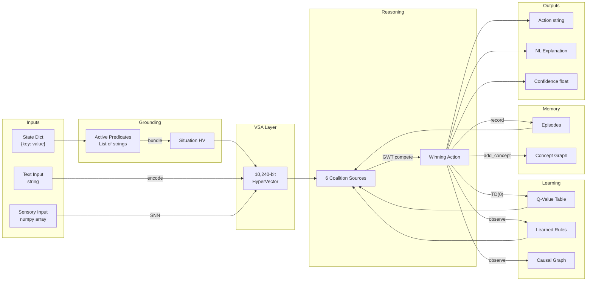
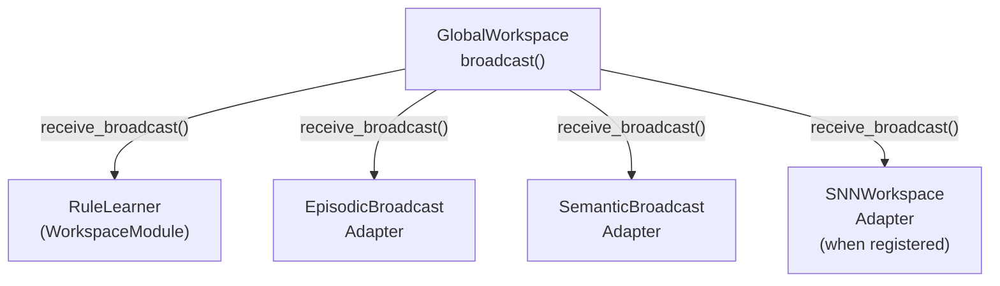
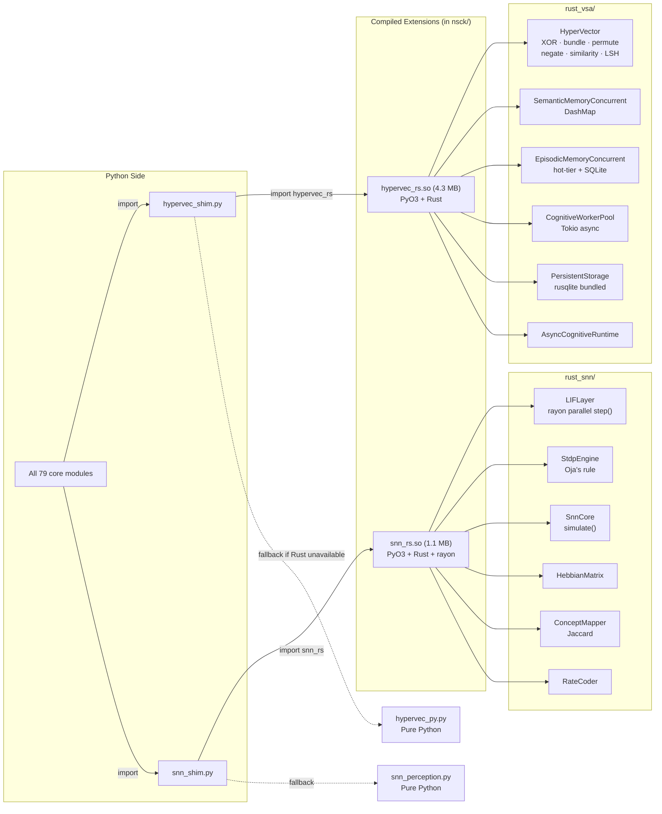
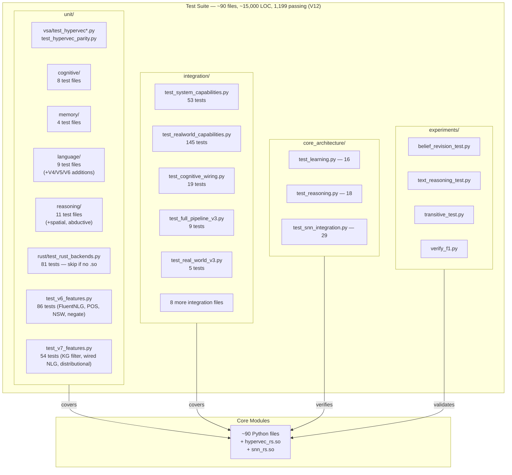

# NSCK Repository Map

A complete Mermaid map showing every file in the codebase, how they connect to each other, what each provides, and the data flow between subsystems.

---

## Complete Codebase Structure

```mermaid
graph TB
    subgraph Root["Node_network/"]
        README_root["README.md"]
        REQ["requirements.txt"]
        PYTEST["pytest.ini"]
        LICENSE["LICENSE"]
    end

    subgraph NSCK["nsck/"]
        subgraph PythonCore["python/core/ — ~90 files, ~28,000 LOC (V12)"]
            subgraph VSA["vsa/"]
                HVPy["hypervec_py.py<br/>361 LOC<br/>━━━━━━━━━━<br/>HyperVectorPy<br/>CleanupMemory<br/>negate() (V6)"]
                HVShim["hypervec_shim.py<br/>320 LOC<br/>━━━━━━━━━━<br/>Backend selector<br/>Rust ↔ Python"]
            end

            subgraph ReasoningDir["reasoning/"]
                CogEng["cognitive_engine.py<br/>1,402 LOC<br/>━━━━━━━━━━<br/>CognitiveEngine<br/>CognitiveState<br/>Proposal"]
                GW["global_workspace.py<br/>312 LOC<br/>━━━━━━━━━━<br/>GlobalWorkspace<br/>Coalition<br/>WorkspaceModule"]
                Plan["planner.py<br/>296 LOC<br/>━━━━━━━━━━<br/>STRIPSPlanner<br/>PlanStep"]
                CausalR["causal_reasoning.py<br/>1,233 LOC<br/>━━━━━━━━━━<br/>CausalDiscovery<br/>CausalGraph<br/>CausalReasoner"]
                RuleL["rule_learner.py<br/>644 LOC<br/>━━━━━━━━━━<br/>RuleLearner<br/>RuleCandidate"]
                AnalE["analogy.py<br/>609 LOC<br/>━━━━━━━━━━<br/>AnalogyEngine<br/>Analogy"]
                CtxE["context_engine.py<br/>440 LOC<br/>━━━━━━━━━━<br/>ContextEngine<br/>ContextFrame"]
                MathR["math_reasoning.py<br/>━━━━━━━━━━<br/>MathReasoner<br/>FPECodebook<br/>LinearSolver"]
                SpatialR["spatial_reasoning.py (V5)<br/>━━━━━━━━━━<br/>SpatialReasoner<br/>PositionCodebook<br/>FPE bit-flip · 8 relations"]
                TemporalR["temporal_reasoning.py (V4)<br/>━━━━━━━━━━<br/>TemporalReasoner<br/>before/after/during"]
                AbductR["abductive_reasoning.py (V4)<br/>━━━━━━━━━━<br/>AbductiveReasoner<br/>best-explanation"]
                PredP["predictive_processor.py (V4)<br/>━━━━━━━━━━<br/>PredictiveProcessor<br/>PRIOR_UNCERTAINTY=0.5"]
            end

            subgraph LearningDir["learning/"]
                Hebb["hebbian.py<br/>506 LOC<br/>━━━━━━━━━━<br/>HebbianMatrixNumPy<br/>VSAHebbianLearner"]
                Curio["curiosity.py<br/>336 LOC<br/>━━━━━━━━━━<br/>CuriosityModule<br/>ExplorationDecision"]
                SchemaI["schema_induction.py (V4)<br/>━━━━━━━━━━<br/>SchemaInducer<br/>slot-filling patterns"]
                PMIL["pmi_learner.py (V4)<br/>━━━━━━━━━━<br/>PMILearner<br/>log₂(P(a,b)/P(a)P(b))"]
                PredC["predictive_coding.py (V4)<br/>━━━━━━━━━━<br/>PredictiveCodingModule"]
                ActiveI["active_inference.py (V4)<br/>━━━━━━━━━━<br/>ActiveInferenceLearner<br/>MIN_TEMP=0.1 MAX_TEMP=5.0"]
            end

            subgraph CognitiveDir["cognitive/"]
                Meta["metacognition.py<br/>504 LOC<br/>━━━━━━━━━━<br/>SafetyGate<br/>MetacognitiveEngine"]
                SelfM["self_model.py<br/>255 LOC<br/>━━━━━━━━━━<br/>SelfModel"]
                ToM["theory_of_mind.py<br/>312 LOC<br/>━━━━━━━━━━<br/>TheoryOfMind<br/>MentalStateModel"]
                Emo["emotion_system.py<br/>420 LOC<br/>━━━━━━━━━━<br/>EmotionSystem"]
            end

            subgraph PerceptionDir["perception/"]
                SNNPerc["snn_perception.py<br/>561 LOC<br/>━━━━━━━━━━<br/>SNNPerceptionModule<br/>LIFNeuronLayer"]
                SNNInt["snn_integration.py<br/>240 LOC<br/>━━━━━━━━━━<br/>SNNWorkspaceAdapter"]
                Bridge["vsa_snn_bridge.py<br/>461 LOC<br/>━━━━━━━━━━<br/>RateCoder<br/>TemporalCoder<br/>HVtoSpikeDecoder"]
                Ground["grounding_verifier.py<br/>585 LOC<br/>━━━━━━━━━━<br/>GroundingVerifier<br/>GroundingResult"]
                SymGround["symbol_grounding.py<br/>196 LOC<br/>━━━━━━━━━━<br/>Abstract grounding"]
            end

            subgraph MemoryDir["memory/"]
                EpiMem["episodic_memory.py<br/>501 LOC<br/>━━━━━━━━━━<br/>EpisodicMemory<br/>LiveEpisode"]
                SemMem["semantic_memory.py<br/>~800 LOC<br/>━━━━━━━━━━<br/>SemanticMemory<br/>NSW ANN (V6)<br/>infer_transitive (V4)<br/>build_prototypes (V4)"]
                StagedR["staged_recall.py<br/>134 LOC<br/>━━━━━━━━━━<br/>StagedRecall"]
            end

            subgraph LangDir["language/"]
                LangMod["language_module.py<br/>526 LOC<br/>━━━━━━━━━━<br/>LanguageModule"]
                Dialog["dialogue_manager.py<br/>506 LOC<br/>━━━━━━━━━━<br/>DialogueManager<br/>FluentNLG wired (V7)"]
                TKL["text_knowledge_learner.py<br/>1,074 LOC<br/>━━━━━━━━━━<br/>TextKnowledgeLearner<br/>_STOP_CONCEPTS (V7)<br/>DistribPreTrain (V7)"]
                UniIn["universal_input.py<br/>947 LOC<br/>━━━━━━━━━━<br/>UniversalInput"]
                Lingua["lingua_cortex.py<br/>260 LOC<br/>━━━━━━━━━━<br/>LinguaCortex<br/>SemanticFingerprint"]
                FlNLG["fluent_nlg.py (V6)<br/>━━━━━━━━━━<br/>FluentResponseComposer<br/>NSCKResponseEngine<br/>RelationVerbalizer"]
                POS["pos_tagger.py (V6)<br/>━━━━━━━━━━<br/>BrillPosTagger<br/>300+ lexicon · 8 rules"]
                Prag["pragmatics.py (V5)<br/>━━━━━━━━━━<br/>PragmaticEngine<br/>15 Horn scales<br/>7 speech acts"]
                DistSem["distributional_semantics.py<br/>━━━━━━━━━━<br/>DistributionalCodebook<br/>BUILTIN_CORPUS (V7)"]
                HFLoad["hf_corpus_loader.py (V7)<br/>━━━━━━━━━━<br/>HFCorpusLoader<br/>offline fallback"]
                CG["construction_grammar.py<br/>━━━━━━━━━━<br/>ConstructionMatcher<br/>71 constructions (V4)"]
            end

            subgraph IntegDir["integration/"]
                Config["config.py<br/>~100 LOC<br/>━━━━━━━━━━<br/>NSCKConfig<br/>25 feature flags"]
                Persist["persistence.py<br/>852 LOC<br/>━━━━━━━━━━<br/>BrainStore"]
                BFusion["brain_fusion.py<br/>481 LOC<br/>━━━━━━━━━━<br/>BrainFusion<br/>FusedBrain"]
                Explain["explanation.py<br/>433 LOC<br/>━━━━━━━━━━<br/>ExplanationGenerator"]
                KI["knowledge_integration.py<br/>530 LOC<br/>━━━━━━━━━━<br/>KnowledgeIntegration"]
            end

            subgraph TrainingDir["training/"]
                SNNTrain["snn_training.py<br/>589 LOC<br/>━━━━━━━━━━<br/>SNNTrainer"]
                SNNBench["snn_benchmarks.py<br/>483 LOC<br/>━━━━━━━━━━<br/>Benchmark suite"]
            end

            subgraph AdaptersDir["adapters/ (V9–V12)"]
                DictAdapt["dict_state_adapter.py<br/>━━━━━━━━━━<br/>DictStateAdapter"]
                TextAdapt["text_adapter.py<br/>━━━━━━━━━━<br/>TextAdapter"]
                NumAdapt["numeric_adapter.py<br/>━━━━━━━━━━<br/>NumericAdapter"]
                NumSeqAdapt["numeric_sequence_adapter.py (V11)<br/>━━━━━━━━━━<br/>NumericSequenceAdapter<br/>FPE + stat predicates"]
                SNNAdapt["snn_adapter.py<br/>━━━━━━━━━━<br/>SNNAdapter"]
                MMFuse["multimodal_fuser.py<br/>━━━━━━━━━━<br/>MultimodalFuser"]
                StreamProc["stream_processor.py<br/>━━━━━━━━━━<br/>StreamProcessor<br/>StreamVerifier"]
                ImgAdapt["image_adapter.py (V12)<br/>━━━━━━━━━━<br/>ImageAdapter<br/>65-dim FPE · CV features"]
                AudAdapt["audio_adapter.py (V12)<br/>━━━━━━━━━━<br/>AudioAdapter<br/>23-dim FPE · MFCC"]
            end

            Substrate["substrate.py (V11)<br/>━━━━━━━━━━<br/>NSCKSubstrate<br/>SubstrateResult<br/>Developer public API"]
        end

        subgraph RustVSA["rust_vsa/ — 7 files, ~2,665 LOC"]
            RLib["lib.rs (280)<br/>HyperVector + PyO3"]
            RSem["semantic.rs (444)<br/>SemanticMemoryConcurrent"]
            REpi["episodic.rs (427)<br/>EpisodicMemoryConcurrent"]
            RWork["worker_pool.rs (488)<br/>CognitiveWorkerPool"]
            RConc["concurrent.rs (319)<br/>Lock-free structures"]
            RPers["persistence.rs (416)<br/>PersistentStorage"]
            RAsync["async_runtime.rs (291)<br/>AsyncCognitiveRuntime"]
        end

        subgraph Tests["tests/ — 40 files, ~9,100 LOC"]
            TUnit["unit/"]
            TInteg["integration/"]
            TCore["core_architecture/"]
            TExp["experiments/"]
            TReg["regression/"]
        end

        subgraph Docs["docs/"]
            DocArch["ARCHITECTURE.md"]
            DocForm["FORMULAS.md"]
            DocWork["WORKFLOWS.md"]
            DocRef["MODULE_REFERENCE.md"]
            DocMap["REPOMAP.md"]
            DocTrans["TRANSPARENCY_GUARANTEE.md"]
            DocSNN["SNN_FINAL_SUMMARY.md"]
            DocAnalysis["ANALYSIS_AND_USECASES.md"]
        end

        subgraph Data["data/"]
            DBeliefA["belief_A.txt"]
            DBeliefB["belief_B.txt"]
            DLong["long_chain.txt"]
            DSound["sound_physics.txt"]
            DXylo["xylophone_planets.txt"]
        end

        Examples["examples/<br/>quickstart.py<br/>learn_from_text.py<br/>custom_module.py"]

        Archive["archive/<br/>Historical experiments<br/>game implementations<br/>benchmarks"]
    end

    subgraph AIModel["nsck_ai_model/ — Separate System"]
        AIEng["ai_engine.py"]
        AITrain["train.py"]
        AIAuto["autonomous_trainer.py"]
        AIEval["evaluator.py"]
        AIDash["dashboard.py"]
    end
```

---

## Module Dependency Graph

Every arrow is a verified `import` statement. The `CognitiveEngine` is the central hub.

```mermaid
graph TD
    %% VSA Foundation (everything depends on this)
    HVShim["hypervec_shim"]
    HVPy["hypervec_py"]
    
    HVShim -->|"fallback"| HVPy
    
    %% Central Hub
    CE["cognitive_engine"]
    
    %% CE → all imports
    CE -->|"import"| HVShim
    CE -->|"import"| Config["config"]
    CE -->|"import"| Explain["explanation"]
    CE -->|"import"| Ground["grounding_verifier"]
    CE -->|"import"| RuleL["rule_learner"]
    CE -->|"import"| EpiMem["episodic_memory"]
    CE -->|"import"| SemMem["semantic_memory"]
    CE -->|"import"| Curio["curiosity"]
    CE -->|"import"| AnalE["analogy"]
    CE -->|"import"| Plan["planner"]
    CE -->|"import"| GW["global_workspace"]
    CE -->|"import"| CausalR["causal_reasoning"]
    CE -->|"import"| SelfM["self_model"]
    CE -->|"import"| ToM["theory_of_mind"]
    CE -->|"import"| Meta["metacognition"]
    CE -->|"import"| Persist["persistence"]
    CE -->|"import"| BFusion["brain_fusion"]
    CE -->|"import"| UniIn["universal_input"]
    CE -->|"import"| LangMod["language_module"]
    CE -->|"import"| Dialog["dialogue_manager"]
    
    %% Cross-module imports
    RuleL -->|"import"| HVShim
    RuleL -->|"import"| Persist
    RuleL -->|"import"| Ground
    RuleL -->|"import"| GW
    
    AnalE -->|"import"| HVShim
    
    CtxE["context_engine"] -->|"import"| HVShim
    
    Curio -->|"import"| HVShim
    
    Meta -->|"import"| HVShim
    Meta -->|"import"| BFusion
    
    SelfM -->|"import"| HVShim
    
    Emo["emotion_system"] -->|"import"| HVShim
    
    SNNPerc["snn_perception"] -->|"import"| Bridge["vsa_snn_bridge"]
    SNNPerc -->|"import"| Hebb["hebbian"]
    SNNPerc -->|"import"| HVShim
    
    Bridge -->|"import"| HVShim
    
    SNNInt["snn_integration"] -->|"import"| SNNPerc
    SNNInt -->|"import"| GW
    SNNInt -->|"import"| SemMem
    
    SNNTrain["snn_training"] -->|"import"| SNNPerc
    SNNTrain -->|"import"| HVShim
    
    EpiMem -->|"import"| HVShim
    EpiMem -->|"import"| Persist
    
    SemMem -->|"import"| HVShim
    
    StagedR["staged_recall"] -->|"import"| HVShim
    
    LangMod -->|"import"| Lingua["lingua_cortex"]
    
    TKL["text_knowledge_learner"] -->|"import"| HVShim
    TKL -->|"import"| Lingua
    TKL -->|"import"| SemMem
    TKL -->|"import"| EpiMem
    TKL -->|"import"| CtxE
    TKL -->|"import"| CausalR
    TKL -->|"import"| LangMod
    
    UniIn -->|"import"| HVShim
    
    BFusion -->|"import"| HVShim
    
    KI["knowledge_integration"] -->|"import"| HVShim
    KI -->|"import"| SemMem
    KI -->|"import"| EpiMem
    KI -->|"import"| CtxE
    KI -->|"import"| CausalR
    
    Plan -.->|"reads"| CausalR
```

---

## Data Flow Between Subsystems

---

## GWT Broadcast Network

---

## Rust ↔ Python Interface

---

## Test Coverage Map

---

## File Size Distribution

| Size Range | Count | Files |
|-----------|-------|-------|
| **1000+ LOC** | 3 | cognitive_engine (1,402), text_knowledge_learner (1,074), causal_reasoning (1,233) |
| **500–999 LOC** | 11 | universal_input (947), persistence (852), rule_learner (644), snn_training (589), grounding_verifier (585), snn_perception (561), knowledge_integration (530), analogy (609), hebbian (506), metacognition (504), dialogue_manager (506) |
| **200–499 LOC** | 15 | language_module (526), snn_benchmarks (483), brain_fusion (481), vsa_snn_bridge (461), context_engine (440), explanation (433), emotion_system (420), episodic_memory (501), hypervec_py (361), curiosity (336), hypervec_shim (320), global_workspace (312), theory_of_mind (312), pragmatics (~200), fluent_nlg (~350) |
| **< 200 LOC** | 12+ | planner (296), lingua_cortex (260), self_model (255), snn_integration (240), symbol_grounding (196), staged_recall (134), pos_tagger (~180), spatial_reasoning (~200), hf_corpus_loader (~120), schema_induction (~150), pmi_learner (~100), active_inference (~120) |

**Total: ~90 Python source files, ~28,000 LOC** + **Rust: 2 crates (~3,100 LOC)** = **~31,000 LOC**

**Rust binaries (build artifacts — gitignored):**
- `nsck/hypervec_rs.so` — 4.3 MB — VSA operations
- `nsck/snn_rs.so` — 1.1 MB — SNN simulation
