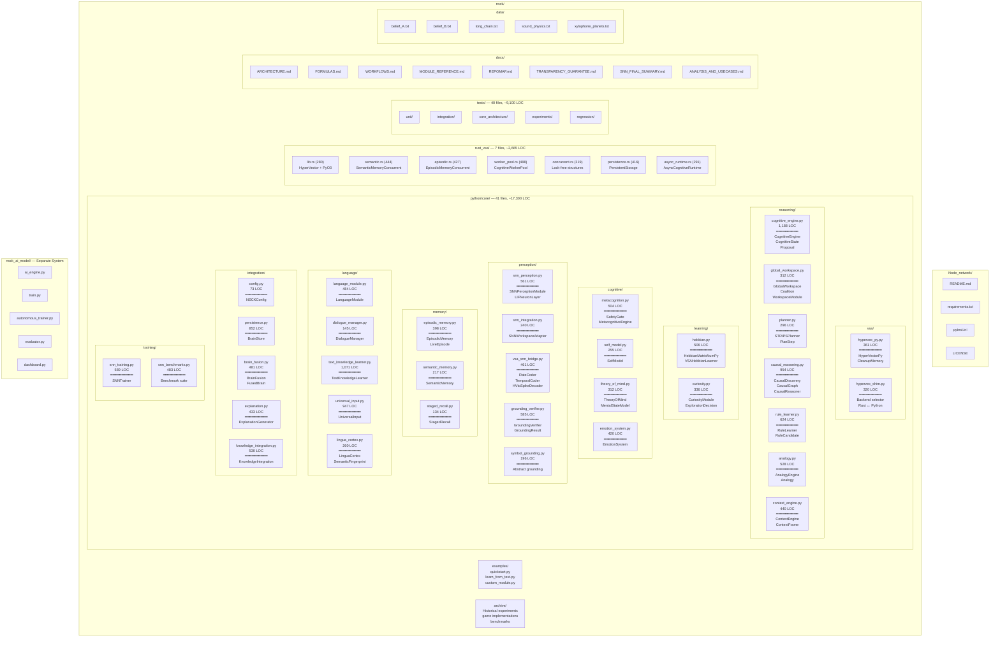
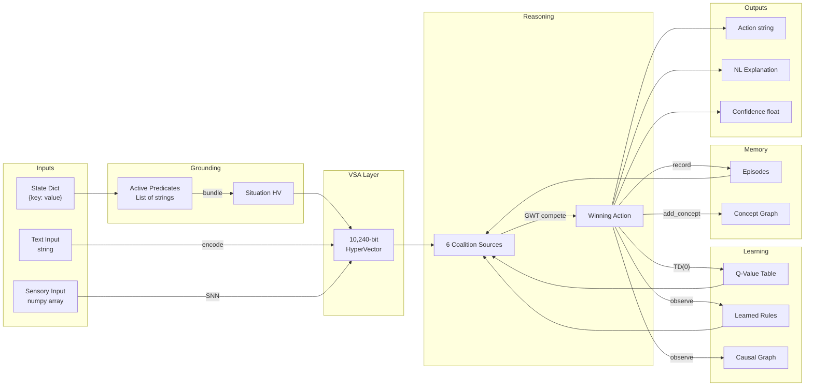
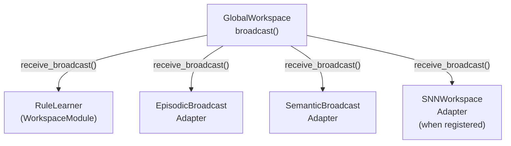
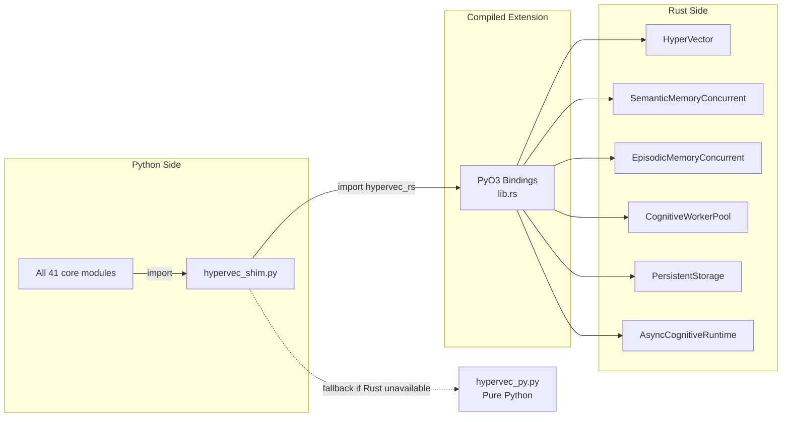
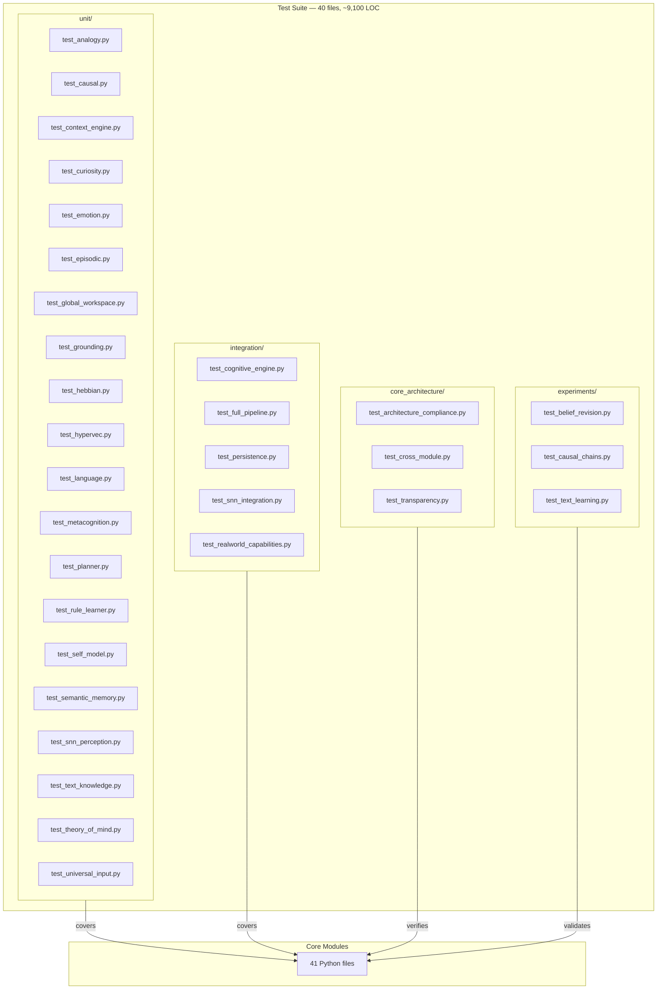

# NSCK Repository Map

A complete Mermaid map showing every file in the codebase, how they connect to each other, what each provides, and the data flow between subsystems.

---

## Complete Codebase Structure

---

## Module Dependency Graph

Every arrow is a verified `import` statement. The `CognitiveEngine` is the central hub.

```mermaid
graph TD
    %% VSA Foundation (everything depends on this)
    HVShim["hypervec_shim"]
    HVPy["hypervec_py"]
    
    HVShim -->|"fallback"| HVPy
    
    %% Central Hub
    CE["cognitive_engine"]
    
    %% CE → all imports
    CE -->|"import"| HVShim
    CE -->|"import"| Config["config"]
    CE -->|"import"| Explain["explanation"]
    CE -->|"import"| Ground["grounding_verifier"]
    CE -->|"import"| RuleL["rule_learner"]
    CE -->|"import"| EpiMem["episodic_memory"]
    CE -->|"import"| SemMem["semantic_memory"]
    CE -->|"import"| Curio["curiosity"]
    CE -->|"import"| AnalE["analogy"]
    CE -->|"import"| Plan["planner"]
    CE -->|"import"| GW["global_workspace"]
    CE -->|"import"| CausalR["causal_reasoning"]
    CE -->|"import"| SelfM["self_model"]
    CE -->|"import"| ToM["theory_of_mind"]
    CE -->|"import"| Meta["metacognition"]
    CE -->|"import"| Persist["persistence"]
    CE -->|"import"| BFusion["brain_fusion"]
    CE -->|"import"| UniIn["universal_input"]
    CE -->|"import"| LangMod["language_module"]
    CE -->|"import"| Dialog["dialogue_manager"]
    
    %% Cross-module imports
    RuleL -->|"import"| HVShim
    RuleL -->|"import"| Persist
    RuleL -->|"import"| Ground
    RuleL -->|"import"| GW
    
    AnalE -->|"import"| HVShim
    
    CtxE["context_engine"] -->|"import"| HVShim
    
    Curio -->|"import"| HVShim
    
    Meta -->|"import"| HVShim
    Meta -->|"import"| BFusion
    
    SelfM -->|"import"| HVShim
    
    Emo["emotion_system"] -->|"import"| HVShim
    
    SNNPerc["snn_perception"] -->|"import"| Bridge["vsa_snn_bridge"]
    SNNPerc -->|"import"| Hebb["hebbian"]
    SNNPerc -->|"import"| HVShim
    
    Bridge -->|"import"| HVShim
    
    SNNInt["snn_integration"] -->|"import"| SNNPerc
    SNNInt -->|"import"| GW
    SNNInt -->|"import"| SemMem
    
    SNNTrain["snn_training"] -->|"import"| SNNPerc
    SNNTrain -->|"import"| HVShim
    
    EpiMem -->|"import"| HVShim
    EpiMem -->|"import"| Persist
    
    SemMem -->|"import"| HVShim
    
    StagedR["staged_recall"] -->|"import"| HVShim
    
    LangMod -->|"import"| Lingua["lingua_cortex"]
    
    TKL["text_knowledge_learner"] -->|"import"| HVShim
    TKL -->|"import"| Lingua
    TKL -->|"import"| SemMem
    TKL -->|"import"| EpiMem
    TKL -->|"import"| CtxE
    TKL -->|"import"| CausalR
    TKL -->|"import"| LangMod
    
    UniIn -->|"import"| HVShim
    
    BFusion -->|"import"| HVShim
    
    KI["knowledge_integration"] -->|"import"| HVShim
    KI -->|"import"| SemMem
    KI -->|"import"| EpiMem
    KI -->|"import"| CtxE
    KI -->|"import"| CausalR
    
    Plan -.->|"reads"| CausalR
```

---

## Data Flow Between Subsystems

---

## GWT Broadcast Network

---

## Rust ↔ Python Interface

---

## Test Coverage Map

---

## File Size Distribution

| Size Range | Count | Files |
|-----------|-------|-------|
| **1000+ LOC** | 3 | cognitive_engine (1,188), text_knowledge_learner (1,071), causal_reasoning (954) |
| **500–999 LOC** | 10 | universal_input (947), persistence (852), rule_learner (624), snn_training (589), grounding_verifier (585), snn_perception (561), knowledge_integration (530), analogy (528), hebbian (506), metacognition (504) |
| **200–499 LOC** | 13 | language_module (484), snn_benchmarks (483), brain_fusion (481), vsa_snn_bridge (461), context_engine (440), explanation (433), emotion_system (420), episodic_memory (398), hypervec_py (361), curiosity (336), hypervec_shim (320), global_workspace (312), theory_of_mind (312) |
| **< 200 LOC** | 7 | planner (296), lingua_cortex (260), self_model (255), snn_integration (240), semantic_memory (217), symbol_grounding (196), dialogue_manager (145), staged_recall (134), config (73) |

**Total: 41 Python files, ~17,300 LOC** + **7 Rust files, ~2,665 LOC** = **~20,000 LOC**
