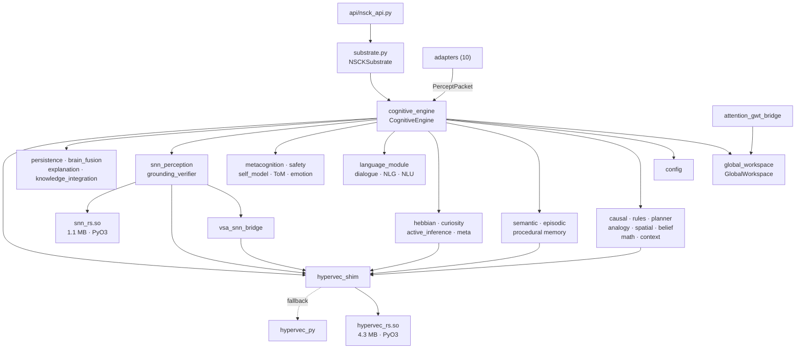
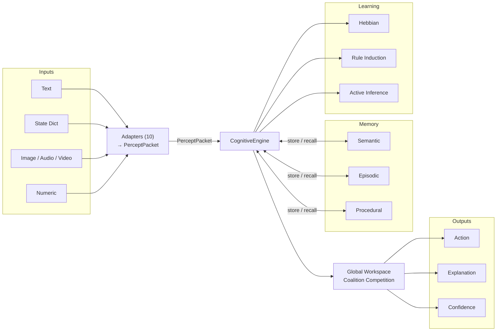
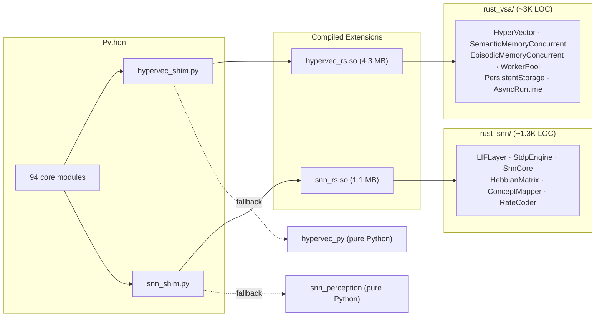

# NSCK V13 — Repository Navigation Map

> **94 core Python modules · 232 classes · ~36K LOC Python · ~4.3K LOC Rust · 1437 tests**

| Metric | Value |
|--------|-------|
| Core Python modules | 94 (in `python/core/`, excl. `__init__.py` and tests) |
| Classes | 232 |
| Python core LOC | ~36,000 |
| Rust LOC | ~4,300 |
| Test files / LOC | 84 / ~19,000 |
| Tests | 1437 (1424 pass, 2 stochastic, 7 skipped, 4 xfailed) |

---

## Directory Structure

```
nsck/
├── python/core/                  94 modules, ~36K LOC
│   ├── adapters/      (10 files) Input normalization and multimodal fusion
│   ├── cognitive/      (5 files) Higher-order cognition and safety
│   ├── integration/    (5 files) Config, persistence, fusion, explanation
│   ├── language/      (20 files) NLU/NLG pipeline, dialogue, pragmatics
│   ├── learning/      (10 files) Hebbian, curiosity, active inference, rules
│   ├── memory/         (7 files) Semantic, episodic, procedural stores
│   ├── multimodal/     (2 files) Cross-modal processing and image generation
│   ├── perception/     (8 files) SNN, symbol grounding, VSA-SNN bridge
│   ├── reasoning/     (14 files) Central engine, GWT, causal, planning
│   ├── training/       (3 files) VSA/SNN training and benchmarks
│   ├── types/          (2 files) PerceptPacket, ModalityAdapter protocols
│   ├── vsa/            (7 files) HyperVector ops (Python + Rust shim)
│   └── substrate.py              Public API entry point
├── rust_vsa/                     Rust VSA accelerator (PyO3) → hypervec_rs.so (4.3 MB)
├── rust_snn/                     Rust SNN accelerator (PyO3) → snn_rs.so (1.1 MB)
├── api/                          FastAPI REST: /decide, /learn, /sleep, /status
├── tests/                        84 files across unit/, integration/, core_architecture/,
│                                 experiments/, regression/, benchmarks/
├── benchmarks/                   Benchmark runner + domain benchmarks
├── eval/                         Evaluation harness and end-to-end evals
├── scripts/                      Utility scripts (verify_rust, generate_v11_report)
├── examples/                     Runnable demos (quickstart, custom_module, learn_from_text, demo_snn)
├── data/                         Built-in datasets
├── docs/                         9 documentation files
├── pyproject.toml                Project metadata and build config
└── conftest.py                   Shared pytest fixtures
```

---

## Key Entry Points

| Entry Point | File | Role |
|-------------|------|------|
| **Public API** | `python/core/substrate.py` | `NSCKSubstrate` — developer-facing interface |
| **Cognitive Hub** | `python/core/reasoning/cognitive_engine.py` | `CognitiveEngine` — central orchestrator |
| **REST API** | `api/nsck_api.py` | FastAPI server (`/decide`, `/learn`, `/sleep`, `/status`) |

---

## Subsystem Reference

### `adapters/` — 10 files · Input → PerceptPacket normalization

`text_adapter`, `dict_state_adapter`, `numeric_adapter`, `numeric_sequence_adapter`, `snn_adapter`, `multimodal_fuser`, `stream_processor`, `image_adapter` (65-dim FPE), `audio_adapter` (23-dim MFCC), `video_adapter`

### `cognitive/` — 5 files · Higher-order cognition and safety

`emotion_system` (valence/arousal), `metacognition` (safety gate + confidence), `safety_verifier`, `self_model`, `theory_of_mind`

### `integration/` — 5 files · Config, persistence, cross-cutting

`brain_fusion`, `config` (NSCKConfig + feature flags), `explanation`, `knowledge_integration`, `persistence` (BrainStore)

### `language/` — 20 files · Full NLU → dialogue → NLG pipeline

`parser`, `language_module`, `vsa_language_module`, `ngram_nlu`, `fluent_nlg`, `nlg`, `dialogue_manager`, `construction_grammar`, `frame_semantics`, `coreference`, `semantic_roles`, `pragmatics`, `distributional_semantics`, `text_knowledge_learner`, `pos_tagger` (300+ lexicon), `universal_input`, `lingua_cortex`, `control`, `hf_corpus_loader`, `compositional_semantics_backup`

### `learning/` — 10 files · From Hebbian to meta-learning

`hebbian`, `curiosity`, `active_inference`, `rule_neural_scorer`, `conformal_wrapper`, `pattern_generalizer`, `cross_domain`, `cross_modal`, `continual_learning`, `meta_learning`

### `memory/` — 7 files · Three-store architecture + maintenance

`semantic_memory` (NSW search), `episodic_memory`, `procedural_memory`, `cross_modal_associative_memory`, `concept_drift_detector`, `homeostasis`, `staged_recall` (fast → deep)

### `multimodal/` — 2 files

`multimodal_processor` (cross-modal alignment), `image_generator` (VSA-guided)

### `perception/` — 8 files · SNN and symbol grounding

`snn_perception` (LIF layers), `snn_shim` (Rust ↔ Python), `snn_integration` (SNNWorkspaceAdapter), `signal_ingestor`, `symbol_grounding`, `grounding_verifier`, `vsa_snn_bridge` (rate/temporal coding), `stream_encoder`

### `reasoning/` — 14 files · Central engine + specialized reasoners

`cognitive_engine` (**central hub**), `global_workspace` (GWT), `causal_reasoning`, `causal_rule_auditor`, `causal_interface`, `causal_service_impl`, `rule_learner`, `attention_gwt_bridge`, `planner` (STRIPS), `analogy`, `math_reasoning`, `spatial_reasoning` (8 relations), `belief_revision` (AGM), `context_engine`

### `training/` — 3 files

`vsa_trainer`, `snn_training` (STDP), `snn_benchmarks`

### `types/` — 2 files

`percept_packet` (PerceptPacket dataclass), `modality_adapter` (ModalityAdapter protocol)

### `vsa/` — 7 files · Hyperdimensional computing foundation

`hypervec_py` (pure-Python fallback), `hypervec_shim` (Rust ↔ Python selector), `fhrr`, `vsa_embedding_bridge`, `resonator`, `universal_hv_encoder`, `rust_concurrent_shim`

### `substrate.py` — Public API

`NSCKSubstrate` wraps `CognitiveEngine` and exposes `decide()`, `learn()`, `sleep()`, `explain()`.

---

## Subsystem Dependency Graph



---

## Data Flow



---

## Rust ↔ Python Interface



---

## Test Organization

```
tests/                            84 files, ~19K LOC, 1437 tests
├── unit/                         Fine-grained module tests
├── integration/                  Cross-subsystem pipeline tests
├── core_architecture/            Architecture invariant checks
├── experiments/                  Research experiments and validations
├── regression/                   Regression tests for fixed bugs
└── benchmarks/                   Performance benchmarks
```

| Result | Count |
|--------|-------|
| Pass (with Rust) | 1424 |
| Stochastic | 2 |
| Skipped | 7 |
| xfailed | 4 |
| **Total** | **1437** |

---

## Quick Reference

```bash
pytest                            # run all 1437 tests (auto-detects Rust .so)
pytest tests/unit/reasoning/      # subsystem tests
pytest tests/integration/         # pipeline tests
uvicorn nsck.api.nsck_api:app     # start REST API
python -m nsck.benchmarks.runner  # run benchmarks
```
