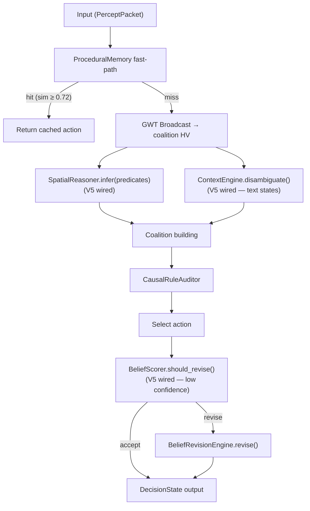

# NSCK Wiring Map — V4

This document describes how all major NSCK modules connect in the V4 system.

---

## Top-Level Data Flow

```
External Input
    │
    ▼
┌─────────────────────────────────────────────────────────┐
│  Perception Layer                                        │
│  TextAdapter / ImageAdapter / AudioAdapter              │
│      │                                                   │
│      ▼                                                   │
│  PerceptPacket                                           │
└──────────────────┬──────────────────────────────────────┘
                   │  PerceptPacket
                   ▼
┌─────────────────────────────────────────────────────────┐
│  ProceduralMemory fast-path (V4 — LSH O(1))             │
│  if similarity(state_hv, skill.context_hv) ≥ 0.72       │
│      └── return cached (action, confidence) immediately  │
│  else fall through ↓                                     │
└──────────────────┬──────────────────────────────────────┘
                   │  (on cache miss)
                   ▼
┌─────────────────────────────────────────────────────────┐
│  GWT Broadcast (Global Workspace Theory)                │
│  CognitiveBroadcast → coalition HV                      │
└──────────────────┬──────────────────────────────────────┘
                   │  Broadcast HV
                   ▼
┌─────────────────────────────────────────────────────────┐
│  Reasoning Layer                                         │
│  CognitiveEngine.decide()                               │
│      │                                                   │
│      ├── CausalRuleAuditor                              │
│      ├── imagine_rollout() (V4 multi-step imagination)  │
│      └── EWC-aware rule pruning (V4)                    │
└──────────────────┬──────────────────────────────────────┘
                   │  DecisionState
                   ▼
┌─────────────────────────────────────────────────────────┐
│  Memory Layer                                            │
│  SemanticMemory [Rust] ← spreading_activation_step (V4) │
│      hot cache LRU 256 entries (V4)                     │
│  EpisodicMemory                                          │
│  ProceduralMemory [LSH O(1)] (V4)                       │
└──────────────────┬──────────────────────────────────────┘
                   │  Updated knowledge
                   ▼
┌─────────────────────────────────────────────────────────┐
│  Learning Layer (EWC-aware, V4)                          │
│  RuleLearner (EWC pruning) / ContinualLearner            │
│  Auto-cache skill on positive reward → ProceduralMemory │
└─────────────────────────────────────────────────────────┘
```

---

## V4 Rust Acceleration Points

```
hypervec_rs [Rust]
    ├── bundle_hvs()          — N-vector majority-vote bundle (V4)
    ├── lsh_bucket()          — ProceduralMemory O(1) lookup (V4)
    ├── spreading_activation_step() — SemanticMemory hot path (V4)
    ├── HyperVector           — 10240-bit XOR/bundle/similarity
    ├── SemanticMemoryConcurrent
    ├── EpisodicMemoryConcurrent
    └── CognitiveWorkerPool

snn_rs [Rust]
    ├── SnnCore / LIFLayer
    ├── StdpEngine
    ├── HebbianMatrix
    ├── ConceptMapper
    └── RateCoder
```

---

## V4 Knowledge Seeding Wiring

```
YAML Domain Kit (navigation.yaml / scheduling.yaml)
    │
    ▼
KnowledgeSeeder.seed_from_yaml(yaml_path, engine)
    ├── semantic_concepts → SemanticMemory.add_concept()
    ├── causal_rules → RuleLearner.learned_rules[domain]
    ├── causal_graph → CausalGraph.add_causes()
    └── high-confidence rules → ProceduralMemory.cache_skill()
    │
    ▼
engine.seed_domain("navigation.yaml")  ← thin wrapper
```

---

## V4 SNN Auto-Grounding Wiring

```
NSCKSubstrate.__init__()
    └── SNNPerceptionModule.register_concepts_from_memory(semantic_memory)
            └── for each concept in SemanticMemory:
                    ConceptMapper.register(concept_name, concept_hv)
            → spike patterns now resolve to named predicates
```

---

## Module Dependency Graph

```
NSCKConfig
    └── NSCKSubstrate
            ├── SemanticMemory (hot cache V4) [Rust shim]
            ├── EpisodicMemory
            ├── ProceduralMemory (LSH O(1) V4)
            ├── CognitiveEngine
            │       ├── CausalRuleAuditor
            │       ├── imagine_rollout() (V4)
            │       ├── EWC rule pruning (V4)
            │       └── VSANLUEngine (V4, primary NLU)
            ├── KnowledgeSeeder (V4)
            └── ContinualLearner (EWC)
```

---

## Config → Module Mapping

| Config Flag | Module Enabled |
|-------------|---------------|
| `enable_causal_enrichment` | `CausalEnricher` |
| `enable_perceptual_enrichment` | `PerceptualEnricher` |
| `enable_semantic_enrichment` | `SemanticEnricher` |
| `enable_glass_box_tracer` | `GlassBoxTracer` |
| `enable_crossmodal_enrichment` | `CrossModalEnricher` |
| `enable_ewc` | `ContinualLearner` + EWC rule pruning (V4) |
| `enable_seeding` | `KnowledgeSeeder` (V4) |
| `enable_hnsw_index` | HNSW in `SemanticMemory` (default-on V4) |
| `perception_mode="bridge"` | Bridge adapters |

---

*Updated for NSCK V4, February 2026.*

---

## V5 Module Wiring — New Connections

The following modules were initialized but not called in V4. In V5, each is
wired into the main decision loop.

### V5 Wiring Summary

| Module | Wired Into | Signal |
|--------|-----------|--------|
| `SpatialReasoner` | `decide()` coalition building | Spatial predicates → suggested actions |
| `BeliefScorer` (BeliefRevision) | `decide()` post-decision | Low-confidence → belief revision trigger |
| `ContextEngine` | `decide()` text processing | Word disambiguation for text states |
| `EmotionSystem` | `learn()` | Reward + novelty → valence/arousal update |
| `MetaLearner` | `register_task()` | Strategy selection for new tasks |
| `ContinualLearner` | `sleep()` | Per-task EWC consolidation |

### V5 Module Dependency Update

```
NSCKConfig
    └── NSCKSubstrate
            ├── SemanticMemory (hot cache V4) [Rust shim]
            ├── EpisodicMemory
            ├── ProceduralMemory (LSH O(1) V4)
            ├── DriftDetector (V5 — wired in sleep())
            ├── CognitiveEngine
            │       ├── CausalRuleAuditor
            │       ├── imagine_rollout() (V4)
            │       ├── EWC rule pruning (V4)
            │       ├── VSANLUEngine (V4, primary NLU)
            │       ├── SpatialReasoner (V5 wired — decide())
            │       ├── BeliefScorer (V5 wired — decide())
            │       ├── ContextEngine (V5 wired — decide())
            │       ├── EmotionSystem (V5 wired — learn())
            │       ├── MetaLearner (V5 wired — register_task())
            │       └── ContinualLearner (V5 wired — sleep())
            ├── KnowledgeSeeder (V4)
            └── ConformalWrapper (V5 — engine confidence used)
```

### V5 `decide()` Flow



### V5 `learn()` Emotion Modulation

```
learn(state, action, reward, task_tag, outcome)
    │
    ├── Q-learning update
    ├── EpisodicMemory.store()
    ├── RuleLearner.observe()
    └── EmotionSystem.update_from_drives(    ← V5 new
            drives={
                "reward": reward,
                "novelty": curiosity.compute_novelty(hv),
            }
        )
```

### V5 `sleep()` Consolidation

```
sleep(task_tag)
    │
    ├── PatternGeneralizer.generalize()     (prototype building + L2 norm V5)
    ├── ContinualLearner.consolidate_task() ← V5 wired
    └── DriftDetector.check()               ← V5 wired (top-50 concept HVs)
```
