# NSCK Workflows

Step-by-step explanations of how NSCK processes information, makes decisions, and learns. All flows are traced from the actual code in `cognitive_engine.py` and supporting modules.

---

## Table of Contents

- [1. The Decision Loop (decide)](#1-the-decision-loop)
- [2. The Learning Cycle (learn + record_outcome)](#2-the-learning-cycle)
- [3. Text Knowledge Ingestion](#3-text-knowledge-ingestion)
- [4. Memory Recall Pipeline](#4-memory-recall-pipeline)
- [5. SNN Perception Pipeline](#5-snn-perception-pipeline)
- [6. Sleep Consolidation](#6-sleep-consolidation)
- [7. Task Registration](#7-task-registration)
- [8. Dialogue Processing](#8-dialogue-processing)
- [9. Transparency / Explanation Flow](#9-transparency--explanation-flow)
- [10. Full Agent Lifecycle](#10-full-agent-lifecycle)

---

## 1. The Decision Loop

**Entry point:** `CognitiveEngine.decide(state: dict, available_actions: list, task_tag: str)`

This is the core cognitive cycle — called once per timestep.

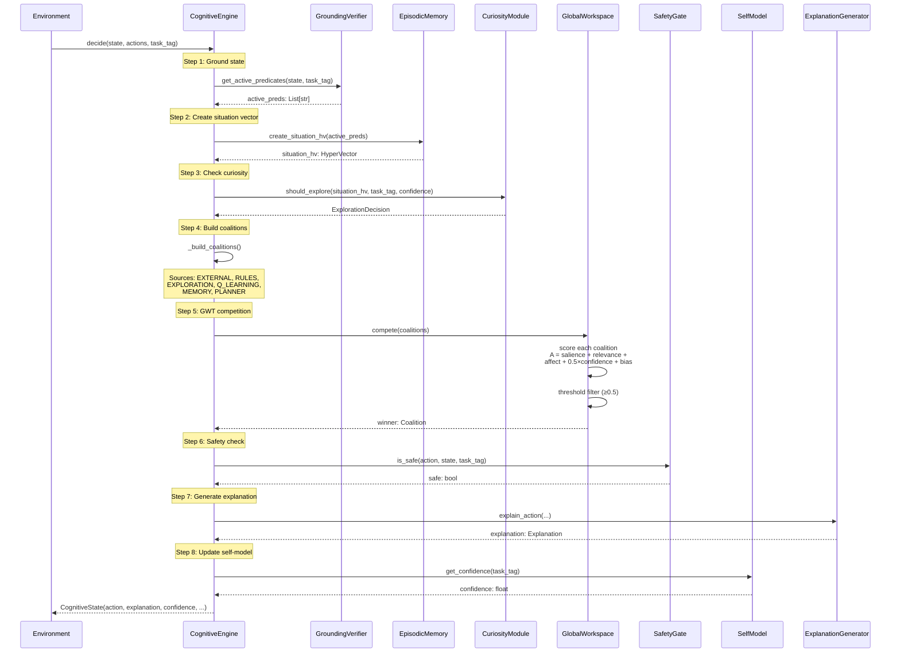

### Step-by-Step Detail

1. **Grounding** — `GroundingVerifier` evaluates all registered predicates against the current state. Each predicate is a lambda function (e.g., `"wall_north": lambda s: s.get("wall_north", False)`). Returns a list of string predicate names that are currently true.

2. **Situation Encoding** — Active predicates are bundled into a 10,240-bit HyperVector: `situation_hv = bundle([HV(pred) for pred in active_preds])`. This provides a compact, similarity-preserving representation of "what's happening now."

3. **Curiosity Check** — The situation HV is compared against all previously visited states. If novelty > 0.5, the curiosity module recommends exploration. A random action is injected as the EXPLORATION coalition.

4. **Coalition Building** — Up to 6 coalition sources contribute proposals:
   - **EXTERNAL**: Domain-registered action selector (e.g., task-specific heuristic)
   - **RULES**: Best matching rule from RuleLearner
   - **EXPLORATION**: Random action if curiosity says explore
   - **Q_LEARNING**: argmax Q(s,a) from tabular Q-values
   - **MEMORY**: Best action from similar past episodes
   - **PLANNER**: A* plan's first step (if planning is active)

5. **GWT Competition** — All coalitions are scored and the highest-activation proposal wins, subject to threshold filtering.

6. **Safety Gate** — A final check that the winning action isn't dangerous. If vetoed, the next-best coalition is tried.

7. **Explanation** — A natural language explanation is generated from templates, describing why this action was chosen.

8. **Return** — A `CognitiveState` is returned containing the action, explanation, confidence, and full reasoning trace.

---

## 2. The Learning Cycle

After each action, two methods update the system:

### record_outcome(state, action, reward, next_state, task_tag)

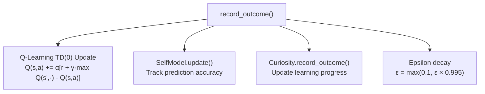

### learn(state, action, reward, next_state, task_tag)

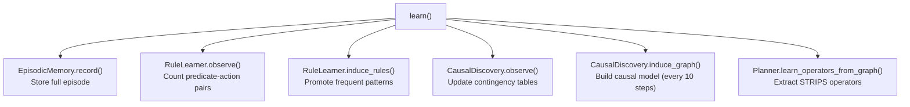

### Learning Timeline

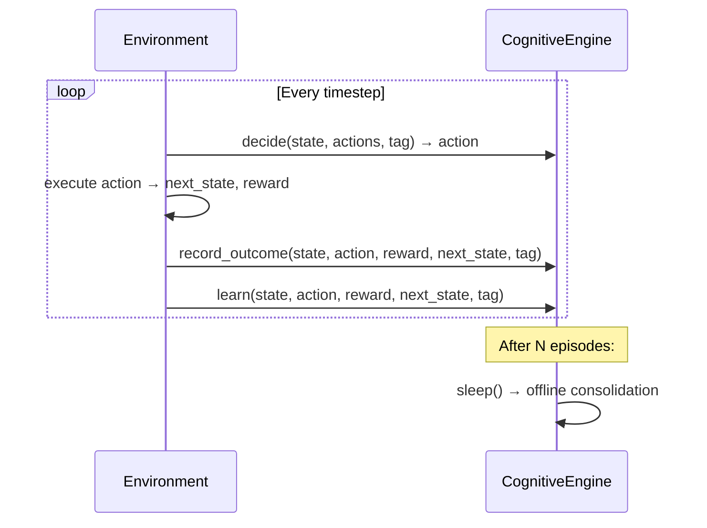

---

## 3. Text Knowledge Ingestion (V7 Pipeline)

**Entry point:** `TextKnowledgeLearner.learn_from_text(text)` (V7: all stages shown)

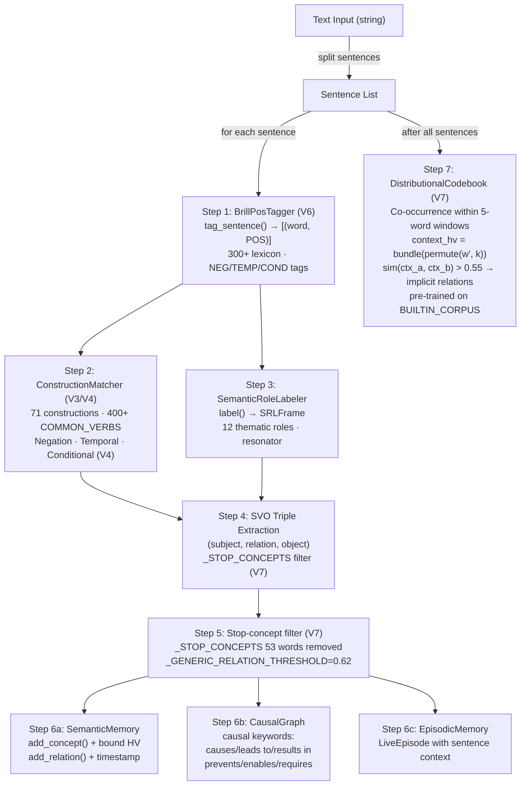

### Detailed Pipeline (V7)

1. **Split**: Sentence tokenization on `.`/`!`/`?`
2. **POS Tagging** (`BrillPosTagger.tag_sentence`): Returns `[(word, POS)]` pairs.
   - Special tags: `NEG` (negators), `TEMP` (temporal connectives), `COND` (conditionals)
3. **Construction Matching** (`ConstructionMatcher.match`): Identifies construction type.
   - 71 constructions including V4 additions: negation, temporal, conditional
4. **Semantic Role Labeling** (`SemanticRoleLabeler.label`): Identifies AGENT, PATIENT, etc.
5. **SVO Extraction**: Subject-Verb-Object triples from CG + SRL output.
6. **Stop-concept filter** (V7): Remove function words from KG using `_STOP_CONCEPTS`; reject generic relations (`sim > 0.62`).
7. **Knowledge Storage**:
   - Concepts → SemanticMemory graph nodes with VSA HyperVectors
   - Relations → SemanticMemory graph edges
   - Causal relations → CausalGraph
   - Full episodes → EpisodicMemory
8. **Distributional Semantics** (V7): Build context HVs from co-occurrence; discover implicit relations.

---

## 4. Memory Recall Pipeline

### Episodic Memory Recall

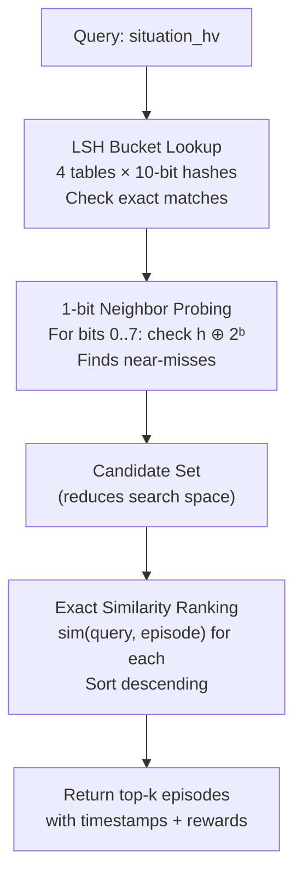

### Semantic Memory Recall

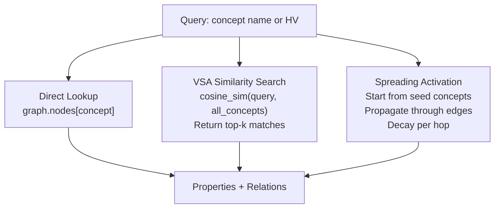

---

## 5. SNN Perception Pipeline

**Entry point:** `SNNPerceptionModule.perceive(sensory_input)`

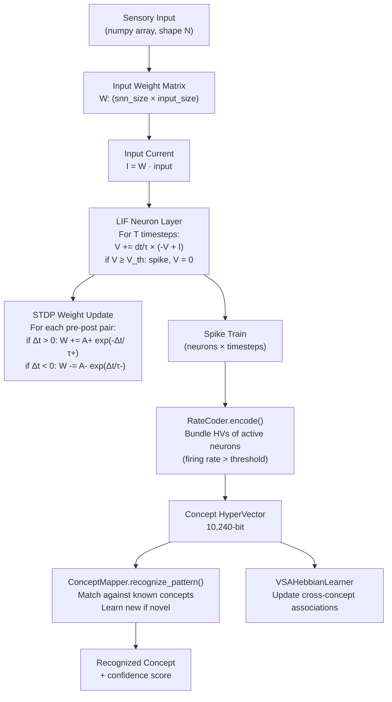

---

## 6. Sleep Consolidation

**Entry point:** `CognitiveEngine.sleep()`

Called periodically (e.g., after N episodes) for offline learning:

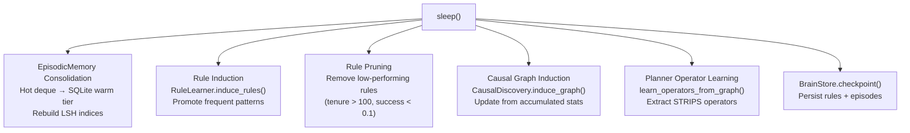

---

## 7. Task Registration

**Entry point:** `CognitiveEngine.register_task(task_tag, predicates, actions, ...)`

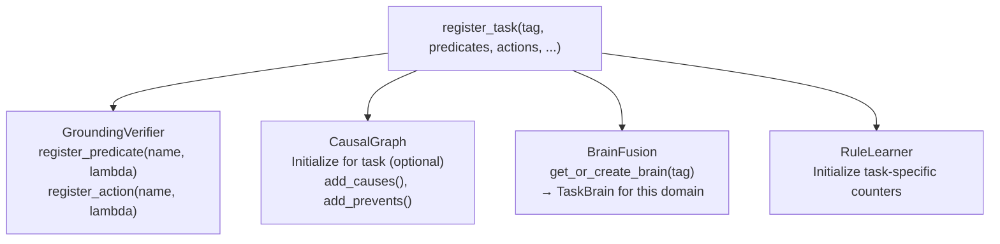

### Example: Registering a Maze Task

```python
engine.register_task(
    task_tag="maze",
    predicates={
        "wall_north": lambda s: s.get("wall_north", False),
        "wall_south": lambda s: s.get("wall_south", False),
        "at_goal":    lambda s: s.get("player") == s.get("goal"),
    },
    actions=["move_north", "move_south", "move_east", "move_west"],
    causal_links=[("move_north", "player_y_decreased")],
)
```

---

## 8. Dialogue Processing

**Entry point:** `DialogueManager.process_turn(text)` — all response paths use `NSCKResponseEngine` (FluentNLG) in V7.

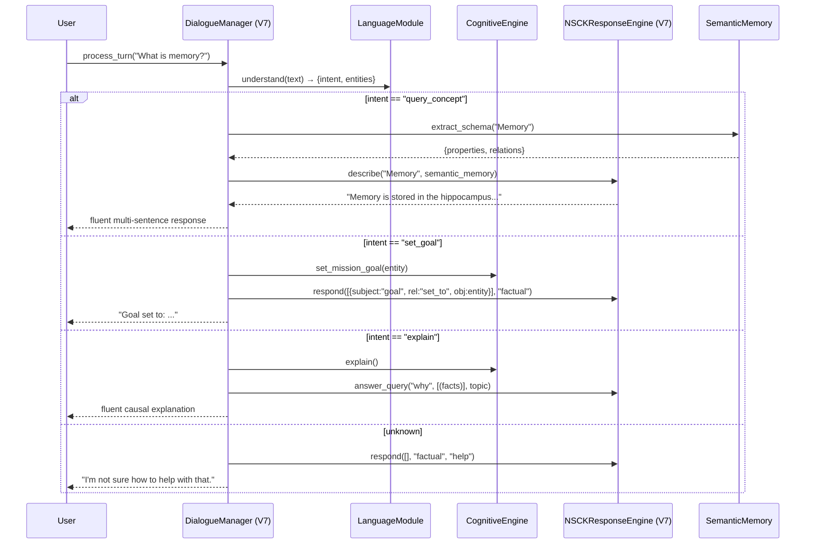

**V7 change:** All branches now use `NSCKResponseEngine` instead of template strings, producing context-appropriate fluent prose.

---

## 9. Transparency / Explanation Flow

Every decision produces a traceable explanation:

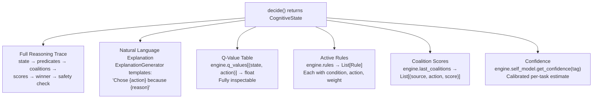

### How to Inspect

```python
engine = CognitiveEngine()
# ... register task and run episodes ...

# Decision trace
state = engine.decide(state, actions, "maze")
print(state.action)           # What was chosen
print(state.explanation)      # Why (natural language)
print(state.confidence)       # How confident

# Inspect internals
print(engine.q_values)        # All Q-values
print(engine.rules)           # All learned rules
print(engine.explain())       # Detailed explanation
```

---

## 10. Full Agent Lifecycle

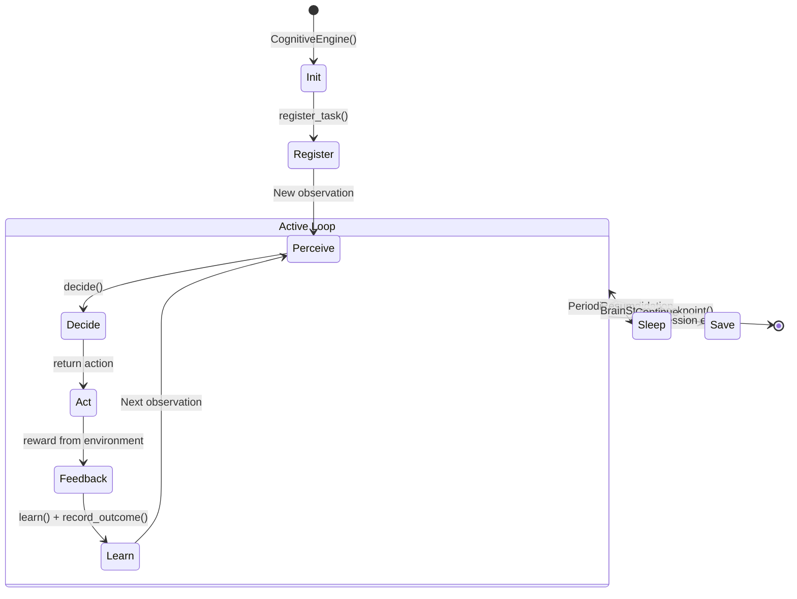

### Lifecycle Phases

| Phase | What Happens | Key Methods |
|-------|-------------|-------------|
| **Init** | All modules instantiated, Rust backend loaded | `CognitiveEngine()` |
| **Register** | Domain-specific predicates, actions, causal links added | `register_task()` |
| **Perceive** | State grounded into predicates + situation HV | `get_active_predicates()`, `create_situation_hv()` |
| **Decide** | Coalitions compete in GWT, safety-checked | `decide()` |
| **Act** | Winning action returned to environment | Return `CognitiveState` |
| **Feedback** | Q-values updated, confidence adjusted | `record_outcome()` |
| **Learn** | Episodes stored, rules induced, causal graph updated | `learn()` |
| **Sleep** | Offline consolidation, pruning, operator learning | `sleep()` |
| **Save** | Brain state persisted to SQLite | `BrainStore.checkpoint()` |
