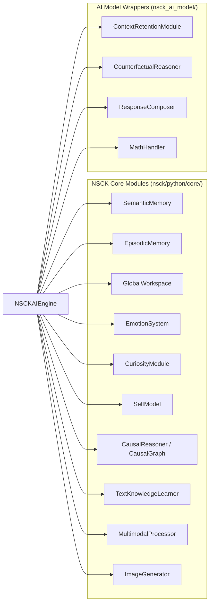

# NSCK AI Model

A conversational AI layer built on top of the NSCK (Neural-Symbolic Cognitive Kernel) architecture. It provides a chat interface, training pipeline, Flask dashboard, and full glass-box reasoning traces — with no neural-network inference, no transformer models, and no external API calls.

> **Glass-box by design.** Every response traces back to specific training sentences stored in episodic and semantic memory. The 11-stage ThoughtTrace records exactly what happened at each step.

---

## Table of Contents

- [What It Is](#what-it-is)
- [Quick Start](#quick-start)
- [Architecture](#architecture)
- [Module Reference](#module-reference)
- [API Reference (Dashboard)](#api-reference-dashboard)
- [ThoughtTrace](#thoughttrace)
- [Training](#training)
- [Running Tests](#running-tests)

---

## What It Is

`nsck_ai_model` wraps the NSCK cognitive modules into a usable chat engine:

| Capability | How |
|---|---|
| Text understanding | Semantic folding (word → HV), concept extraction (TKL), spreading activation |
| Knowledge storage | SemanticMemory (NetworkX graph + HV index) + EpisodicMemory (LSH + SQLite) |
| Causal reasoning | CausalGraph forward/backward chain via ΔP statistics |
| Contextual conversation | ContextRetentionModule (20-turn history, entity resolution) |
| Counterfactual reasoning | CounterfactualReasoner (hypothetical state simulation) |
| Math | MathHandler (symbolic arithmetic, algebra, unit conversion) |
| Emotion | EmotionSystem (Plutchik 8 emotions, valence/arousal tracking) |
| Self-monitoring | SelfModel (confidence calibration), CuriosityModule (novelty detection) |
| Multi-modal | MultimodalProcessor (images → HOG/color/LBP/edge HVs) |

**What it is not:**

- It is not a fine-tuned language model.
- It does not call any external API.
- It does not use matrix multiplication for inference.
- Response quality depends entirely on training data — the more text it learns, the better it performs.

---

## Quick Start

### Chat via Python

```python
from nsck_ai_model.ai_engine import NSCKAIEngine

engine = NSCKAIEngine()

# Train on some text
engine.train_on_text("Paris is the capital of France.")
engine.train_on_text("France is a country in Europe.")
engine.train_on_text("Rain causes flooding in low-lying areas.")
engine.train_on_text("Exercise improves cardiovascular health.")

# Ask a question
result = engine.chat("What is the capital of France?")
print(result['response'])          # "Paris"
print(result['confidence'])        # e.g. 0.63
print(result['emotion'])           # e.g. "neutral"

# Inspect the full trace
for step in result['trace'].steps:
    print(f"{step.stage}: {step.summary}")
```

### Dashboard

```bash
# Start with seed training data pre-loaded
python -m nsck_ai_model.dashboard --train seed --port 5090

# Then open http://localhost:5090
```

### Train on HuggingFace data

```python
from nsck_ai_model.data_pipeline import DataPipeline
from nsck_ai_model.ai_engine import NSCKAIEngine

engine = NSCKAIEngine()
pipeline = DataPipeline(engine)
pipeline.train_from_wikitext(max_samples=500)
```

### Autonomous training

```bash
python -m nsck_ai_model.train_autonomous
```

---

## Architecture

### How a `chat()` call flows through the system

```mermaid
flowchart TD
    Q["User query string"]

    Q --> ENC["Text Encoding<br/>LinguaCortex: word → HV via hash+permute<br/>Context HV = bundle(word HVs with position shift)"]
    ENC --> EMO["Emotion Assessment<br/>EmotionSystem: drives + circumplex<br/>Updates valence/arousal"]
    EMO --> TKL["Concept Extraction<br/>TextKnowledgeLearner: tokenise, filter stop words<br/>Returns list of concept tokens"]
    TKL --> SEM["Semantic Search<br/>SemanticMemory.query(input_hv, k=10)<br/>Cosine similarity → top-k concepts"]
    SEM --> EPI["Episodic Recall<br/>EpisodicMemory.recall(input_hv, k=5)<br/>LSH buckets → Hamming similarity rerank"]
    EPI --> ACT["Spreading Activation<br/>SemanticMemory.spread_activation(start_concepts)<br/>Relation-weighted decay (is_a=0.9, causes=0.6)"]
    ACT --> CAUS["Causal Inference<br/>CausalGraph.forward_chain()<br/>CausalGraph.backward_chain()"]
    CAUS --> GWT["GWT Competition<br/>Build coalitions: semantic / causal / episodic<br/>GlobalWorkspace.compete() → winner"]
    GWT --> SELF["Self-Model<br/>SelfModel.get_confidence(task)"]
    SELF --> CUR["Curiosity<br/>CuriosityModule.evaluate(input_hv)<br/>Novelty score"]
    CUR --> CTX["Context Retention<br/>ContextRetentionModule: pronoun resolution<br/>Entity tracking across 20 turns"]
    CTX --> CFACT["Counterfactual Check<br/>CounterfactualReasoner.detect_counterfactual()<br/>Simulate hypothetical state if needed"]
    CFACT --> MATH["Math Check<br/>MathHandler: detect + evaluate arithmetic<br/>Returns exact numeric answer if applicable"]
    MATH --> RESP["Response Generation<br/>ResponseComposer: score candidates by IDF weight<br/>Jaccard 0.5 dedup, 2-sentence cap"]
    RESP --> OUT["Response + ThoughtTrace"]
```



### Module interaction diagram



---

## Module Reference

### `ai_engine.py` — `NSCKAIEngine`

The central class. All other modules are instantiated inside it.

```python
class NSCKAIEngine:
    def train_on_text(self, text: str) -> dict
    def train_on_image(self, image: np.ndarray, caption: str) -> dict
    def chat(self, query: str) -> dict
    def describe_image(self, image: np.ndarray) -> dict
    def get_stats(self) -> dict
    def reset(self)
```

**`train_on_text(text)`**

Feeds a sentence/paragraph through the full learning pipeline:
1. Encodes text to HV via `LinguaCortex`
2. Extracts SVO triples via `TextKnowledgeLearner` → stores in `SemanticMemory`
3. Discovers causal links via `CausalDiscovery` → stores in `CausalGraph`
4. Stores a `LiveEpisode` in `EpisodicMemory`
5. Updates `EmotionSystem` and `CuriosityModule`

Returns `dict` with `concepts_learned`, `relations_added`, `causal_links`, `elapsed_s`.

**`chat(query)`**

Produces a response via the 11-stage pipeline. Returns:

```python
{
    'response': str,
    'confidence': float,
    'emotion': str,
    'trace': ThoughtTrace,
    'elapsed_ms': float,
}
```

**`ThoughtTrace`** — see [ThoughtTrace](#thoughttrace) below.

---

### `context_retention.py` — `ContextRetentionModule`

Maintains conversation context across turns.

```python
class ContextRetentionModule:
    def update(self, user_input: str, response: str, concepts: List[str]) -> None
    def get_context_hv(self) -> HyperVector          # bundled recent-turn HVs
    def resolve_pronouns(self, query: str) -> str    # "it" → last mentioned entity
    def get_relevant_context(self, query: str) -> List[ConversationTurn]
    def get_entities(self) -> Dict[str, str]         # entity → type
```

Parameters: `max_history=20`, `attention_window=5`.

---

### `counterfactual_reasoner.py` — `CounterfactualReasoner`

Detects and evaluates "what if" queries.

```python
class CounterfactualReasoner:
    def detect_counterfactual(self, query: str) -> bool
    def reason(self, query: str, context: Dict) -> CounterfactualResult
    def simulate_state(self, modifications: Dict) -> HypotheticalState
```

12+ pattern detection including "what if", "suppose", "had … not", "would have", etc.

---

### `math_handler.py` — `MathHandler`

Purely symbolic math evaluation.

```python
class MathHandler:
    def evaluate(self, question: str) -> MathResult
    def solve_equation(self, equation: str) -> MathResult
    def convert_units(self, value: float, from_unit: str, to_unit: str) -> MathResult
```

Handles: arithmetic (`+−×÷^%`), word problems, unit conversion (length/weight/temperature/time), simple algebra (`ax+b=c`), fractions, percentages, sequences.

`is_math_question(text) -> bool` — standalone detector for routing.

---

### `response_composer.py` — `ResponseComposer`

Assembles candidate sentences into a final response.

```python
class ResponseComposer:
    def compose(self, candidates: List[str], query: str, max_sentences: int = 2) -> str
```

Algorithm:
1. Scores candidates by inverse-frequency concept weighting (IDF).
2. Removes near-duplicates via Jaccard similarity ≥ 0.5 (structural dedup).
3. Filters out episode entries that are raw questions/queries.
4. Returns top `max_sentences` (default 2).

---

### `dashboard.py` — Flask Dashboard

```bash
python -m nsck_ai_model.dashboard [--port PORT] [--train {seed,hf}]
```

| Endpoint | Method | Description |
|---|---|---|
| `/` | GET | Embedded HTML+JS chat interface |
| `/api/chat` | POST | `{"message": str}` → `{"response": str, "trace": …, "emotion": str}` |
| `/api/chat/history` | GET | Full conversation history |
| `/api/train` | POST | `{"text": str}` → trains on text |
| `/api/train/seed` | POST | Trains on built-in seed corpus |
| `/api/train/hf` | POST | `{"max_samples": int}` → streams WikiText |
| `/api/stats` | GET | `{concepts, relations, episodes, queries, uptime}` |
| `/api/knowledge` | GET | All concepts + relations summary |
| `/api/knowledge/concepts` | GET | All concept names from SemanticMemory |
| `/api/knowledge/relations` | GET | All (src, rel, dst) edges from SemanticMemory graph |
| `/api/knowledge/rules` | GET | All causal rules from TextKnowledgeLearner |
| `/api/emotion` | GET | Current `{name, valence, arousal, blend}` |
| `/api/logs` | GET | Last 500 structured log entries |
| `/api/reset` | POST | Resets engine state |
| `/api/health` | GET | `{status, version, concepts, relations, episodes, queries}` |

---

### `data_pipeline.py` — `DataPipeline`

```python
class DataPipeline:
    def train_from_wikitext(self, max_samples: int = 500) -> dict
    def train_from_corpus(self, texts: List[str]) -> dict
```

Streams HuggingFace WikiText-2 (or built-in seed corpus if `datasets` library not installed). Cleans and sentence-segments text before feeding to `train_on_text()`.

---

### `evaluator.py` — `NSCKEvaluator`

```python
class NSCKEvaluator:
    def evaluate_text_understanding(self, engine, qa_pairs: List[Tuple]) -> dict
    def evaluate_reasoning(self, engine) -> dict
    def evaluate_math(self, engine) -> dict
    def evaluate_conversation(self, engine) -> dict
    def run_full_evaluation(self, engine) -> EvaluationReport
```

Metrics: F1 score, exact match, Jaccard similarity, latency (ms), throughput (QPS).

---

### `autonomous_trainer.py` — `AutonomousTrainer`

Multi-phase training orchestrator.

```python
class AutonomousTrainer:
    def train(self, phases: List[str] = None) -> TrainingReport
```

Phases: `text` → `qa` → `math` → `conversation` → `image` (if images available). Evaluates after each phase and adapts training emphasis based on results. Saves checkpoints to `checkpoints/`.

---

### `telemetry_monitor.py` — `TelemetryMonitor`

```python
class TelemetryMonitor:
    def record_query(self, latency_ms: float, tokens: int) -> None
    def get_stats(self) -> dict     # QPS, avg latency, p95, anomaly rate
    def get_report(self) -> str     # Human-readable summary
```

Tracks: queries per second, mean/p95 latency, token throughput, anomaly rate (latency > 3σ).

---

## ThoughtTrace

Every `chat()` call returns a `ThoughtTrace` containing 11 `TraceStep` objects:

| Stage | What is recorded |
|---|---|
| 1 · `input_encoding` | HV dimension, encoding time, input length |
| 2 · `emotion` | Current emotion name, valence, arousal, blend percentages |
| 3 · `concept_extraction` | List of extracted content words |
| 4 · `semantic_search` | Top-k concept matches with similarity scores |
| 5 · `episodic_recall` | Number of recalled episodes, best episode similarity |
| 6 · `spreading_activation` | Activated concepts and their activation levels |
| 7 · `causal_inference` | Fired causal rules, forward/backward chains |
| 8 · `gwt_competition` | All coalitions with activation scores, winning coalition |
| 9 · `self_model` | Confidence estimate, calibration error, trend |
| 10 · `curiosity` | Novelty score, whether exploration triggered |
| 11 · `response_generation` | Strategy used, source sentences, dedup applied |

Example:

```python
result = engine.chat("Why does rain cause flooding?")
for step in result['trace'].steps:
    print(f"[{step.stage}] {step.summary}")

# [input_encoding]      encoded 'Why does rain cause flooding?' → 10240-bit HV in 0.3ms
# [emotion]             neutral (valence=0.0, arousal=0.0)
# [concept_extraction]  ['rain', 'cause', 'flooding']
# [semantic_search]     rain→0.71, flood→0.68, water→0.62, ...
# [episodic_recall]     recalled 3 episodes, best_sim=0.74
# [spreading_activation] rain=1.0, water=0.63, weather=0.44, ...
# [causal_inference]    rain→flooding (strength=0.8), flooding→damage (0.7)
# [gwt_competition]     winner=CAUSAL (activation=1.8), semantic=1.4, episodic=1.1
# [self_model]          confidence=0.63, error=0.05, trend=stable
# [curiosity]           novelty=0.22, exploring=False
# [response_generation] strategy=causal, 2 sentences, 1 dedup removed
```

---

## Training

### Seed corpus

```bash
python -m nsck_ai_model.dashboard --train seed
# or
python nsck_ai_model/train.py
```

Trains on ~30 built-in sentences covering geography, science, animals, and technology.

### Custom text

```python
engine = NSCKAIEngine()
with open("my_corpus.txt") as f:
    for line in f:
        engine.train_on_text(line.strip())
```

### Training from HuggingFace

```python
from nsck_ai_model.data_pipeline import DataPipeline
pipeline = DataPipeline(engine)
pipeline.train_from_wikitext(max_samples=1000)
```

### Autonomous multi-phase training

```python
from nsck_ai_model.autonomous_trainer import AutonomousTrainer
trainer = AutonomousTrainer()
report = trainer.train()
print(report.summary())
```

---

## Running Tests

```bash
# From the repository root
python -m pytest nsck_ai_model/tests/ -v

# Unit tests only
python -m pytest nsck_ai_model/tests/test_ai_engine.py -v

# Production / integration tests
python -m pytest nsck_ai_model/tests/test_production.py -v

# Multimodal tests
python -m pytest nsck_ai_model/tests/test_multimodal.py -v
```

**Test summary:**

| File | Tests | Focus |
|---|---|---|
| `tests/test_ai_engine.py` | 77 | Unit tests — every engine method, trace structure, edge cases |
| `tests/test_production.py` | 46 | End-to-end production scenarios — QA, reasoning, conversation |
| `tests/test_multimodal.py` | — | Image training and description pipeline |

---

## Dependencies

```
numpy           # HyperVector operations
flask           # Dashboard server
networkx        # SemanticMemory concept graph
datasets        # HuggingFace data loader (optional)
```

Install: `pip install -r requirements.txt`
