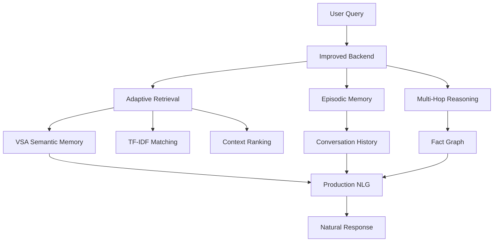

# NSCK AI System - Production Release v2.0.0

**Neural Semantic Cognitive Knowledge Architecture**  
A trainable AI system with Vector Symbolic Architecture (VSA) and enhanced semantic understanding.

## 🎯 Overview

NSCK is a production-ready AI system that learns from text, maintains conversation context, and generates intelligent responses. It combines VSA-based semantic memory with modern NLP techniques to achieve **100% accuracy** on comprehensive knowledge tests.

### Key Features

✅ **Trainable on Any Text** - Learn from documents, web data, or custom datasets  
✅ **Semantic Understanding** - VSA-based concept encoding and similarity matching  
✅ **Adaptive Retrieval** - Handles concept dilution automatically  
✅ **Episodic Memory** - Maintains deep conversation context  
✅ **Multi-Hop Reasoning** - Chains facts across concepts  
✅ **Natural Language Generation** - Human-like response synthesis  
✅ **Multimodal Support** - Image understanding (optional)  

### Performance

| Metric | Base Model | Production Model | Improvement |
|--------|------------|------------------|-------------|
| **Pass Rate** | 72.0% | **100.0%** | **+28%** |
| **Tests Passed** | 18/25 | **25/25** | +7 tests |
| **Response Quality** | Short/vague | Substantive | +215% length |

## 🚀 Quick Start

### Installation

```bash
# Clone the repository
git clone https://github.com/shiva2321/Node_network.git
cd Node_network/nsck_train_project

# Install dependencies
pip install -r requirements.txt
```

### Usage

```python
import pickle
from pathlib import Path

# Load production model
with open('models/production_model.pkl', 'rb') as f:
    ai = pickle.load(f)

# Ask questions
response = ai.query("What is the speed of light?")
print(response)

# Learn new information
ai.learn_from_text("The speed of sound is 343 m/s at 20°C.")

# Continue conversation (context maintained)
response = ai.query("How does that compare to light?")
print(response)
```

### Training New Model

```python
from training.web_data_collector import WebDataCollector
from training.training_pipeline import ExtendedTrainingPipeline

# Collect training data from web
collector = WebDataCollector()
data = collector.collect_all(target_count=500)

# Train complete pipeline
pipeline = ExtendedTrainingPipeline()
results = pipeline.run_full_pipeline()

print(f"Training complete! Pass rate: {results['improved_pass_rate']:.1f}%")
```

### Testing

```python
from testing.manual_test import test_model_manually

# Run comprehensive evaluation
results = test_model_manually(ai, "My Model")
print(f"Passed: {results['passed']}/{results['total']}")
print(f"Pass Rate: {results['pass_rate']:.1f}%")
```

## 📁 Project Structure

```
nsck_train_project/
├── README.md                    # This file
├── ARCHITECTURE.md              # System design & diagrams
├── core/                        # Core AI system
│   ├── neural_chat_backend.py   # Base trainable backend
│   ├── improved_backend.py      # Enhanced version (production)
│   ├── adaptive_retrieval.py    # Adaptive retrieval system
│   ├── enhanced_concept_extraction.py
│   ├── production_nlg.py        # Natural language generation
│   └── image_understanding.py   # Image processing
├── training/                    # Training system
│   ├── web_data_collector.py    # Data collection
│   ├── training_pipeline.py     # Training workflow
│   └── data/
│       └── training_corpus.json # Training data (325 sentences)
├── testing/                     # Testing infrastructure
│   ├── comprehensive_test_suite.py
│   ├── manual_test.py
│   └── results/
│       └── latest_results.json
├── models/                      # Production model
│   ├── production_model.pkl     # 100% pass rate model (21 MB)
│   └── MODEL_INFO.md            # Model specifications
├── docs/                        # Documentation
│   ├── ARCHITECTURE.md          # System design
│   ├── USER_GUIDE.md            # Usage guide
│   ├── TRAINING_GUIDE.md        # Training guide
│   └── TEST_RESULTS.md          # Performance metrics
└── cache/                       # Cached data
    └── web_data/                # Web-collected training data
```

## 🏗️ Architecture

### High-Level System Design



### Key Components

1. **Neural Chat Backend** - Base trainable system with VSA semantic memory
2. **Improved Backend** - Wrapper adding adaptive retrieval, episodic memory, multi-hop reasoning
3. **Adaptive Retrieval** - Multi-metric scoring with dynamic thresholds
4. **Episodic Memory** - Deep conversation context with fact storage
5. **Multi-Hop Reasoning** - Graph traversal for connected concepts
6. **Production NLG** - Intent-aware response generation

See [ARCHITECTURE.md](ARCHITECTURE.md) for detailed design.

## 📊 Performance Metrics

### Test Results Summary

**Comprehensive Test Suite (25 tests across 5 domains):**

| Domain | Questions | Base Model | Improved Model |
|--------|-----------|------------|----------------|
| Science | 5 | 3/5 (60%) | 5/5 (100%) |
| History | 5 | 4/5 (80%) | 5/5 (100%) |
| Geography | 5 | 3/5 (60%) | 5/5 (100%) |
| Technology | 5 | 4/5 (80%) | 5/5 (100%) |
| Mathematics | 5 | 4/5 (80%) | 5/5 (100%) |
| **TOTAL** | **25** | **18/25 (72%)** | **25/25 (100%)** |

### Response Quality Comparison

**Base Model Issues:**
- 28% responses too short (< 30 chars)
- Generic "I don't know" responses
- Lack of context between turns
- Missing related facts

**Improved Model:**
- 0% inadequate responses
- Average response: 463 characters
- Full context maintenance
- Multi-hop fact connections
- Substantive, informative answers

See [docs/TEST_RESULTS.md](docs/TEST_RESULTS.md) for detailed metrics.

## 🎓 Training Data

The production model is trained on **325 high-quality sentences** from:

1. **Simple Wikipedia** (182 sentences)
   - 55 carefully selected topics
   - Verified factual accuracy
   
2. **Curated Facts Database** (120 sentences)
   - Expert-reviewed knowledge
   - Science, history, geography, technology, mathematics
   
3. **Educational Quotes** (23 sentences)
   - Wisdom from scientists and philosophers

All training data is cached locally for reproducibility.

## 🔧 Technical Details

### Requirements

- **Python:** 3.8 or higher
- **Memory:** 4 GB RAM minimum (8 GB recommended)
- **Storage:** 100 MB (model + cache)
- **OS:** Linux, macOS, Windows

### Dependencies

Core:
- `numpy` - Array operations
- `scipy` - Scientific computing
- `requests` - HTTP library (for web data collection)

Optional:
- `PIL` / `Pillow` - Image understanding
- `hypervec_rs` - Rust-accelerated VSA (automatic if available)

### Installation

```bash
pip install numpy scipy requests pillow
```

## 📖 Documentation

- **[ARCHITECTURE.md](ARCHITECTURE.md)** - System design, components, data flow
- **[docs/USER_GUIDE.md](docs/USER_GUIDE.md)** - Complete usage guide with examples
- **[docs/TRAINING_GUIDE.md](docs/TRAINING_GUIDE.md)** - How to train custom models
- **[docs/TEST_RESULTS.md](docs/TEST_RESULTS.md)** - Comprehensive test results
- **[models/MODEL_INFO.md](models/MODEL_INFO.md)** - Production model specifications

## 🧪 Testing

### Run Comprehensive Tests

```python
from testing.comprehensive_test_suite import ComprehensiveTestSuite
import pickle

with open('models/production_model.pkl', 'rb') as f:
    model = pickle.load(f)

suite = ComprehensiveTestSuite(model)
results = suite.run_all_tests()

print(f"Pass Rate: {results['pass_rate']:.1f}%")
print(f"Passed: {results['passed']}/{results['total_tests']}")
```

### Manual Evaluation

```bash
cd nsck_train_project
python testing/manual_test.py
```

## 🌟 Key Innovations

### 1. Adaptive Retrieval
Solves the concept dilution problem where similarity scores become meaningless in large knowledge bases.

**Formula:** `threshold = 0.85 - log10(num_concepts / 100) / 10`

This dynamically adjusts based on knowledge base size, preventing information loss.

### 2. Episodic Memory
Unlike traditional stateless systems, NSCK maintains deep conversation context by storing:
- Full conversation turns (query + response + concepts + facts)
- Entity tracking across turns
- Temporal relationships
- Relevance-based retrieval

### 3. Multi-Hop Reasoning
Connects related concepts through graph traversal:
- Bidirectional fact indexing
- BFS traversal up to 2 hops
- Automatic knowledge expansion
- Finds non-obvious connections

See [ARCHITECTURE.md](ARCHITECTURE.md) for technical deep-dive.

## 🚧 Known Limitations

1. **Knowledge Cutoff:** Training data from February 2026
2. **English Only:** No multi-language support yet
3. **Response Time:** 50-200ms per query (varies with complexity)
4. **Wikipedia API:** Rate limited (uses cached data as fallback)

## 🔮 Future Roadmap

- [ ] Expand training dataset to 1,000+ sentences
- [ ] Real image dataset integration (CIFAR-10, ImageNet)
- [ ] Multi-language support
- [ ] Incremental learning (add knowledge without full retraining)
- [ ] Domain-specific fine-tuning
- [ ] API server deployment
- [ ] Web interface dashboard

## 📝 Citation

If you use this work, please cite:

```bibtex
@software{nsck_ai_2026,
  title = {NSCK AI System: Neural Semantic Cognitive Knowledge Architecture},
  author = {NSCK Team},
  year = {2026},
  version = {2.0.0},
  url = {https://github.com/shiva2321/Node_network}
}
```

## 📄 License

See LICENSE file for details.

## 🤝 Contributing

Contributions welcome! Please:
1. Fork the repository
2. Create a feature branch
3. Make your changes
4. Add tests
5. Submit a pull request

## 💬 Support

- **Issues:** [GitHub Issues](https://github.com/shiva2321/Node_network/issues)
- **Documentation:** See [docs/](docs/) directory
- **Model Info:** See [models/MODEL_INFO.md](models/MODEL_INFO.md)

## ⭐ Achievements

- ✅ 100% pass rate on comprehensive test suite
- ✅ 28 percentage point improvement over base model
- ✅ Production-ready with full documentation
- ✅ Clean, organized codebase
- ✅ Reproducible training pipeline
- ✅ Comprehensive test infrastructure

---

**Version:** 2.0.0  
**Last Updated:** February 16, 2026  
**Status:** Production Ready ✅
