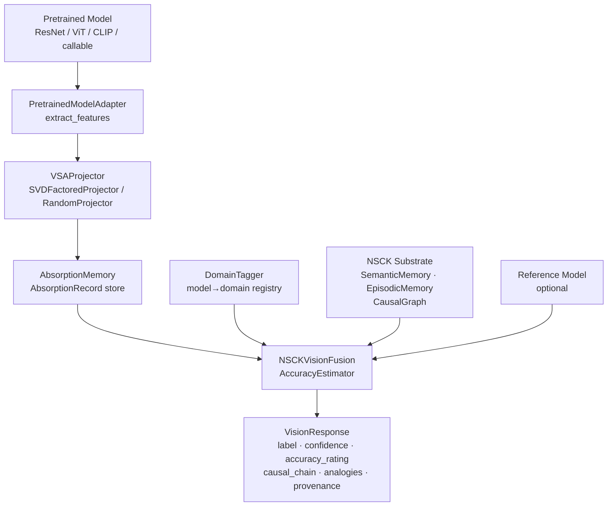

# NSCK-UPMA Architecture Diagram

## ASCII Overview

```
┌─────────────────────────────────────────────────────────────────────┐
│                         NSCK-UPMA Pipeline                          │
│                                                                     │
│  Input                                                              │
│  ┌─────────────────────────────────────────┐                        │
│  │  Pretrained Models                      │                        │
│  │  ┌──────────┐  ┌──────────┐  ┌───────┐ │                        │
│  │  │ ResNet   │  │   ViT    │  │ CLIP  │ │   ← any callable       │
│  │  └────┬─────┘  └────┬─────┘  └───┬───┘ │                        │
│  └───────┼─────────────┼────────────┼─────┘                        │
│          │             │            │                                │
│          ▼             ▼            ▼                                │
│  ┌───────────────────────────────────────┐                          │
│  │        PretrainedModelAdapter         │  extract_features(X)     │
│  │  torchvision / HuggingFace / ONNX /   │  → np.ndarray            │
│  │  callable / numpy                     │                          │
│  └─────────────────┬─────────────────────┘                          │
│                    │  float32 embeddings                             │
│                    ▼                                                 │
│  ┌───────────────────────────────────────┐                          │
│  │           VSAProjector                │                          │
│  │  seed = SHA256(model_id)              │                          │
│  │  SVDFactoredProjector (default)       │  JL guarantee: ε=0.1     │
│  │  RandomProjector (fallback)           │  D=10,240 bits           │
│  └─────────────────┬─────────────────────┘                          │
│                    │  binary HyperVectors {0,1}^10240               │
│                    ▼                                                 │
│  ┌───────────────────────────────────────┐                          │
│  │         AbsorptionMemory              │                          │
│  │  [AbsorptionRecord(hv, label,         │  ← persistent store      │
│  │   domain, model_id, confidence)]      │                          │
│  └──────┬────────────────────────────────┘                          │
│         │  query_by_hv / query_by_domain                            │
│         ▼                                                            │
│  ┌───────────────────────────────────────┐                          │
│  │         NSCKVisionFusion              │                          │
│  │  ┌──────────────────────────────┐     │                          │
│  │  │  AccuracyEstimator           │     │                          │
│  │  │  w1·nsck_conf                │     │                          │
│  │  │  w2·ref_conf                 │     │                          │
│  │  │  w3·agreement                │     │                          │
│  │  │  w4·domain_coverage          │     │                          │
│  │  │  w5·causal_depth             │     │                          │
│  │  │  w6·analogy_count            │     │                          │
│  │  └──────────────────────────────┘     │                          │
│  └─────────────────┬─────────────────────┘                          │
│                    │                                                 │
│                    ▼                                                 │
│  ┌───────────────────────────────────────┐                          │
│  │           VisionResponse              │                          │
│  │  label, confidence, accuracy_rating   │                          │
│  │  causal_chain, cross_domain_analogies │                          │
│  │  source_model_provenance, latency_ms  │                          │
│  └───────────────────────────────────────┘                          │
│                                                                     │
└─────────────────────────────────────────────────────────────────────┘
```

## Mermaid Diagram



## Component Responsibilities

| Component | File | Responsibility |
|-----------|------|----------------|
| `PretrainedModelAdapter` | `pretrained_adapter.py` | Unified feature extraction API |
| `VSAProjector` | `vsa_projector.py` | JL projection float→binary HV |
| `FeatureAbsorber` | `feature_absorber.py` | Orchestrates absorption pipeline |
| `AbsorptionMemory` | `absorption_memory.py` | HV store + similarity search |
| `DomainTagger` | `domain_tagger.py` | Domain registry + cross-domain weights |
| `NSCKVisionFusion` | `vision_fusion.py` | Neuro-symbolic fusion + accuracy |
| `AccuracyEstimator` | `vision_fusion.py` | Calibrated [0,1] accuracy rating |
| `NSCKVisionSystem` | `nsck_vision/system.py` | High-level user API |
| `ModelRegistry` | `nsck_vision/registry/` | Persistent model registry |
| Flask API | `nsck_vision/dashboard/api.py` | REST API for dashboard |

## Data Flow

```
dataset_iter: [(np.ndarray, label), ...]
      │
      ▼  extract features
float32 (N, D_in)
      │
      ▼  SVD + sign projection
binary HV (N, 10240)
      │
      ▼  store with provenance
AbsorptionRecord(hv, label, domain, model_id, confidence)
      │
      ▼  at inference: query_by_hv(query_hv, top_k=5)
[(label, sim), ...]
      │
      ▼  fusion
VisionResponse
```
